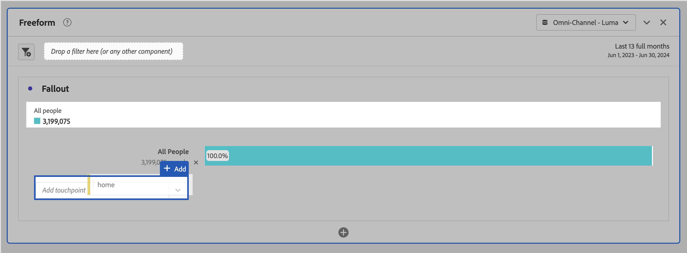
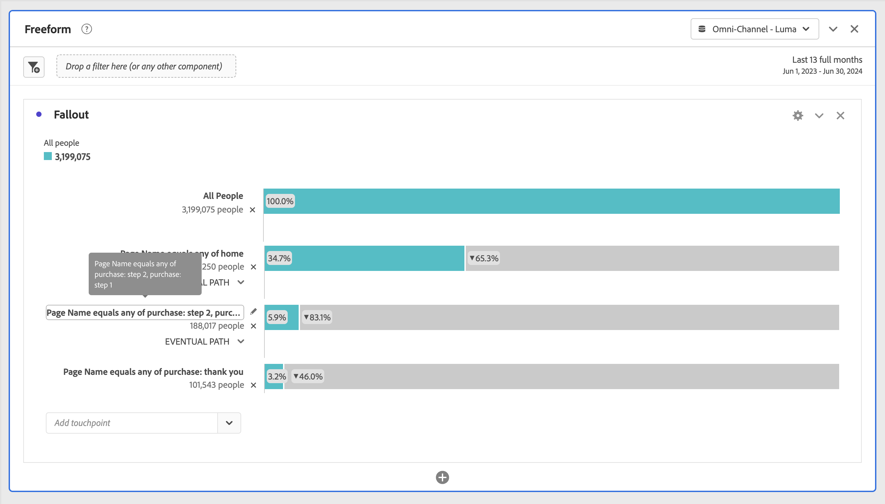
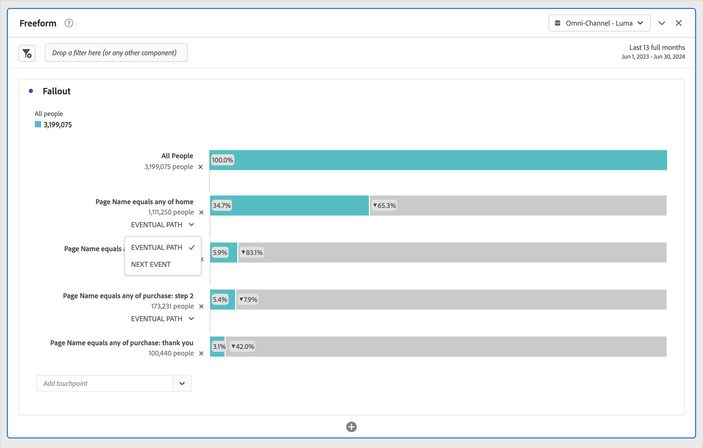
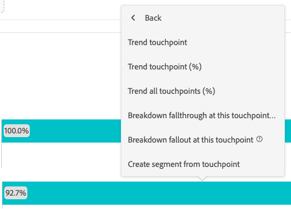

# Configure a fallout visualization

You can specify the touchpoints to create a multi-dimensional fallout sequence. Commonly, a touchpoint is a page on your site. However, touchpoints are not limited to pages. For example, you can add events, such as units, as well as unique persons and return visits. You can also add dimensions, such as a category, browser type, or internal search term.

You can even add segments within a touchpoint. For example, you might want to compare segments, such as iOS and Android&trade; users. Drag the desired segments to the top of the fallout and information about those segments is added to the fallout report. If you want to show only those segments, you can remove the All Visits baseline.

There is no limitation on the number of steps that you can add or the number of dimensions used.

You can do pathing on dimensions, metrics, and segments. For example, suppose that someone is looking at shoes, shirt on one page, and on the next page they're looking at shirt, socks. The next product flow report from shoes will be shirt and socks, NOT shirt.

## Use

1. Add a  **[!UICONTROL Fallout]** visualization. See [Add a visualization to a panel](../freeform-analysis-visualizations.md#add-visualizations-to-a-panel).
1. Drag a page, for example home, from the Page dimension onto the *Add touchpoint* dropdown menu.

   

   Hover over a touchpoint to see the fallout and other information about that level, such as the name of the touchpoint, and the person count at that point. And see the success rate for that touchpoint (as well as compare the success rate to other touchpoints.)

   The circled numbers in the gray portion of the bar show the fallout between touchpoints (not the overall fallout to that point). The **[!UICONTROL Touchpoint %]** shows the successful fall through from the previous step to the current step in the fallout report.

   You can also add a single page to the fallout report, rather than the entire dimension. Click the right arrow  on the page dimension to pick a specific page to add to the Fallout report.

1. Continue adding touchpoints until your sequence is complete.

   You can **combine multiple touchpoints** by dragging one or more additional components onto a touchpoint.

   >[!NOTE]
   >
   >Multiple segments are joined with AND, but multiple items such as dimension items and metrics are joined with OR.

   

1. You can also **constrain individual touchpoints to the next event** (as opposed to *eventually*) within the path. Underneath each touchpoint, there is a selector with the options **[!UICONTROL Eventual path]** and **[!UICONTROL Next event]**, as shown here:

   

   | Option | Description | 
   |---|---|
   | **[!UICONTROL Eventual path]** (default) | Persons are counted that will *eventually* land on the next page in the path, but not necessarily on the next event. |
   | **[!UICONTROL Next event]** | re counted that will land on the next page in the path on the very next event. |

## Settings

As part of the visualization, specific settings are available.

| Fallout container | Description |
|--- |--- |
| **[!UICONTROL Session]** or **[!UICONTROL Person]**|  Switch between [!UICONTROL Session] and [!UICONTROL Person] to analyze person pathing. The default is [!UICONTROL Person]. These settings help you understand person engagement at the person level (across sessions), or constrain the analysis to a single session. |

## Context menu

As part of the visualization, specific context menu options are available.

| Option | Description |
|--- |--- |
|**[!UICONTROL Trend touchpoint]**|See trend data for a touchpoint in a line graph, with some pre-built anomaly detection data.|
|**[!UICONTROL Trend touchpoint (%)]**|Trends the total fallout percentage.|
|**[!UICONTROL Trend all touchpoints (%)]**|Trends all the touchpoint percentages in the fallout (except **[!UICONTROL All People]**, if it's included), on the same chart.|
|**[!UICONTROL Break down fallthrough at this touchpoint]**|View what persons did between two touchpoints (this touchpoint and the next touchpoint) if they continued to the next touchpoint. This creates a freeform table showing your dimensions. You can replace dimensions and other elements of the table.|
|**[!UICONTROL Break down fallout at this touchpoint]**|View what people who did not make it through the funnel did immediately after the selected step.|
|**[!UICONTROL Create segment from touchpoint]**|Create a new segment from the selected touchpoint.|

>[!MORELIKETHIS]
>
>[Add a visualization to a panel](/help/analyze/analysis-workspace/visualizations/freeform-analysis-visualizations.md#add-visualizations-to-a-panel)
>[Visualization settings](/help/analyze/analysis-workspace/visualizations/freeform-analysis-visualizations.md#settings)
>[Visualization context menu](/help/analyze/analysis-workspace/visualizations/freeform-analysis-visualizations.md#context-menu)
>

