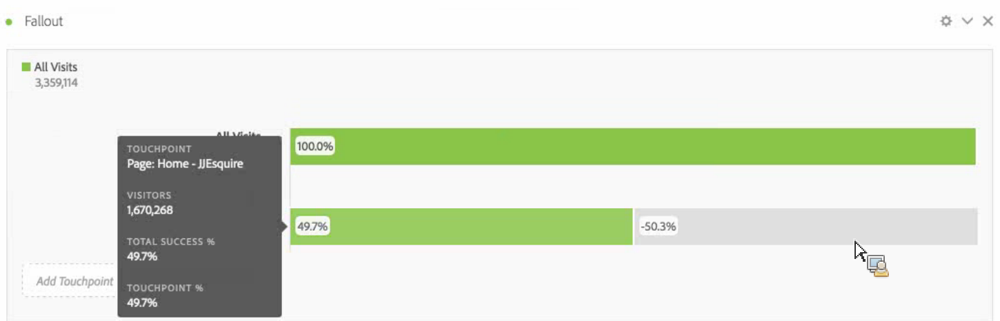
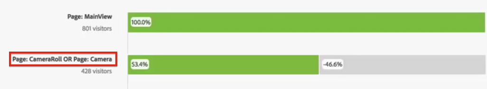

# Configure a fallout visualization

You can specify the touchpoints to create a multi-dimensional fallout sequence. Commonly, a touchpoint is a page on your site. However, touchpoints are not limited to pages. For example, you can add events, such as units, as well as unique visitors and return visits. You can also add dimensions, such as a category, browser type, or internal search term.

You can even add segments within a touchpoint. For example, you might want to compare segments, such as iOS and Android users. Drag the desired segments to the top of the fallout and information about those segments is added to the fallout report. If you want to show only those segments, can you remove the All Visits baseline.

There is no limitation on the number of steps you can add or the number of dimensions used.

You can do pathing on eVars, including merchandising eVars and [listVars](https://experienceleague.adobe.com/docs/analytics/implementation/vars/page-vars/page-variables.html) (variables that can have multiple values per hit, such as products, listVars, merchandising eVars and list props). For example, suppose someone is looking at shoes,shirt on one page, and on the next page they're looking at shirt,socks. The next product flow report from shoes will be shirt and socks, NOT shirt.

1. Drag a [!UICONTROL Fallout] visualization from the Visualizations drop-down into a [!UICONTROL Freeform Table].

1. Drag the Page dimension into the Freeform Table and from there, drag a page (in this case, Home - JJEsquire) into the **[!UICONTROL Add TouchPoint]** field as the first touchpoint.

   

   Hover over a touchpoint to see the fallout and other information about that level, such as the name of the touchpoint, the visitor count at that point, and see the success rate for that touchpoint (as well as compare the success rate to other touchpoints.)

   The circled numbers in the gray portion of the bar show the fallout between touchpoints (not the overall fallout to that point). The Touchpoint % shows the successful fallthrough from the previous step to the current step in the fallout report.

   You can also add a single page to the fallout report, rather than the entire dimension. Click the right arrow ">" on the page dimension to pick the specific page to add to the fallout report.

1. Continue adding touchpoints until your sequence is complete.

   You can **combine multiple touchpoints** by dragging one or more additional ones onto a touchpoint.

   >[!NOTE]
   >
   >Multiple Segments are joined with AND, but multiple items such as dimension items and metrics are joined with OR.

   

1. You can also **constrain individual touchpoints to the next hit** (as opposed to "eventually") within the path. Underneath each touchpoint, there is a selector with the options "Eventual Path" and "Next Hit", as shown here:

   

<table id="table_A91D99D9364B41929CC5A5BC907E8985"> 
 <tbody> 
  <tr> 
   <td colname="col1"> 
Eventual Path 
 
(Default) 
 </td> 
   <td colname="col2"> 
Visitors are counted that will "eventually" land on the next page in the path in that session, but not necessarily on the next hit. 
 </td> 
  </tr> 
  <tr> 
   <td colname="col1"> 
Next Hit 
 </td> 
   <td colname="col2"> 
Visitors are counted that will land on the next page in the path on the very next hit. 
 </td> 
  </tr> 
 </tbody> 
</table>

## Fallout settings {#section_0C7C89D72F0B4D6EB467F278AC979093}

| Setting | Description |
|--- |--- |
|Fallout Container <ul><li>Visit</li><li>Visitor</li></ul>|Lets you switch between Visit and Visitor to analyze visitor pathing. The default is Visitor.  These settings help you understand visitor engagement at the visitor level (across visits), or constrain the analysis to a single visit.|

When you **right-click a touchpoint**, the following options appear:

| Option | Description |
|--- |--- |
|Trend touchpoint|See trend data for a touchpoint in a line graph, with some pre-built anomaly detection data.|
|Trend touchpoint (%)|Trends the total fallout percentage.|
|Trend all touchpoints (%)|Trends all the touchpoint percentages in the fallout (except "All Visits", if it's included), on the same chart.|
|Break down fallthrough at this touchpoint|View what visitors did between two touchpoints (this touchpoint and the next touchpoint) if they continued to the next touchpoint. This creates a freeform table showing your dimensions. You can replace dimensions and other elements of the table.|
|Break down fallout at this touchpoint|View what people who did not make it through the funnel did immediately after the selected step.|
|Create segment from touchpoint|Create a new segment from the selected touchpoint.|
