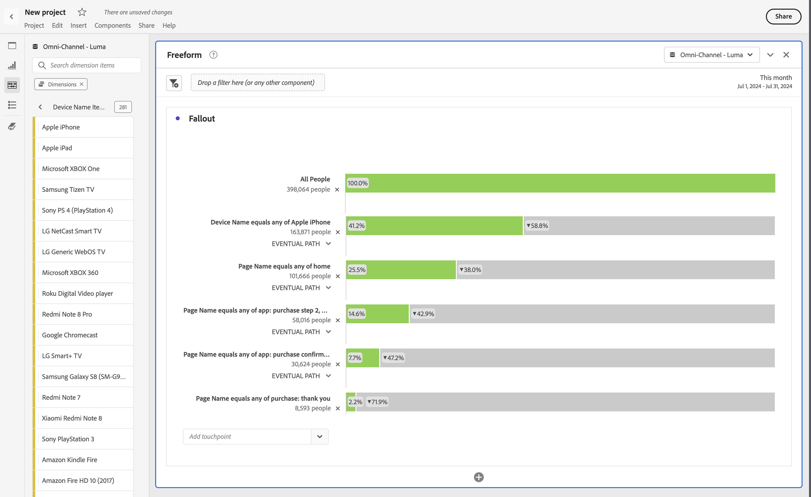
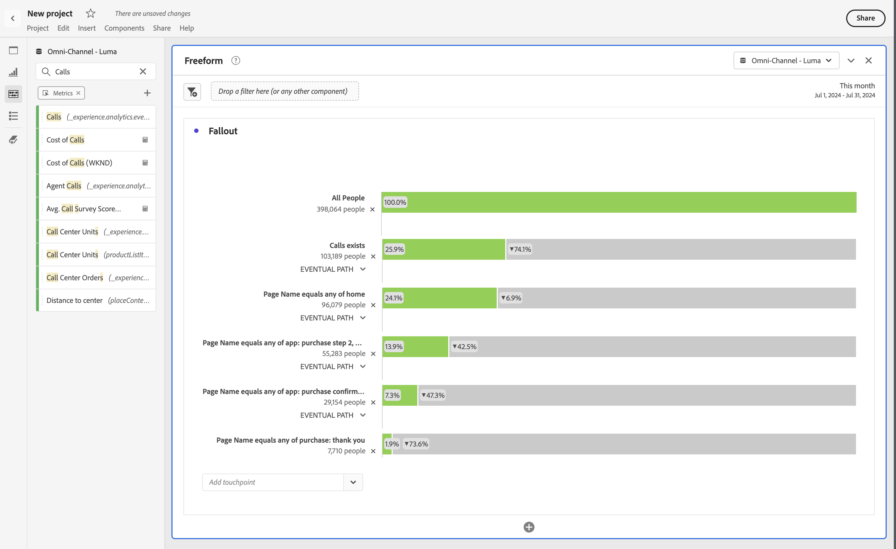
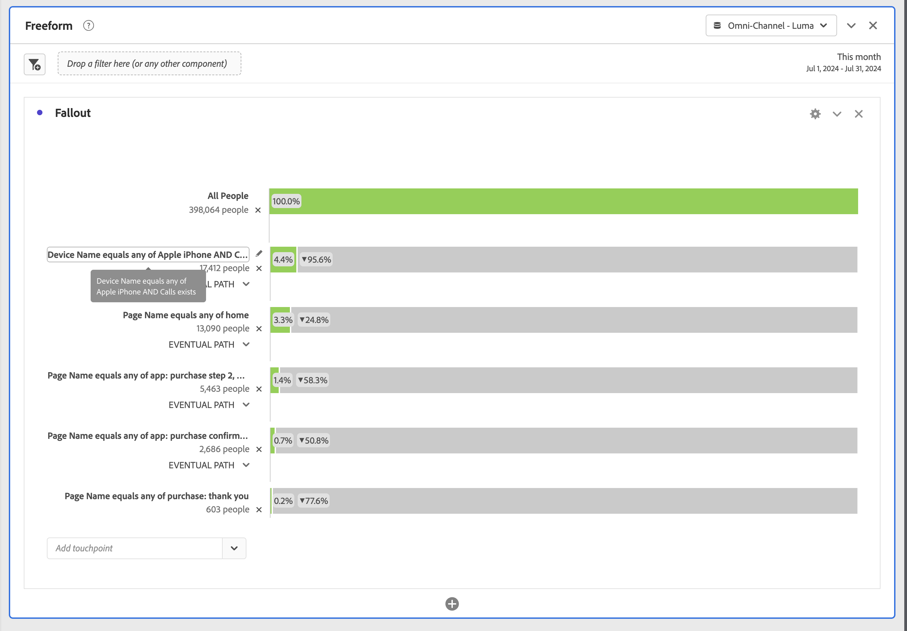

# Inter-dimensional fallout

Fallout in Analysis Workspace lets you mix and match dimensions and metrics as touchpoints in funnels and workflows. Fallouts gives you more flexibility in defining the user steps you want to investigate.

For example, in addition to a Page dimension, you can add other dimension items (like a specific device name from the Device name dimension) to a Fallout visualization. Combining dimensions lets you visualize how pages and certain actions interplay in customers' paths.

For example, in addition to a Page dimension, you can add other dimension items (like a specific device name from the Device name dimension) to a Fallout visualization. Combining dimensions lets you visualize how pages and certain actions interplay in customers' paths.

The fallout gets updated dynamically and lets you see fallout across multiple dimensions.

You can also add metrics. For example, you can add the metric Call to show only paths for users for which calls exist and have contacted the call center:

You can combine dimensions and metrics. Drag another dimension or metric on top of an existing one. For example, to understand the fallout of people that have an iPhone and have contacted the call center.

