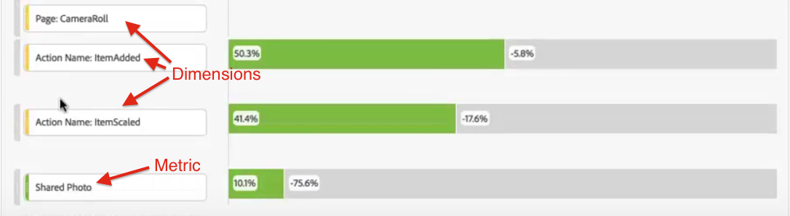

# Multi-dimensional fallout

Fallout in Analysis Workspace lets you to mix and match dimensions and metrics as touchpoints in funnels and workflows. This gives you more flexibility in defining the user steps you want to investigate.

Here is a video on the subject:

>[!VIDEO](https://video.tv.adobe.com/v/24043/?quality=12)

**Example**: In addition to, say, a Page dimension, you can add action-based dimension items to a Fallout visualization. This lets you visualize how pages and certain actions interplay in customers' paths.

The fallout gets updated dynamically and lets you see fallout across multiple dimensions.

You can also add metrics to this mix. In this example, we have added the metric "Shared Photo" to flesh out the path that customers took:

In addition, you can combine different dimensions and metrics into AND checkpoints. Just drag another dimension or metric on top of an existing one:

