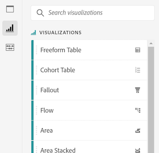
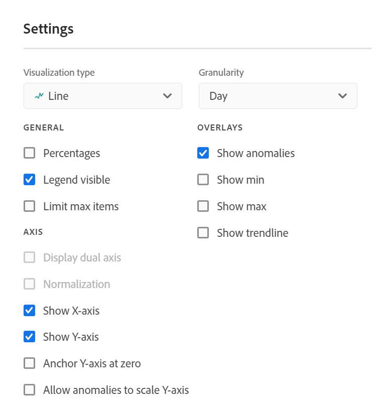
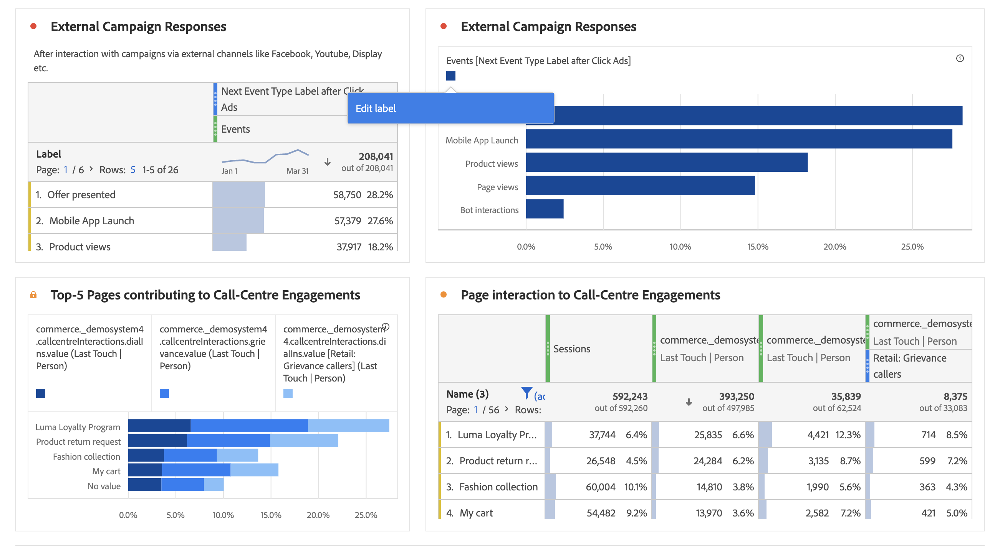
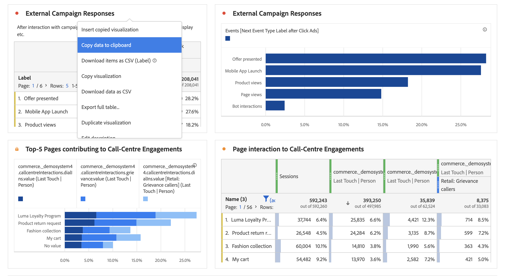

# Visualizations overview

Workspace offers a number of visualizations that let you generate visual representations of your data, such as bar charts, donut charts, histograms, line charts, maps, scatterplots, and others. Most visualization types will be familiar to you if you use Adobe Analytics. However, Analysis Workspace provides visualization settings and many new or unique visualizations types with interactive capabilities.

You can access visualizations from the top left icon in Workspace, a [blank panel](https://experienceleague.adobe.com/docs/analytics/analyze/analysis-workspace/panels/blank-panel.html), or through the right-click menu in your workflow. 

The following visualization types are available in Analysis Workspace:

| Visualization name | Description |
| --- | --- |
| [Area](/help/analyze/analysis-workspace/visualizations/area.md) | Like a line graph, but with a colored area below the line. Use an area graph when you have multiple metrics and want to visualize the area expressed by the intersection of two or more metrics. |
| [Bar](/help/analyze/analysis-workspace/visualizations/bar.md) | Shows vertical bars representing various values across one or more metrics. |
| [Bullet graph](/help/analyze/analysis-workspace/visualizations/bullet-graph.md) | Shows how a value you are interested in compares to or measures against other performance ranges (goals). |
| [Cohort table](/help/analyze/analysis-workspace/visualizations/cohort-table/cohort-analysis.md) | A *`cohort`* is a group of people sharing common characteristics over a specified period. Cohort Analysis is useful for retention, churn or latency analysis. |
| [Donut](/help/analyze/analysis-workspace/visualizations/donut.md) | Similar to a pie chart, this visualization shows data as parts or segments of a whole. |
| [Fallout](/help/analyze/analysis-workspace/visualizations/fallout/fallout-flow.md) | Fallout reports show where visitors left (fell out) and continued through (fell through) a predefined sequence of pages. Can be set to eventual or exact sequences |
| [Flow](/help/analyze/analysis-workspace/visualizations/c-flow/flow.md) | Shows exact customer paths through your websites and apps. |
| [Freeform table](/help/analyze/analysis-workspace/visualizations/freeform-table/freeform-table.md) | A Freeform table is not merely a data table, but also an interactive visualization. It is the foundation for data analysis in Workspace.|
| [Histogram](/help/analyze/analysis-workspace/visualizations/histogram.md) | A histogram buckets visitors, visits or hits into buckets based on a metric volume. |
| [Horizontal bar](/help/analyze/analysis-workspace/visualizations/horizontal-bar.md) | Shows horizontal bars representing various values across one or more metrics. |
| [Line](/help/analyze/analysis-workspace/visualizations/line.md) | Represents metrics using a line in order to show how values change over a period of time. A line chart uses time along the x-axis. |
| [Map](/help/analyze/analysis-workspace/visualizations/map-visualization.md) | Lets you build a visual map of any metric (including calculated metrics). |
| [Scatterplot](/help/analyze/analysis-workspace/visualizations/scatterplot.md) | Shows the relationship between dimension items and up to three metrics. |
| [Summary number](/help/analyze/analysis-workspace/visualizations/summary-number-change.md) | Shows the selected cell as 1 large number. |
| [Summary change](/help/analyze/analysis-workspace/visualizations/summary-number-change.md) | Shows the change between the selected cells as 1 large number/percent. |
| [Text](/help/analyze/analysis-workspace/visualizations/text.md) | Lets you add user-defined text to your Workspace. Helpful for adding additional context to your analysis and insights, in addition to leveraging panel/visualization descriptions |
| [Treemap](/help/analyze/analysis-workspace/visualizations/treemap.md) | Displays hierarchical (tree-structured) data as a set of nested rectangles. |
| [Venn](/help/analyze/analysis-workspace/visualizations/venn.md) | Uses circles to depict the metric overlap of up to 3 segments. |

## Customize visualization settings

You can customize visualization settings for an individual visualization, or for all visualizations that you create. 

### Customize visualization settings for a single visualization

To access [!UICONTROL Visualization Settings] for an individual visualization:

1. In Analysis Workspace, hover over the visualization whose settings you want to customize.

1. Click the gear icon.

   Each type of visualization has unique settings that you can customize. For informationa bout available settings, see [Settings](#settings).

### Customize visualization settings for all visualizations you create

YUou can customize settings for all visualizations that you create. For more information, see [User preferences](/help/analyze/analysis-workspace/user-preferences.md).

## Settings {#settings}

| Setting | Description |
| --- | --- |
| Visualization Type | Change the type of visual used to depict the data. |
| Granularity | For trended visualizations, you can change the time granularity (day, week, month, etc.) from this dropdown. This change also applies to the data source table. |
| Percentages | Displays values in percentages. |
| 100% Stacked | This setting on area stacked, bar stacked or horizontal bar stacked visualizations turns the chart into a "100% stacked" visualization. Example:  |
| Legend Visible | Lets you hide the detailed legend text for the Summary Number/Summary Change visualization. |
| Limit Max Items | Lets you limit the number of items that a visualization displays. |
| Anchor Y Axis at Zero | If all the values plotted on the chart are considerably above zero, the chart default will make the bottom of the y-axis NON-ZERO. If you check this box, the y-axis will be forced to zero (and it will re-draw the chart). |
| Normalization | Forces metrics to equal proportions. This is helpful when plotted metrics are of very different magnitudes. |
| Display Dual Axis | Only applies if you have two metrics - you can have a y-axis on the left (for one metric) and on the right (for the other metric). This is helpful when plotted metrics are of very different magnitudes. |
| Show Anomalies | Enhances line graphs and freeform tables by displaying anomaly detection. Anomaly detection in line visualizations includes an expected value (dashed line) and an expected range (shaded band). |

## Legend {#legend}

A visualization legend helps you to relate date in a source table to plotted series in the visualization. The legend is interactive - you can click a legend item to show/hide a series in the visualization. This is helpful if you want to simplify the data being visualized. 

Additionally, you can rename legend labels to help you make visuals more consumable. Note: legend editing does **not** apply to: Treemap, Bullet, Summary Change/Number, Text, Freeform, Histogram, Cohort or Flow visualizations.

To edit a legend label:

1. Right-click one of the legend labels.
1. Click **[!UICONTROL Edit Label]**.

   

1. Enter the new label text.
1. Press **[!UICONTROL Enter]** to save.

## Right-click menu {#right-click}

Additional functionality for a visualziation is available by right-clicking on the visualization header. Settings will vary by visualization. Some of the settings available are:

| Setting | Description |
| --- | --- |
| Insert Copied Panel/Visualization|Lets you paste ("insert") a copied panel or visualization to another place within the project, or into a completely different project. |
| Copy Visualization | Lets you right-click and copy a visualization, so that you can insert it to another place within the project, or into a completely different project. |
| [Download items as CSV](https://experienceleague.adobe.com/docs/analytics/analyze/analysis-workspace/curate-share/download-send.html?#download-items) | Download up to 50,000 dimension items for the selected dimension as a CSV. |
| [Download data as CSV](https://experienceleague.adobe.com/docs/analytics/analyze/analysis-workspace/curate-share/download-send.html?#download-data) | Download visualization data source as a CSV. |
| Duplicate Visualization | Makes an exact duplicate of the current visualization, which you can then modify. |
| Edit Description | Add (or edit) a text description for the visualization. |
| Get Visualization Link | Lets you direct someone to a specific visualization within a project. When the link is clicked, the recipient will be required to login before being directed to the exact visualization linked to. |
| Start Over | (Works for Flow, Venn, Histogram) Deletes the configuration for the current visualization so you can re-configure it from scratch. |

## Create Visual icon {#quick-viz}

If you are not sure which visualization to pick, click the **[!UICONTROL Create Visual]** icon in any table row (available on hover). This the the fastest way to add a visualization. Clicking it prompts Analysis Workspace to take an educated guess at which visualization would best fit your data. For example, if you have 1 row selected, it will create a trended line graph. If you have 3 segment rows selected, it will create a Venn diagram. 

## Change the scale axis on visualizations

Here is a video overview:

>[!VIDEO](https://video.tv.adobe.com/v/24708/?quality=12)
