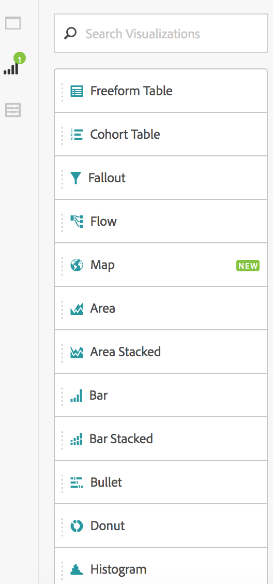
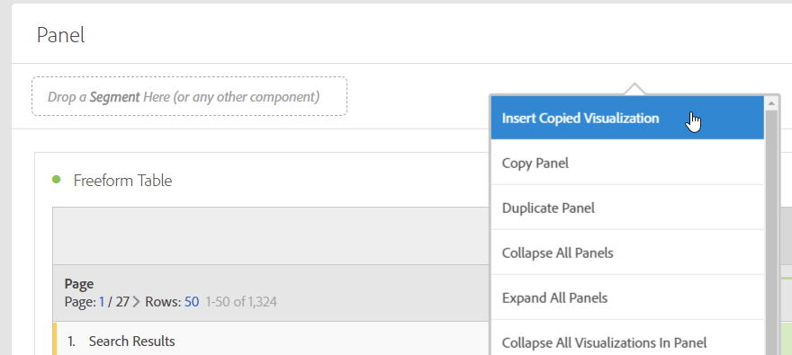

# Visualizations overview

Workspace offers a number of visualizations that let you generate visual representations of your data, such as bar charts, donut charts, histograms, line charts, maps, scatterplots, and others. Each visualization has its own settings that you can manage. Click the name of the visualization for more detailed information.

Video tutorial: [Visualization Types in Analysis Workspace](https://docs.adobe.com/content/help/en/analytics-learn/tutorials/analysis-workspace/visualizations/visualization-types.html) (2:57)

|Visualization name| Description|
|---|---|
|[Area](/help/analyze/analysis-workspace/visualizations/area.md)|like a line graph, but with a colored area below the line. Use an area graph when you have multiple metrics and want to visualize the area expressed by the intersection of two or more metrics.|
|[Bar](/help/analyze/analysis-workspace/visualizations/bar.md)|Shows vertical bars representing various values across one or more metrics.|
|[Bullet graph](/help/analyze/analysis-workspace/visualizations/bullet-graph.md)|Shows how a value you are interested in compares to or measures against other performance ranges (goals).|
|[Cohort table](/help/analyze/analysis-workspace/visualizations/cohort-table/cohort-analysis.md)|A *`cohort`* is a group of people sharing common characteristics over a specified period. Cohort Analysis is useful, for example, when you want to learn how a cohort engages with a brand. You can easily spot changes in trends, then respond accordingly.|
|[Donut](/help/analyze/analysis-workspace/visualizations/donut.md)|Similar to a pie chart, this visualization shows data as parts or segments of a whole.|
|[Fallout](/help/analyze/analysis-workspace/visualizations/fallout/fallout-flow.md)|Fallout reports show where visitors left (fell out) and continued through (fell through) a predefined sequence of pages.|
|[Flow](/help/analyze/analysis-workspace/visualizations/c-flow/flow.md)|Shows customer paths through your websites and apps.|
|[Freeform table](/help/analyze/analysis-workspace/visualizations/freeform-table/freeform-table.md)|A Freeform table is not merely a data table, but also an interactive visualization.|
|[Histogram](/help/analyze/analysis-workspace/visualizations/histogram.md)|A histogram is similar to a bar chart, but it groups numbers into ranges (buckets).|
|[Horizontal bar](/help/analyze/analysis-workspace/visualizations/horizontal-bar.md)|Shows horizontal bars representing various values across one or more metrics.|
|[Line](/help/analyze/analysis-workspace/visualizations/line.md)|Represents metrics using a line in order to show how values change over a period of time. A line chart can be used only when time is used as a dimension.|
|[Map](/help/analyze/analysis-workspace/visualizations/map-visualization.md)|Lets you build a visual map of any metric (including calculated metrics).|
|[Scatterplot](/help/analyze/analysis-workspace/visualizations/scatterplot.md)|Shows the relationship between dimension items and up to three metrics.|
|[Summary number](/help/analyze/analysis-workspace/visualizations/summary-number-change.md)|Depending on which cell is selected, this visualization shows totals and summaries. |
|[Summary change](/help/analyze/analysis-workspace/visualizations/summary-number-change.md)|Depending on which cells are selected, this visualization compares cells to each other.|
|[Text](/help/analyze/analysis-workspace/visualizations/text.md)|Lets you add user-defined text to your Workspace.|
|[Treemap](/help/analyze/analysis-workspace/visualizations/treemap.md)|Displays hierarchical (tree-structured) data as a set of nested rectangles.|
|[Venn](/help/analyze/analysis-workspace/visualizations/venn.md)|Lets you drag in up to 3 segments (from Components) and one metric to build a Venn diagram.|

## Visualizations panel {#section_DC07F032FBEF4046A40F7B95C28DA018}

To display the Visualizations panel, click **[!UICONTROL Visualizations]** in the side panel.

Most visualization types (such as Area, Bar, Donut, and Line charts) will be familiar to you if you use Adobe Analytics. However, Analysis Workspace provides visualization settings and many new or unique visualizations types with interactive capabilities.

## Visualization settings {#section_D3BB5042A92245D8BF6BCF072C66624B}

To access [!UICONTROL Visualization Settings], drag a visualization to the [!UICONTROL Freeform Panel], then click the [!UICONTROL Visualization Settings] gear icon.

>[!IMPORTANT]
>
>Which visualization settings are visible depends on the visualization. Not all settings apply to all visualizations. In addition, some advanced settings appear **only** for specific visualizations, such as the [Histogram settings](/help/analyze/analysis-workspace/visualizations/histogram.md#section_09D774C584864D4CA6B5672DC2927477).

| Setting | Description |
|--- |--- |
|Percentages|Displays values in percentages.|
|100% Stacked|This setting on area stacked or bar stacked or horizontal bar stacked visualizations turns the chart into a "100% stacked" visualization. Example: |
|Legend Visible|Lets you hide the filter details text for the Summary Number/Summary Change visualization.|
|Limit Max Items|Lets you limit the number of items that a visualization displays.|
|Anchor Y Axis at Zero|If all the values plotted on the chart are considerably above zero, the chart default will make the bottom of the y-axis NON-ZERO. If you check this box, the y-axis will be forced to zero (and it will re-draw the chart).|
|Normalization|Forces metrics to equal proportions.|
|Display Dual Axis|Only applies if you have two metrics - you can have a y-axis on the left (for one metric) and on the right (for the other metric).|
|Show Anomalies|Enhances line graphs and freeform tables to display data anomalies.|

## Create Visual icon {#section_9C11D9DEDC42413AA53E69A71A509DFC}

If you are not sure which visualization to pick, click the **[!UICONTROL Create Visual]** icon in any table row. This icon will appear when you hover over the table row. Clicking it prompts Analysis Workspace to take an educated guess at which visualization would best fit your data. For example, if you have up to 3 segments selected, it will create a Venn diagram. For more than 3 segments, it will create a bar chart. For other types of data, it might create a line graph, etc.

## Right-click visualization/panel menu {#section_05B7914D4C9E443F97E2BFFDEC70240C}

Settings that are contextual to a graph can be accessed when right-clicking next to a visualization or panel header. Some or all of the following settings will be available:

| Setting | Description |
|--- |--- |
|Insert Copied Visualization/Panel|Lets you paste ("insert") that copied element into another place within the project, or into a completely different project.|
|Copy Visualization/Panel|Lets you right-click and copy a visualization or panel.|
|Duplicate Visualization/Panel|Makes an exact duplicate of the current visualization, which you can then modify.|
|Collapse all Panels|Collapses all project panels.|
|Collapse all Visualizations in Panel|Collapses all visualizations in this project panel.|
|Expand all Panels|Expands all project panels.|
|Expand all Visualizations in Panel|Expands all visualizations in this project panel.|
|Edit Description|Add (or edit) a text description for the visualization/panel. This description appears in  Project  >  Project Info & Settings .|
|Get Panel Link|Lets you direct someone to a specific panel within a project.|
|Get Visualization Link|Lets you copy and share this link to send others directly to this visualization. Users will be required to log in.|
|Start Over|(Works for Flow, Venn, Histogram) Deletes the configuration for the current visualization and opens a new panel where you can re-configure it.|

## Edit legend labels {#section_94F1988CB4B9434BA1D9C6034062C3DE}

You can rename series names in visualization legends (Fallout, Area, Area Stacked, Bar, Bar Stacked, Donut, Histogram, Horizontal Bar, Horizontal Bar Stacked, Line, Scatter, and Venn) to help you make visuals more consumable.

Legend editing does **not** apply to: Treemap, Bullet, Summary Change or Number, Text, Freeform, Histogram, Cohort or Flow visualizations.

To edit a legend label in a Line chart, for example,

1. Right-click one of the legend labels.
1. Click **[!UICONTROL Edit Label]**.

   

1. Enter the new label text.
1. Press **[!UICONTROL Enter]** to save.

Here is a [link to a video](https://docs.adobe.com/content/help/en/analytics-learn/tutorials/analysis-workspace/visualizations/series-label-editing.html) on this topic.
