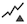
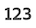
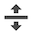
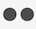
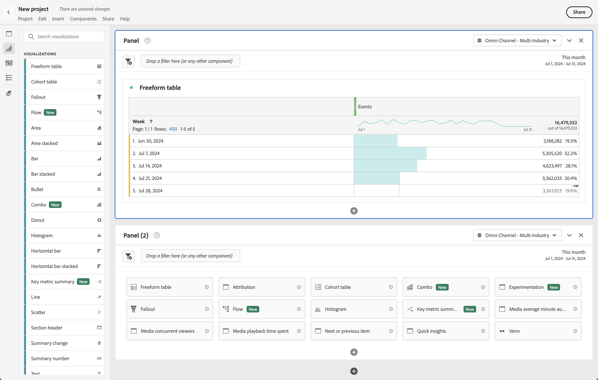
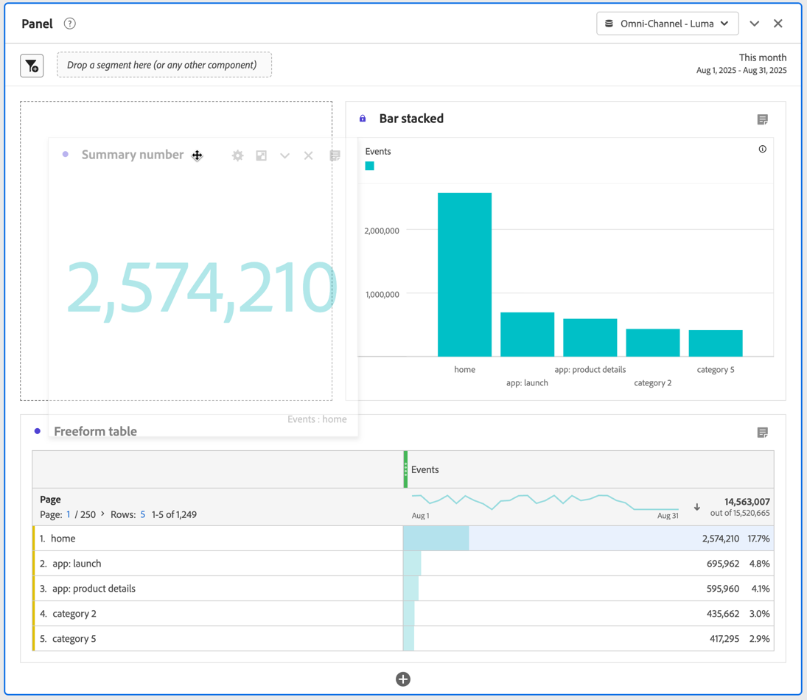
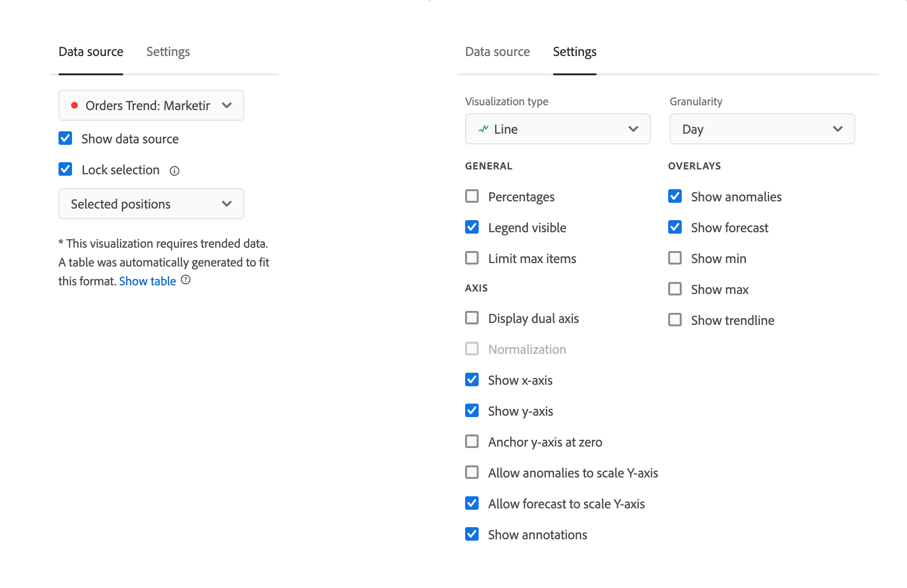

# Visualizations overview

Workspace offers a number of visualizations that let you generate visual representations of your data. Such as bar charts, donut charts, histograms, line charts, maps, scatterplots, and others. 

## Types

The following visualization types are available in Analysis Workspace:

| Icon | Name | Description |
| :---: | --- | ---|
| | [Area](/help/analyze/analysis-workspace/visualizations/area.md)  | An area graph visualization. Like a line graph, but with a colored area below the line. Use an area graph when you have multiple metrics and want to visualize the area expressed by the intersection of two or more metrics. |
| | [Bar](/help/analyze/analysis-workspace/visualizations/bar.md)  | A bar graph visualization with vertical bars representing various values across one or more metrics. |
| | [Bar stacked](/help/analyze/analysis-workspace/visualizations/bar.md)  | A stacked bar graph visualization with vertical bars representing various values across one or more metrics. |
| 
| [Bullet](/help/analyze/analysis-workspace/visualizations/bullet-graph.md)  | A bullet graph visualization, which shows how a value you are interested in compares to or measures against other performance ranges (goals). |
| | [Cohort table](/help/analyze/analysis-workspace/visualizations/cohort-table/cohort-analysis.md) | A cohort visualization is a group of people sharing common characteristics over a specified period. A cohort table is useful for retention, churn or latency analysis. |
|  | [Combo](combo-charts.md) | A combo chart enables you to build quickly a comparison visualization without having to build a table first.  |
|  | [Donut](/help/analyze/analysis-workspace/visualizations/donut.md)  | Similar to a pie chart, a donut visualization shows data as parts or segments of a whole. |
|  |  [Fallout](/help/analyze/analysis-workspace/visualizations/fallout/fallout-flow.md) | A fallout visualization shows where persons left (fell out) and continued through (fell through) a predefined sequence of pages. |
|  | [Flow](/help/analyze/analysis-workspace/visualizations/c-flow/flow.md) | A flow visualization shows exact customer paths through your websites and apps. |
| 
 | [Freeform table](/help/analyze/analysis-workspace/visualizations/freeform-table/freeform-table.md) | A freeform table visualization is an interactive visualization. The freeform table visualization is the foundation for data analysis in Workspace.|
|  | [Histogram](/help/analyze/analysis-workspace/visualizations/histogram.md) | A histogram visualization buckets persons, visits or events into buckets based on a metric volume. |
|  | [Horizontal bar](/help/analyze/analysis-workspace/visualizations/horizontal-bar.md)| A horizontal bar visualization shows horizontal bars representing various values across one or more metrics. |
|  | [Horizontal bar stacked](/help/analyze/analysis-workspace/visualizations/horizontal-bar.md)| A stacked horizontal bar visualization shows horizontal bars representing various values across one or more metrics. |
|  | [Key metric summary](/help/analyze/analysis-workspace/visualizations/key-metric.md) | A Key metrics summary visualization combines the line, summary change, and summary number visualizations. |
|  | [Line](/help/analyze/analysis-workspace/visualizations/line.md)| A line visualization represents metrics using a line to show how values change over a period of time. A line chart uses time along the x-axis. |
|  | [Map](/help/analyze/analysis-workspace/visualizations/map-visualization.md) | Lets you build a visual map of any metric (including calculated metrics) |
|  | [Scatter](/help/analyze/analysis-workspace/visualizations/scatterplot.md)  | A scatterplot visualization shows the relationship between dimension items and up to three metrics. |
|   | [Section header](section-header.md) | To identify and articulate sections within a panel. |
|   | [Summary change](/help/analyze/analysis-workspace/visualizations/summary-number-change.md)| A summary change visualization shows the change between the selected cells as one large number or percentage. |
| 
 |[Summary number](/help/analyze/analysis-workspace/visualizations/summary-number-change.md) | A summary number visualization shows the selected cell as one large number. |
|  | [Text](/help/analyze/analysis-workspace/visualizations/text.md) | A text visualization lets you add user-defined text to your Workspace. Helpful for adding additional context to your analysis and insights, in addition to leveraging panel/visualization descriptions |
|  | [Treemap](/help/analyze/analysis-workspace/visualizations/treemap.md)
 | A treemap visualization displays hierarchical (tree-structured) data as a set of nested rectangles. |
|  | [Venn](/help/analyze/analysis-workspace/visualizations/venn.md) | A venn visualization uses circles to depict the metric overlap of up to 3 segments. |

<!--

| Name| Icon | Description |
| --- |:---: | ---|
| [Area](/help/analyze/analysis-workspace/visualizations/area.md)|
 | Like a line graph, but with a colored area below the line. Use an area graph when you have multiple metrics and want to visualize the area expressed by the intersection of two or more metrics. |
| [Bar](/help/analyze/analysis-workspace/visualizations/bar.md)|
 | Shows vertical bars representing various values across one or more metrics. |
| [Bullet graph](/help/analyze/analysis-workspace/visualizations/bullet-graph.md)|
 | Shows how a value you are interested in compares to or measures against other performance ranges (goals). |
| [Cohort table](/help/analyze/analysis-workspace/visualizations/cohort-table/cohort-analysis.md)|
 | A *`cohort`* is a group of people sharing common characteristics over a specified period. Cohort Analysis is useful for retention, churn or latency analysis. |
| [Donut](/help/analyze/analysis-workspace/visualizations/donut.md) | 
 | Similar to a pie chart, this visualization shows data as parts or segments of a whole. |
| [Fallout](/help/analyze/analysis-workspace/visualizations/fallout/fallout-flow.md) | 
 | Fallout reports show where visitors left (fell out) and continued through (fell through) a predefined sequence of pages. Can be set to eventual or exact sequences |
| [Flow](/help/analyze/analysis-workspace/visualizations/c-flow/flow.md) | 
 | Shows exact customer paths through your websites and apps. |
| [Freeform table](/help/analyze/analysis-workspace/visualizations/freeform-table/freeform-table.md) | 
 | A Freeform table is not merely a data table, but also an interactive visualization. It is the foundation for data analysis in Workspace.|
| [Histogram](/help/analyze/analysis-workspace/visualizations/histogram.md) | 
 | A histogram buckets visitors, visits or hits into buckets based on a metric volume. |
| [Horizontal bar](/help/analyze/analysis-workspace/visualizations/horizontal-bar.md) | 
 | Shows horizontal bars representing various values across one or more metrics. |
| [Key metric summary](/help/analyze/analysis-workspace/visualizations/key-metric.md) | 
 | Shows how a metric is trending within a single timeframe, or lets you compare metric performance across two timeframes. |
| [Line](/help/analyze/analysis-workspace/visualizations/line.md) | 
 | Represents metrics using a line in order to show how values change over a period of time. A line chart uses time along the x-axis. |
| [Map](/help/analyze/analysis-workspace/visualizations/map-visualization.md) | 
 | Lets you build a visual map of any metric (including calculated metrics). |
| [Scatterplot](/help/analyze/analysis-workspace/visualizations/scatterplot.md) | 
 | Shows the relationship between dimension items and up to three metrics. |
| [Summary number](/help/analyze/analysis-workspace/visualizations/summary-number-change.md) | 
 | Shows the selected cell as 1 large number. |
| [Summary change](/help/analyze/analysis-workspace/visualizations/summary-number-change.md) | 
 | Shows the change between the selected cells as 1 large number/percent. |
| [Text](/help/analyze/analysis-workspace/visualizations/text.md) | 
 | Lets you add user-defined text to your Workspace. Helpful for adding additional context to your analysis and insights, in addition to leveraging panel/visualization descriptions |
| [Treemap](/help/analyze/analysis-workspace/visualizations/treemap.md) | 
 | Displays hierarchical (tree-structured) data as a set of nested rectangles. |
| [Venn](/help/analyze/analysis-workspace/visualizations/venn.md) | 
 | Uses circles to depict the metric overlap of up to 3 segments. |

-->

## Add visualizations to a panel

1. Open the Analysis Workspace project where you want to add a visualization.

1. Use any of the following methods to add the visualization:

   

   * In the left panel, select  **Visualizations**, then drag a visualization to the panel where you want to add the visualization to. 

   * On the panel where you want to add the visualization, select , then choose the icon that represents the visualization that you want to add. Hover over the icon for each visualization to see the name.

   * Add a [blank panel](/help/analyze/analysis-workspace/c-panels/blank-panel.md), then select the visualization that you want to add.

   * From the context menu of an existing visualization in your Analysis Workspace project, select **[!UICONTROL Duplicate visualization]** or **[!UICONTROL Copy visualization]**.

   * Use the Workspace **[!UICONTROL Insert]** menu to insert a visualization.

   * From the context menu in a Freeform table, select **[!UICONTROL Visualize]**. Then select the visualization from the submenu. Based on the current selection in the table, Workspace determines which visualization to offer and interprets the data to build the requested visualization.

When you add a simple visualization, for example a [Line](line.md) of [Bar](bar.md) visualization, the visualization uses the closest freeform table as the data source. You can always modify the [data source](#data-source) of a your visualizations.

## Manage visualizations

You can manage a visualization when you hover over the visualization or select the visualization.

* To collapse a visualization, select .
* To reveal a collapsed visualization, select .
* To delete a visualization, select . To undo, select **[!UICONTROL Edit]** > **[!UICONTROL Undo]** (**[!UICONTROL *cmd+z*]** | **[!UICONTROL *ctrl+z*]**).
* To return a visualization to the default height, select .
* To move a visualization within a panel, drag and drop the visualization whenever a  is visible (ususally when you hover over the header).

## Legend

A visualization legend helps you to relate date in a source table to plotted series in the visualization. The legend is interactive - you can select a legend item to show/hide a series in the visualization, which is helpful if you want to simplify the data being visualized. 

Additionally, you can rename legend labels to help you make visuals more consumable. Note: legend editing does **not** apply to: Treemap, Bullet, Summary Change/Number, Text, Freeform, Histogram, Cohort or Flow visualizations.

To edit a legend label:

1. Right-click one of the legend labels.
1. Click **[!UICONTROL Edit Label]**.

   

1. Enter the new label text.
1. Press **[!UICONTROL Enter]** to save.

## Settings

Each visualization has its own settings. To access visualization settings, select  **[!UICONTROL Settings]** in the visualization header to show a popup.

Depending on the visualization, you can configure

* details for the source of data of the visualization through the [**[!UICONTROL Data source]**](#data-source) tab, and
* settings for the visualization through the [**[!UICONTROL Settings]**](#settings-1) tab. 

### Data source

You can control which data source and items or positions within that data source correspond to a visualization. See [Manage data sources](t-sync-visualization.md) for more information. 

### Settings

Which visualization settings are available depends on the visualization. The table below summarizes the most common settings. Some visualizations do have specific settings. See the individual visualization documentation for more details.

| Option | Description |
| --- | --- |
| **[!UICONTROL Visualization type]** | Change the type of visualization used to visualize the data. |
| **[!UICONTROL Granularity]** | Change the time granularity for trended visualizations. This change also applies to the data source table. |
| **[!UICONTROL Percentages]** | Display values in percentages. |
| **[!UICONTROL 100% stacked]** | Turn the chart into a 100% stacked visualization.  Only applicable for an area, bar and horizontal bar stacked visualization. |
| **[!UICONTROL Legend visible]** | Show the legend text. |
| **[!UICONTROL Limit max items]** | Limit the number of items that a visualization displays. When selected, define the number of max items. |
| **[!UICONTROL Show annotations]** | Show the annotations made for this visualization. |
| **[!UICONTROL Hide title]** | Hide the title of the visualization. |
| **[!UICONTROL Anchor y-axis at zero]** | Force the bottom of the y-axis to zero. If all the values plotted on the chart are considerably above zero, the chart default makes the bottom of the y-axis non-zero. If you enable this option, the y-axis is forced to zero (and the chart is redrawn). |
| **[!UICONTROL Display dual axis]** | Display left and right y-axes for two different metrics. This option only applies if you have two metrics. Dual axes are helpful when plotted metrics are of different magnitudes. |
| **[!UICONTROL Show x-axis]** | Show the x-axis in the visualization. |
| **[!UICONTROL Show y-axis]** | Show the y-axis in the visualization. |
| **[!UICONTROL Show barbells on lines]** | Show barbells on the line visualization in a combo chart visualization. |
| **[!UICONTROL Normalization]** | Force metrics to equal proportions. Equal proportions are helpful when plotted metrics are of different magnitudes. |
| **[!UICONTROL Show anomalies]** | Enhance line graphs and freeform tables by displaying anomaly detection. Anomaly detection in line visualizations includes an expected value (dashed line) and an expected range (shaded band). |
| **[!UICONTROL Show forecast]** | Enhance line graphs and freeform tables by displaying forecast values. |
| **[!UICONTROL Show min]** | Show the minimal value in the visualization. |
| **[!UICONTROL Show max]** | Show the maximal value in the visualization. |
| **[!UICONTROL Show trendline]** | Show a trendline in the visualization. When selected, you can select the type of trendline from the drop-down menu. |

You can customize the settings for all visualizations that you create. For more information, see [User preferences](/help/analyze/analysis-workspace/user-preferences.md).

## Context menu {#right-click}

Use the context menu (available through alternate select, for example, right-click when using a mouse) on a visualization header to access additional functionality for a visualization. Not all options are available for all visualizations.

| Option | Description |
| --- | --- |
| **[!UICONTROL Insert copied visualization]**| Paste (insert) a copied visualization to another place within the project, or into a completely different project. |
| **[!UICONTROL Copy data to clipboard]** | [Copy data](/help/analyze/analysis-workspace/curate-share/download-send.md#copy-to-clipboard) from the visualization onto the clipboard. |
| **[!UICONTROL Copy selection to clipboard]** | [Copy the selection](/help/analyze/analysis-workspace/curate-share/download-send.md#copy-to-clipboard) from the visualizaion onto the clipboard. |
| **[!UICONTROL Download items as CSV (*dimension name*)]** | [Download the dimension items](/help/analyze/analysis-workspace/curate-share/download-send.md#download-items-as-csv) (to a maximum of 50,000) of the visualization to your local device. A maximum of 50,000 dimension items for the selected dimension. |
| **[!UICONTROL Copy visualization]** | Copy the visualization, so that you can insert the visualization to another place within the project, or into a completely different project. |
| **[!UICONTROL Download data CSV]** | [Download the displayed data](/help/analyze/analysis-workspace/curate-share/download-send.md#download-as-csv) of the visualization to your local device. |
| **[!UICONTROL Duplicate visualization]** | Make an exact duplicate of the visualization. |
| **[!UICONTROL Edit description]** | Add (or edit) a text description for the visualization. See [Text](text.md). |
| **[!UICONTROL Get visualization link]** | Copy and share a link directly to the visualization. A Share link dialog displays the link. Select Copy to copy the link to your clipboard. |
| **[!UICONTROL Start over]** | Delete the configuration for the current visualization so you can re-configure it from scratch. |

## Configuration

Some visualizations (like Cohort table, Fallout, Flow, and others) have a configuration dialog to assist you in building the visualization. Use  at the top of the visualization to access and change the configuration.

## Visualize

If you are not sure which visualization to pick, select  **[!UICONTROL Visualize]** in any freeform table row (available on hover). This selection is the fastest way to add a visualization. Analysis Workspace takes an educated guess at which visualization would best fit your data. For example, if you have one row selected, it creates a trended [line graph](line.md). If you have three filter rows selected, it creates a [venn](venn.md) diagram. 

<!--
## Settings {#settings}

| Setting | Description |
| --- | --- |
| Visualization Type | Change the type of visual used to depict the data. |
| Granularity | For trended visualizations, you can change the time granularity (day, week, month, etc.) from this drop-down list. This change also applies to the data source table. |
| Percentages | Displays values in percentages. |
| 100% Stacked | This setting on area stacked, bar stacked or horizontal bar stacked visualizations turns the chart into a "100% stacked" visualization. Example:  |
| Legend Visible | Lets you hide the detailed legend text for the Summary Number/Summary Change visualization. |
| Limit Max Items | Lets you limit the number of items that a visualization displays. |
| Anchor Y Axis at Zero | If all the values plotted on the chart are considerably above zero, the chart default will make the bottom of the y-axis NON-ZERO. If you check this box, the y-axis will be forced to zero (and it will re-draw the chart). |
| Normalization | Forces metrics to equal proportions. This is helpful when plotted metrics are of very different magnitudes. |
| Display Dual Axis | Only applies if you have two metrics - you can have a y-axis on the left (for one metric) and on the right (for the other metric). This is helpful when plotted metrics are of very different magnitudes. |
| Show Anomalies | Enhances line graphs and freeform tables by displaying anomaly detection. Anomaly detection in line visualizations includes an expected value (dashed line) and an expected range (shaded band). |

## Legend {#legend}

A visualization legend helps you to relate date in a source table to plotted series in the visualization. The legend is interactive - you can click a legend item to show/hide a series in the visualization. This is helpful if you want to simplify the data being visualized. 

Additionally, you can rename legend labels to help you make visuals more consumable. Note: legend editing does **not** apply to: Treemap, Bullet, Summary Change/Number, Text, Freeform, Histogram, Cohort or Flow visualizations.

To edit a legend label:

1. Right-click one of the legend labels.
1. Click **[!UICONTROL Edit Label]**.

   

1. Enter the new label text.
1. Press **[!UICONTROL Enter]** to save.

## Right-click menu {#right-click}

Additional functionality for a visualziation is available by right-clicking on the visualization header. Settings will vary by visualization. Some of the settings available are:

| Setting | Description |
| --- | --- |
| Insert Copied Panel/Visualization|Lets you paste ("insert") a copied panel or visualization to another place within the project, or into a completely different project. |
| Copy Visualization | Lets you right-click and copy a visualization, so that you can insert it to another place within the project, or into a completely different project. |
| [Download items as CSV](/help/analyze/analysis-workspace/curate-share/download-send.md#download-items) | Download up to 50,000 dimension items for the selected dimension as a CSV. |
| [Download data as CSV](/help/analyze/analysis-workspace/curate-share/download-send.md#download-data) | Download visualization data source as a CSV. |
| Duplicate Visualization | Makes an exact duplicate of the current visualization, which you can then modify. |
| Edit Description | Add (or edit) a text description for the visualization. |
| Get Visualization Link | Lets you direct someone to a specific visualization within a project. When the link is clicked, the recipient will be required to login before being directed to the exact visualization linked to. |
| Start Over | (Works for Flow, Venn, Histogram) Deletes the configuration for the current visualization so you can re-configure it from scratch. |

## Create Visual icon {#quick-viz}

If you are not sure which visualization to pick, click the **[!UICONTROL Create Visual]** icon in any table row (available on hover). This the the fastest way to add a visualization. Clicking it prompts Analysis Workspace to take an educated guess at which visualization would best fit your data. For example, if you have 1 row selected, it will create a trended line graph. If you have 3 segment rows selected, it will create a Venn diagram. 

## Change the scale axis on visualizations

Here is a video overview:

>[!VIDEO](https://video.tv.adobe.com/v/24708/?quality=12)

-->
