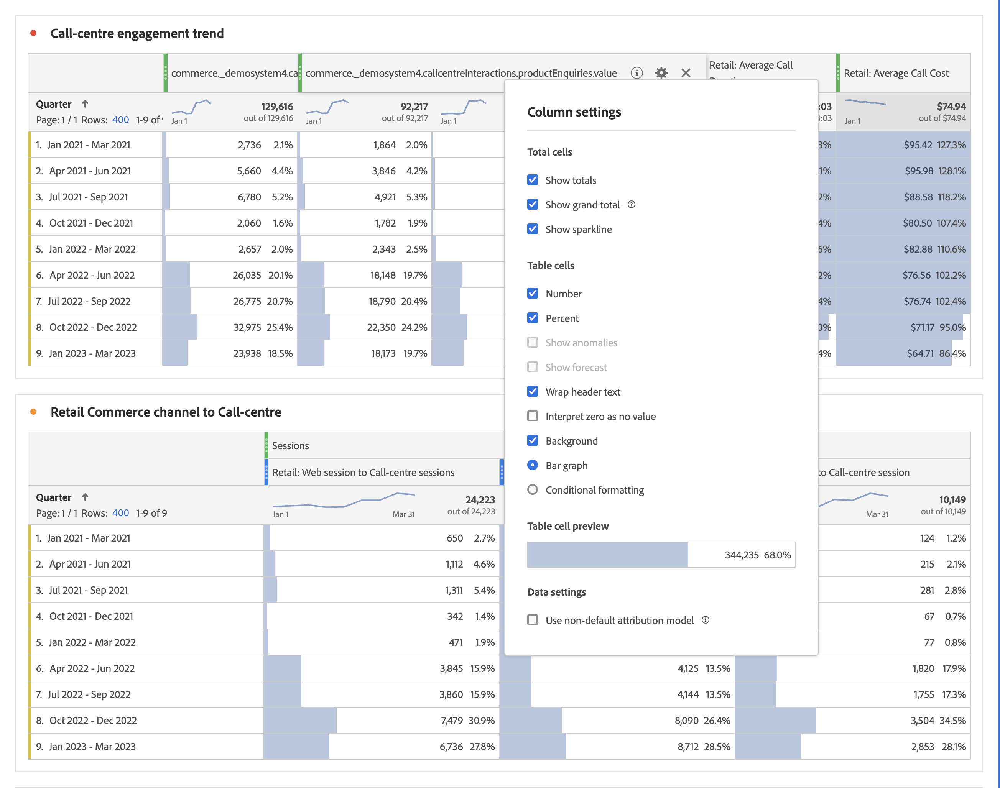

# Column settings

[!UICONTROL Column settings] let you configure column formatting, some of which can be conditional.

>[!BEGINSHADEBOX]

See  [Row and column settings in a Freeform table](https://video.tv.adobe.com/v/40382/?quality=12&learn=on){target="_blank"} for a demo video.

>[!ENDSHADEBOX]

To access [!UICONTROL Column settings], select  in the column heading.

You can edit settings for multiple columns at once. Select multiple columns and select  in any one of the selected columns. Any change that you make applies to all columns with cells selected in them.

| Option | Description |
| --- | --- |
| **[!UICONTROL Show total]** | Show a client-side sum of the column. This total does **not** de-duplicate metrics like sessions or persons. |
| **[!UICONTROL Show grand total]** | Show a server-side sum of the column. The grand total de-duplicates metrics like sessions or persons. |
| **[!UICONTROL Show sparkline]** | Show a line chart at the column header. | 
| **[!UICONTROL Number]** | Determine if a cell shows/hides the numeric value for the metric. For example, if the metric is Page Views, the numeric value is the number of page views for the row item. |
| **[!UICONTROL Percent]** | Determine if a cell shows/hides the percent value for the metric. For example, if the metric is Page Views, the percent value is the number of page views for the row item, divided by the total page views for the column.  Note: Percentages greater than 100% are possible to ensure to be accurate. The upper bound cap can move to 1,000% to prevent columns width become too large. |
| **[!UICONTROL Show anomalies]** | Determine if anomaly detection is run on the values in this column. |
| **[!UICONTROL Show forecast]** | Determine if forecast values are shown in this column. |
| **[!UICONTROL Wrap header text]** | Wrap the header text in Freeform tables to make headers more readable and tables more shareable. Wrapping is useful for PDF rendering and for metrics with long names. Enabled by default. |
| **[!UICONTROL Interpret zero as no value]** | Determine, for cells with a 0 value, whether to show a 0 or a blank cell. This interpretation is useful when you look at data for each day of a month, and some days are in the future.  Instead of showing 0's for future dates, blank cells are shown instead. Charts respect this setting as well (that is, the charts do not show a line or bar with 0 values). |
| **[!UICONTROL Background]** | Determine if a cell shows/hides all cell formatting, including the bar graph and conditional formatting. |
| **[!UICONTROL Bar Graph]** | Show a horizontal bar graph representing the cell's value relative to the total for the column. |
| **[!UICONTROL Conditional Formatting]** | Use conditional formatting. See the [section](#conditional-formatting) below. |
| **[!UICONTROL Table Cell Preview]** | A preview of how each cell appears with the currently selected formatting options applied. |
| **[!UICONTROL Use non-default attribution model]** | Use a non-default attribution model. See the [section](#use-non-default-attribution-model) below. | 

## Conditional formatting {#conditional-formatting}

Conditional formatting applies formatting to upper, midpoint, and lower limits that you can define. Applying conditional formatting within Freeform tables is also automatically enabled on breakdowns, unless [!UICONTROL Custom] limits are selected.

| Conditional formatting options | Description |
| --- | --- |
|**[!UICONTROL  Use percent limits]** | Change the limit range to be based on percentages rather than absolute values. The percentage limit range works for metrics that are solely percentage based (like Bounce Rate) and for metrics that have a count and a percentage (like Page Views). |
| **[!UICONTROL Auto-generated]**| Automatically calculate upper/mid/lower limits based on the data. The upper limit is the largest value in this column. The lower limit is the lowest, and the midpoint is the average of the upper and lower limits. |
| **[!UICONTROL Custom]** | Manually assign **[!UICONTROL Upper limit]**, **[!UICONTROL Midpoint]** and **[!UICONTROL Lower limit]**. Limits provide the flexibility to determine when a column value becomes good, average, or poor. |
| **[!UICONTROL Conditional formatting palette]** | Apply a preconfigured color set to cells. Depending on which of the four available color schemes you select, different colors are assigned to high values, midpoint values, and low values.   Replacing a dimension in the table resets the conditional formatting limits. Replacing a metric recalculates the limits for that column (where a metric is on the X axis and a dimension is on the Y axis). |

## Use non-default attribution model {#use-non-default-attribution-model}

<!-- markdownlint-disable MD034 -->

>[!CONTEXTUALHELP]
>id="workspace_freeformtable_column_usenondefaultattributionmodel"
>title="Use non-default attribution model"
>abstract="Enable a non-default attribution model for the selected columns."

<!-- markdownlint-enable MD034 -->

<!-- markdownlint-disable MD034 -->

>[!CONTEXTUALHELP]
>id="workspace_freeformtable_column_usenondefaultattributionmodel_disabled"
>title="Use non-default attribution model"
>abstract="Non-default attribution mode are unavailable for this metric."

<!-- markdownlint-enable MD034 -->

>[!NOTE]
>
>Consider the following when updating a component's attribution to a non-default attribution model:
>
>* **When using the component in a report with *a single dimension*:** The component's attribution ignores the allocation model when a non-default attribution model is used.
>
>* **When using the component in a report with *multiple dimensions*:** The component's attribution retains the allocation model when a non-default attribution model is used.
>
>

To use a non-default attribution model for a metric in Analysis Workspace:

1. Select **[!UICONTROL Use non-default attribution model]**. When already selected, use **[!UICONTROL Edit]** to edit the attribution model. Or unselect to return to the default attribution model.

   

2. In **[!UICONTROL Column attribution model]**, select a **[!UICONTROL Model]** and a **[!UICONTROL Lookback window]**. The lookback window determines the window of data attribution that is applied for each conversion.

   

### Attribution models

{{attribution-models-details}}

### Container

{{attribution-container}}

### Lookback window

{{attribution-lookback-window}}

### Example

{{attribution-example}}

>[!MORELIKETHIS]
>
>* [Manage data sources](/help/analyze/analysis-workspace/visualizations/t-sync-visualization.md)

>[!BEGINSHADEBOX]

See  [Dynamic columns](https://video.tv.adobe.com/v/23138?quality=12&learn=on){target="_blank"} for a demo video.

>[!ENDSHADEBOX]

