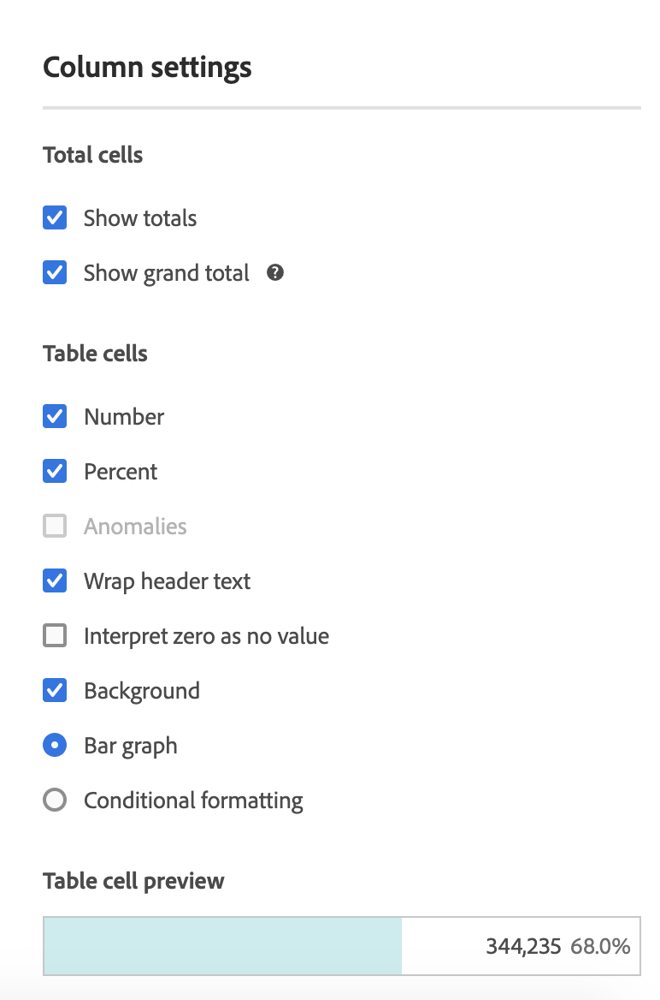
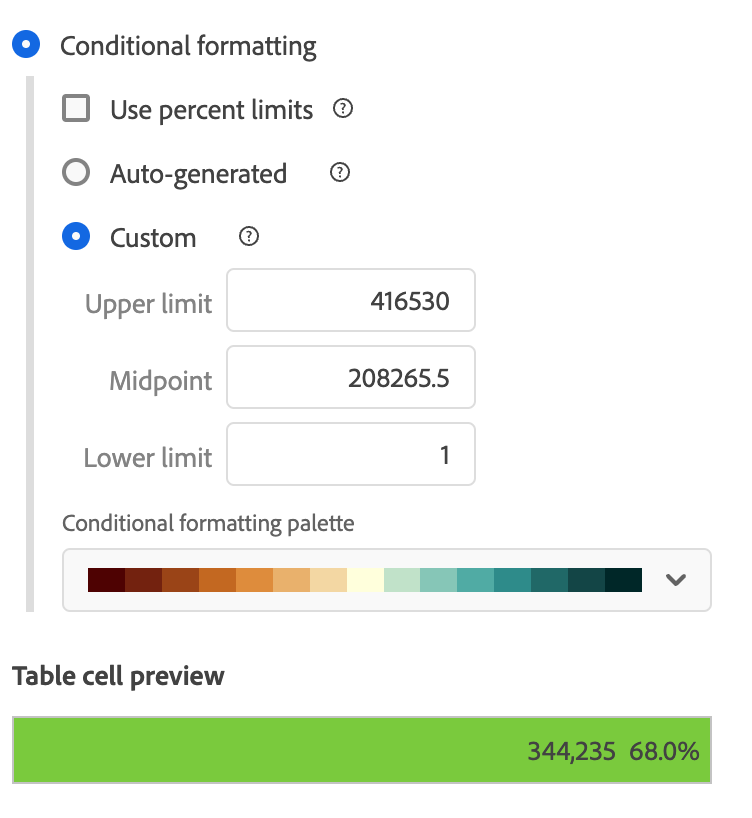
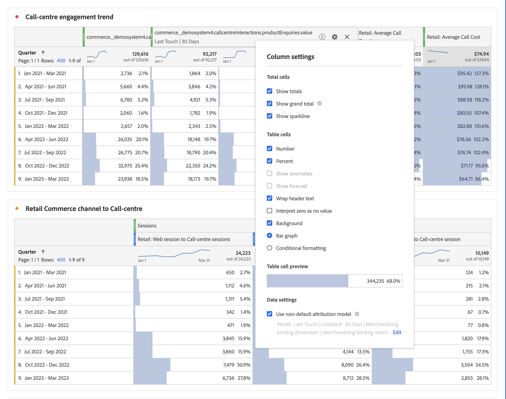
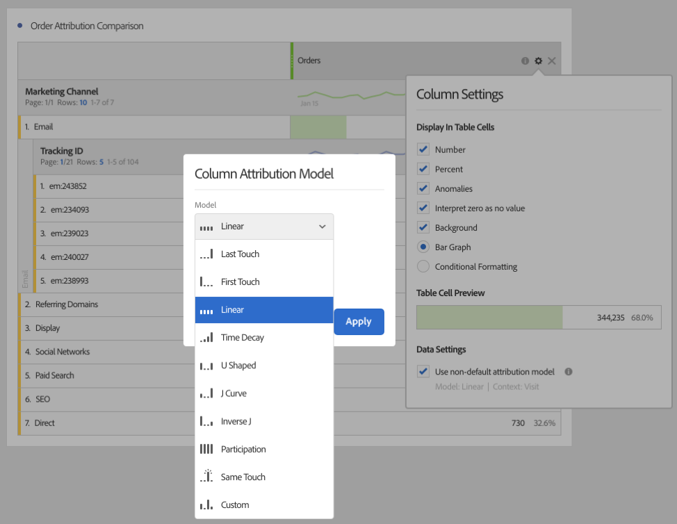

# [!UICONTROL Column Settings]

[!UICONTROL Column Settings] let you configure column formatting, some of which can be conditional.

## Edit [!UICONTROL Column Settings] {#edit-column-settings}

You can edit column settings for an individual column or for multiple columns simultaneously. 

1. In Analysis Workspace, drag a Freeform Table to your project.

1. (Conditional) To edit multiple columns simultaneously, select each column you want to edit while holding the Shift key.

1. Hover over the column you want to edit, then select the gear icon.

   If you selected multiple colums, click the gear icon for any of the selected columns. Any changes you make apply to all selected columns.

   

1. Continue with [Column settings](#column-settings).

## Column settings

You can update the following column settings for individual tables in Analysis Workspace, as described in [Edit Column Settings](#edit-uicontrol-column-settings).

Some of these same settings can also be managed for all new projects that you create in Analysis Workspace, as described in [User preferences](/help/analyze/analysis-workspace/user-preferences.md)

| Element | Description |
| --- | --- |
| **Total cells** |  |
| Show totals | This total is typically equal to or a subset of the [!UICONTROL Grand Total]. It reflects any table filters applied within the freeform table, including the [!UICONTROL Include None] option.  |
| Show grand total | This total represents all hits that have been collected, sometimes referred to as 'report suite total'. When a segment is applied either at the panel level or within the freeform table, this total adjusts to reflect all hits that match the segment criteria. Grand total is not supported for tables or breakdowns with [static rows](/help/analyze/analysis-workspace/visualizations/freeform-table/workspace-totals.md). |
| **Table cells** |   |
| Number | Determines if a cell shows/hides the numeric value for the metric. For example, if the metric is Page Views, the numeric value is the number of page views for the row item. |
| Percent | Determines if a cell shows/hides the percent value for the metric. For example, if the metric is Page Views, the percent value is the number of page views for the row item divided by the total page views for the column.  Note:  We can show percentages greater than 100%, to be more accurate. We are also moving the upper bound cap to 1,000% to ensure columns can grow in widths too large. |
| Anomalies | Determines if anomaly detection is run on the values in this column. For more information, see [View anomalies in Analysis Workspace](/help/analyze/analysis-workspace/virtual-analyst/c-anomaly-detection/view-anomalies.md).|
| Wrap Header Text | Lets you wrap the header text in Freeform tables to make headers more readable and tables more shareable. This is useful for .pdf rendering and for metrics with long names. Enabled by default. |
| Interpret zero as no value | For cells with a 0 value, determines whether to show a 0 or a blank cell. This is useful when you look at data for each day of a month, and some days haven't happened yet.  Instead of showing 0's for future dates, blank cells can be shown instead. Charts respect this setting as well (i.e., they do not showing a line or bar with 0 values when this setting is checked). |
| Background | Determines if a cell shows/hides all cell formatting, including the bar graph and conditional formatting. |
| Bar Graph | Shows a horizontal bar graph representing the cell's value relative to the total for the column. |
| Conditional Formatting | See the section below. |
| Table Cell Preview | Shows a preview of how each cell appears with the currently selected formatting options applied. |

## Conditional formatting {#conditional-formatting}

Conditional formatting applies formatting to upper, midpoint, and lower limits that you can define. Applying conditional formatting (colors, etc) within Freeform tables is also automatically enabled on breakdowns, unless "Custom" limits are selected.

| Element | Description |
| --- | --- |
| Conditional Formatting | Applies the following colors to cells, based on data values: <ul><li>Green: high values</li><li>Yellow: midpoint values</li><li>Red: low values</li></ul>   Replacing a dimension in the table resets the conditional formatting limits. Replacing a metric recalculates the limits for that column (where a metric is on the X axis and a dimension is on the Y axis). |
| Use Percent Limits | Change the limit range to be based on percentages rather than absolute values. This works for metrics that are solely percentage based (like Bounce Rate) as well as for metrics that have a count and a percentage (like Page Views.) |
| Auto-generated | Automatically calculate upper/mid/lower limits based on the data. The upper limit is the largest value in this column. The lower limit is the lowest, and the midpoint is the average of the upper and lower limits. |
| Custom | Manually assign upper/mid/lower limits. This gives you the flexibility to determine when a column value becomes good, average, or poor. |

## Use non-default attribution model {#attribution}

Analysis Workspace supports [attribution](/help/analyze/analysis-workspace/attribution/overview.md) for almost any metric. 

1. Click the Settings (gear) icon in a Freeform Table column.

   

1. Under **[!UICONTROL Data Settings]**, check **[!UICONTROL Use non-default attribution model]**. For more information on different attribution models, see [Attribution models](/help/analyze/analysis-workspace/attribution/models.md).

   

>[!MORELIKETHIS]
>
>* [Manage data sources](/help/analyze/analysis-workspace/visualizations/t-sync-visualization.md)

## Dynamic columns

Here is a video on how to use dynamic columns in Analysis Workspace:

>[!VIDEO](https://video.tv.adobe.com/v/23138/?quality=12)
