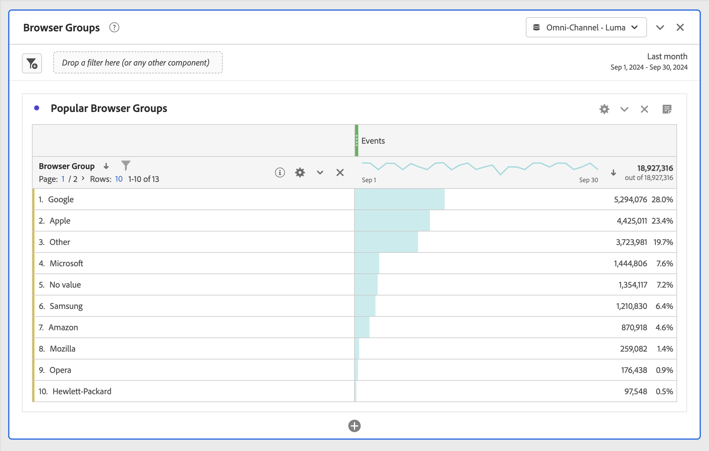
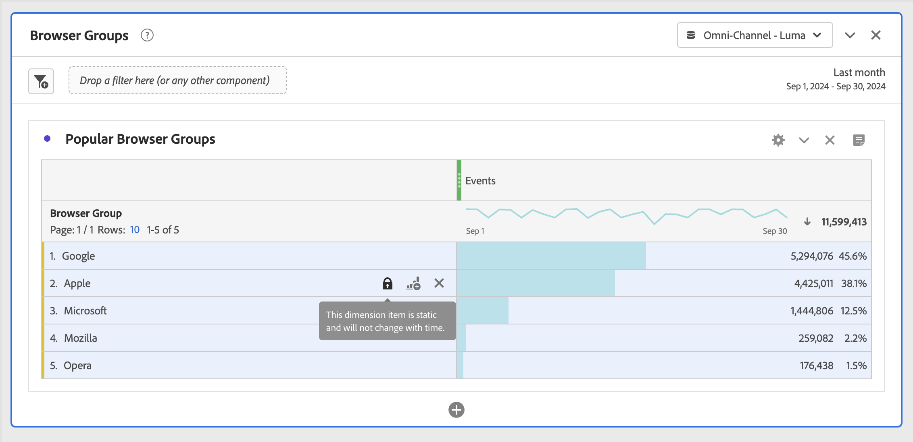
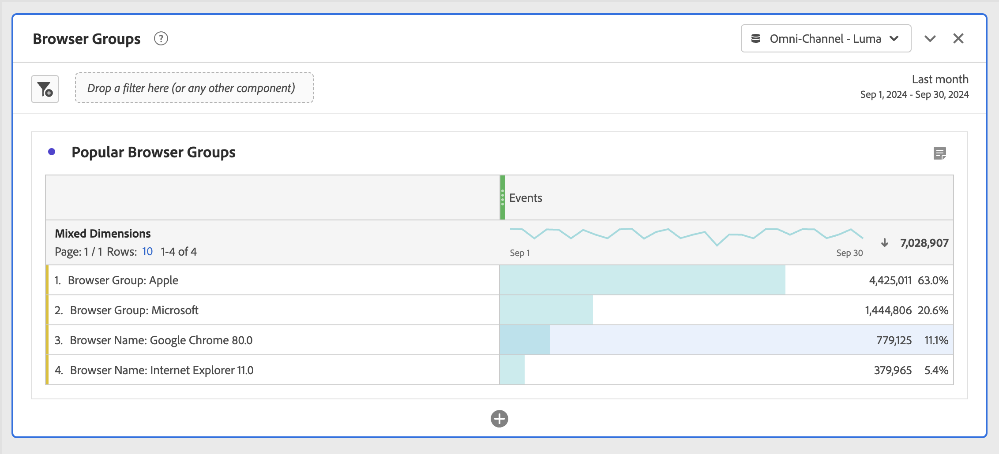

# Dynamic vs static dimension items in freeform tables

In Freeform tables, the rows and columns can contain various component values in them. These values can be dynamic (change with time) or static (do not change with time), depending on the analysis that you want to build.

## Dynamic dimension items

Dynamic dimension items change with time and are dependent on the metric being sorted by in the freeform table. Dynamic dimension items are preferred when you want to analyze the top items for a given time period.

When you drop a dimension into a freeform table, dynamic rows are returned. They represent the top items that correspond to the dimension for a given metric and time period. You can also drop a dimension into freeform table columns and the dimension automatically expands into the top 5 dimension items.

For example, when you drag the Browser Type dimension into the table, the top Browser Type dimension items (e.g. Microsoft, Apple, Google, etc.) dynamically return to the table rows. If dropped into a column, the top 5 Browser Type dimension items dynamically return.

Dynamic dimension items have the row filter option, and do **not** have lock and X icons present.

## Static dimension items

Static dimension items do not change with time; they are fixed components that are always returned in a freeform table. Static dimension items are preferred when you want to always analyze the same item, whether it be specific campaigns or specific days in the week.

Any time you manually select and drop specific component values (dimension, metric, segment, date range) into a table, the result is a static list of rows or columns. Static dimension items can also be created if you choose to:

* From rows, Right-click > [!UICONTROL Display only selected rows]
* From columns, Right-click > [!UICONTROL Make item static]

For example, when you drag over specific Browser Type items such as Microsoft and Apple, those 2 specific items always get pulled into the table. 

Static dimension items do **not** have the row filter option. Instead, lock and X icons are present on each item. Click the X icon to remove that dimension item from the table.

## Mixed dimension items

Dimension items from different dimensions can be added to the same table. The row header say "Mixed Dimensions" in these cases. These dimension items are static. For example, adding specific dimension items from the Browser Type dimension and other dimension items from the Browser dimension.

## Freeform total rows

Dynamic and static rows behave differently in the freeform total row. By default:

* Dynamic rows are summed server-side and de-duplicate metrics such as visits or visitors
* Static rows are summed client-side and do **not** de-duplicate metrics. To calculate the total row server-side, change the Row setting to **Show grand total**. [Learn more](https://experienceleague.adobe.com/docs/ analytics/analyze/analysis-workspace/visualizations/freeform-table/workspace-totals.html)
