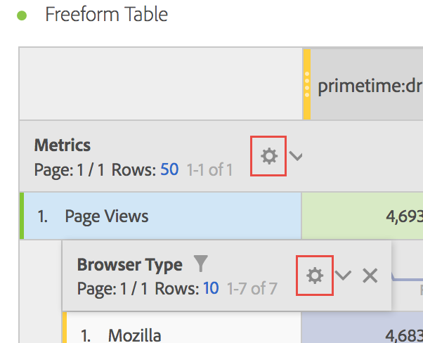

# Row settings

Row settings vary depending on which component you have dragged into the table. To access table row settings, click the Settings icon next to a dimension, segment, metric, time period, or a breakdown within each of these:

| Setting | Description |
|--- |--- |
|Align dates|This is a table-level setting that aligns dates from each column to all start on the same row. Date aligning is enabled by default when a time dimension is used in the rows of the table, and different date ranges are applied in the columns. For example, in a daily table with October and September applied to the columns, the left column starts with October 1 and the right column starts with September 1.|
|Breakdown by position|By default, this setting is disabled and breakdowns are fixed to static row items. For example, let's say you breakdown the top 3 Page dimension items (Homepage, Search Results, Checkout) by Marketing Channel. Then, you leave the project and return two weeks later. Upon opening the project again, the top 3 pages have changed, and now Homepage, Search Results and Checkout are the top 4-6 pages instead. By default, your Marketing Channel breakdowns will still appear under Homepage, Search Results and Checkout, even though they are now in rows 4-6.   In contrast, **Breakdown by position** will always breakdown the top 3 items, regardless of what they are. Referring back to our example, when you re-open your project, the Marketing Channel breakdowns will be tied to the top 3 pages in the table, not Homepage, Search Results and Checkout which are now in rows 4-6.|
|Percentages|**Calculate percentages by column** is the default setting; the percentages visible in a column are calculated based on the column total.  **Calculate percentages by row** forces the Freeform table to calculate the cell percentages across the row as opposed to down the column, with Grand total as the denominator. This is especially useful for trending percentages. This setting is enabled by default when using the Visualize icon.|
|Column Totals|These settings are available only for [static rows](manual-vs-dynamic-rows.md).   **Show as sum of current rows** shows a client-side sum of the rows in the table which means the total will *not* de-duplicate metrics like visits or visitors.   **Show grand total** shows a server-side sum which means the total will de-duplicate metrics.|

## Videos

Here is a short video on "Percentage by Row":

>[!VIDEO](https://video.tv.adobe.com/v/23134/?quality=12)
