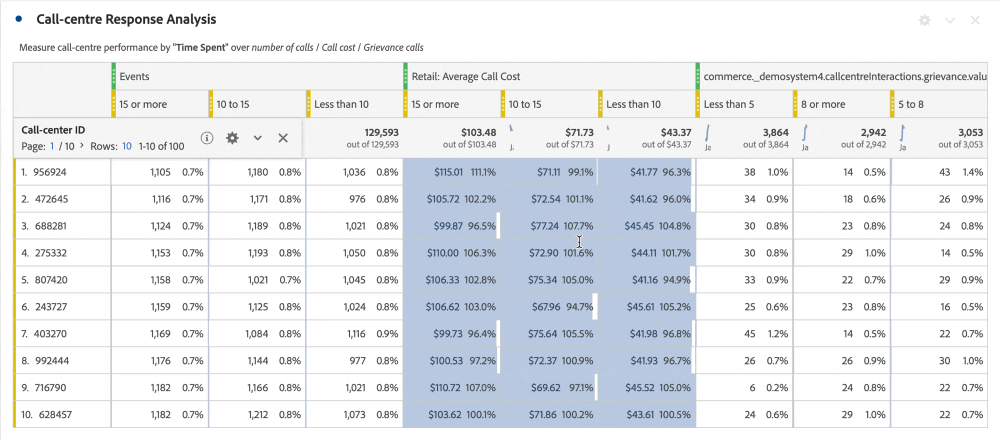

# Row settings

>[!BEGINSHADEBOX]

See  [Row and column settings in a Freeform table](https://video.tv.adobe.com/v/40382/?quality=12&learn=on){target="_blank"} for a demo video.

>[!ENDSHADEBOX]

Row settings vary depending on which component you have dragged into the table. To access table row settings, select  **[!UICONTROL Settings]** next to a dimension, filter, metric, time period, or a breakdown within each of these objects.

| Setting | Description |
| --- | --- |
| **[!UICONTROL Breakdown by position]** | By default, this setting is disabled and breakdowns are fixed to static row items. For example, imagine you breakdown the top 3 Page dimension items (Homepage, Search Results, Checkout) by Marketing Channel. Then, you leave the project and return two weeks later. Upon opening the project again, the top 3 pages have changed, and now Homepage, Search Results and Checkout are the top 4-6 pages instead. By default, your Marketing Channel breakdowns still appear under Homepage, Search Results and Checkout, even though they are now in rows 4-6.   In contrast, **Breakdown by position** always breaks down the top 3 items, regardless of what they are. Referring back to the example, when you re-open your project, the Marketing Channel breakdowns are tied to the top 3 pages in the table. And not to Homepage, Search Results and Checkout, which are now in rows 4-6. |
| **[!UICONTROL Percentages]** | **Calculate percentages by column** (default): the percentages visible in a cells are calculated based on the column total.  **Calculate percentages by row**: the percentages in cells are calculated across the row, as opposed to down the column, with Grand total as the denominator. This calculation is useful for trending percentages. |
| **[!UICONTROL Column totals]** | These settings are available only for [static rows](/help/analyze/analysis-workspace/visualizations/freeform-table/column-row-settings/manual-vs-dynamic-rows.md).   **Show as sum of current rows** shows a client-side sum of the rows in the table, which means the total does *not* de-duplicate metrics like visits or persons.   **Show grand total** shows a server-side sum, which means the total of de-duplicated metrics. |

## Change row count

To change the number of rows that are displayed:

1. Click the number next to **[!UICONTROL Rows]** at the top of the first column of the table.

   

1. From the drop-down list, select the number of rows you would like the table to display.

## Context-menu

The following context menu options are available when selecting the dimension header.

| Option | Description |
| --- | --- |
| **[!UICONTROL Copy selection to clipboard]** | Copy the selection from the visualization onto the clipboard. |
| **[!UICONTROL Download items as CSV (*dimension name*)]** | Immediately download the dimension items (to a maximum of 50,000) of the visualization to your local device. A maximum of 50,000 dimension items for the selected dimension. |
| **[!UICONTROL Download selection as CSV]** | Immediately download the dimension items of the visualization to your local device. |
| **[!UICONTROL Create hyperlink for all dimension items]** | Create hyperlinks for all the dimension items. See [Hyperlinks for dimensions in a freeform table](../freeform-table-hyperlinks.md) |
| **[!UICONTROL Edit hyperlink for all dimension items]** | Edit hyperlinks for all the dimension items. See [Hyperlinks for dimensions in a freeform table](../freeform-table-hyperlinks.md) |
| **[!UICONTROL Remove hyperlink for all dimension items]** | Remove hyperlinks for all the dimension items. See [Hyperlinks for dimensions in a freeform table](../freeform-table-hyperlinks.md) |
| **[!UICONTROL Delete]** | Deletes the dimension from the table. |
| **[!UICONTROL Visualize]** | Visualize the dimension using any of the available visualizations. |
| **[!UICONTROL Display only selected rows]** | Display only the selected items in the visualization. |
| **[!UICONTROL Create annotation from selection]** | Open up the **[!UICONTROL Annotation details]** to add an annotation. |

The following additional context menu options are available when selecting one or more dimension items (first column) or one or more individual cells in the freeform table..

| Option | Description |
| --- | --- |
| **[!UICONTROL Create hyperlink]** | Create a hyperlink for the item. See [Hyperlinks for dimensions in a freeform table](../freeform-table-hyperlinks.md) |
| **[!UICONTROL Edit hyperlink]** | Edit a hyperlink for the item. See [Hyperlinks for dimensions in a freeform table](../freeform-table-hyperlinks.md) |
| **[!UICONTROL Remove hyperlink]** | Remove a hyperlink for the item. See [Hyperlinks for dimensions in a freeform table](../freeform-table-hyperlinks.md) |
| **[!UICONTROL Breakdown]** | Break down the dimension item. Select from the list of **[!UICONTROL Dimensions]**, **[!UICONTROL Metrics]**, **[!UICONTROL Filters]** or **[!UICONTROL Date ranges]**. Alternative search for a component, using *Search*. |
| **[!UICONTROL Delete selected]** | Delete the selected rows (items). |
| **[!UICONTROL Trend selection]** | Create a trended line chart visualization for the selection. |
| **[!UICONTROL Display only selected rows]** | Display only the selected rows in the visualization. |
| **[!UICONTROL Display all rows]** | Display all rows in the visualization. |
| **[!UICONTROL Create filter from selection]** | Open up the **[!UICONTROL Filter builder]** to build a filter from the selection. |
| **[!UICONTROL Create audience from selection]** | Open up the **[!UICONTROL Create audience]** dialog to build an audience from the selection. |

The following additional context menu options are available when selecting a metric column header.

| Option | Description |
|---|---|
| **[!UICONTROL Create metric from selection]** | Create a new metric from the selected metric. Metric can be Mean, Media, Column max, Column min, Column sum. You can also select Open in calculated metric builder to create a calculated metric. |
| **[!UICONTROL Add time period column]** | Add a time period column. You are offered several options, where the calendar range of the panel determines the *date range*: <li>**[!UICONTROL Prior *date range* to this date range]**</li><li>**[!UICONTROL These *date range* to this date range]**.</li><li>**[!UICONTROL Custom date range to this date range]**. Opens up the **[!UICONTROL Date range builder]** to specify the date range.</li>See [Date comparison](/help/analyze/analysis-workspace/components/calendar-date-ranges/time-comparison.md) for more information. |
| **[!UICONTROL Compare time periods]** | Adds compare time period columns. Only available when the dimension is not based on time. You are offered several options determines the *date range*: <li>**[!UICONTROL Prior *date range* to this date range]**</li><li>**[!UICONTROL Custom date range to this date range]**. Opens up the **[!UICONTROL Date range builder]** to specify the date range.</li>See [Date comparison](/help/analyze/analysis-workspace/components/calendar-date-ranges/time-comparison.md) for more information. |
| **[!UICONTROL Modify attribution models]** | Modify the attribution model for the column. |
| **[!UICONTROL Compare attribution model]** | Specify a new attibution model and compare it to the attribution model for the selected column. A new column is added with the new attribution model metrics. Also, a Percent change column is added for comparison. |
| **[!UICONTROL Reset column widths]** | Reset the column widths to the default width. |
| **[!UICONTROL Create annotation from selection]** | Open up the **[!UICONTROL Annotation details]** to add an annotation. |
| **[!UICONTROL Create filter from selection]** | Open up the **[!UICONTROL Filter builder]** to build a filter from the selection. |
| **[!UICONTROL Create audience from selection]** | Open up the **[!UICONTROL Create audience]** dialog to build an audience from the selection. |

## Change row height

You can set the [view density](/help/analyze/analysis-workspace/build-workspace-project/view-density.md) of a project to **[!UICONTROL Compact]**, **[!UICONTROL Comfortable]**, and **[!UICONTROL Expanded]**.
