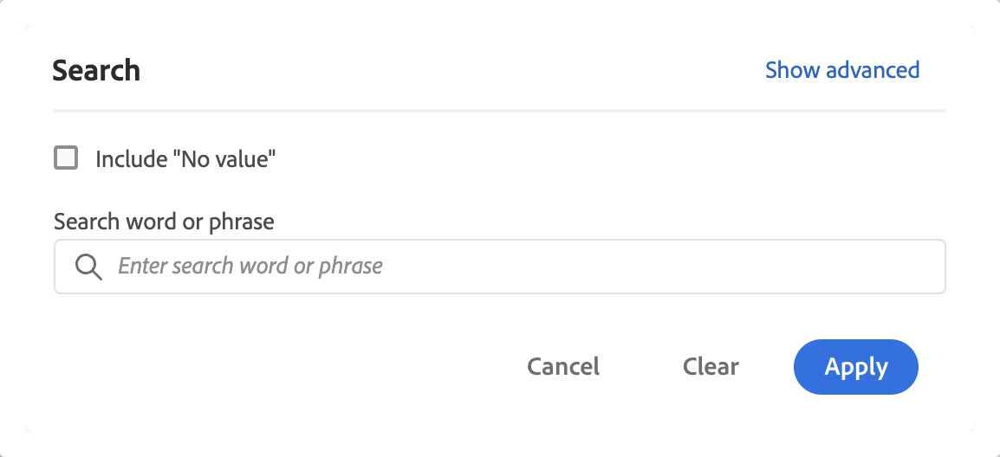
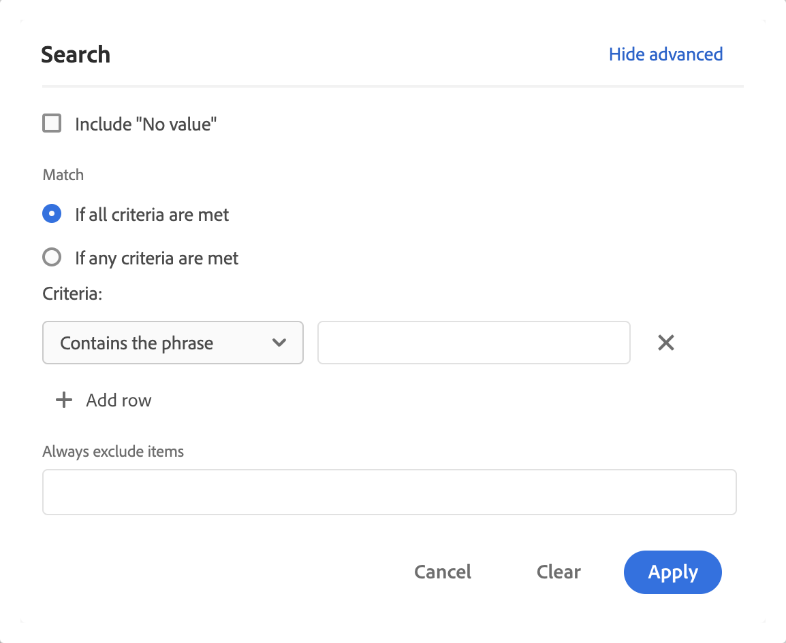
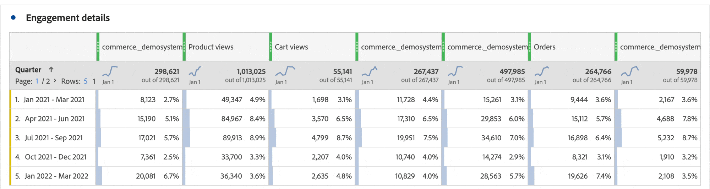

# Filter and sort freeform tables

Freeform tables in Analysis Workspace are the foundation for interactive data analysis. As such, they can contain thousands of rows of information. Filtering and sorting the data can be a critical part of efficiently surfacing the most important information. 

## Filter tables

Filters in Analysis Workspace help you surface the most important information.

>[!NOTE]
>
> Only dynamic dimension items can be filtered as described in this section. Static dimension items cannot be filtered. For more information, see [Dynamic vs static dimension items in freeform tables](/help/analyze/analysis-workspace/visualizations/freeform-table/column-row-settings/manual-vs-dynamic-rows.md).

You can use several methods to filter rows from a freeform table.

- Exclude specific rows from a table
- Apply filters to a table 
- Use audience filters

Be sure to read how each method impacts [Freeform table totals](/help/analyze/analysis-workspace/visualizations/freeform-table/workspace-totals.md).

### Exclude specific rows from a table

You can quickly exclude specific rows from the table without the need to use   **[!UICONTROL Filter]**. 

>[!NOTE]
>
>When you exclude rows as described in this section, an [!UICONTROL Always exclude items] rule is added automatically in the [!UICONTROL Advanced] filter dialog. You can view the applied rule by selecting the  Filter icon, then [**[!UICONTROL Show advanced]**](#apply-a-simple-or-advanced-filter-to-a-table).

To exclude specific rows from a Freeform table:

1. Hover over the row that you want to exclude, then select . 

   Hold the ***shift*** to select a range of rows, or hold the ***cmd*** key (on Mac) or the ***ctrl*** key (on Windows) to select multiple rows.

<!--### Right-click > Delete selected rows

Note: this option does not seem to work. AN-338422

1. Select 1 or more rows. 
1. Right-click and select **[!UICONTROL Delete Selected Rows]**. 

   This action will remove the rows from the table and apply a table filter.-->

### Apply a simple or advanced filter to a table
 
 To filter data in Freeform tables:
 
 1. Hover over the column that contains the data you want to filter. <!--only some types of columns show the filter... Which? Just Dimensions?-->
 
 1. Select   **Filter** when it appears.

    

    The following options are available in the **[!UICONTROL Search]** dialog:

    {width="500"}

    |Option | Function | 
    |---------|----------|
    | [!UICONTROL **Include "No value"**] | Select this option to show a **[!UICONTROL No value]** row in the table for data that has no value for the selected dimension. Unselect this option to hide the **[!UICONTROL No value]** row. |
    | [!UICONTROL **Search word or phrase**] | Specify a word or phrase that you want to filter by. Only rows that contain the word or exact phrase specified are shown. |
    

 1. (Optional) To filter by different criteria or by multiple criteria, select [!UICONTROL **Show advanced**]. 

    The following advanced filter options are available:

    {width=500}

    |Option | Function | 
    |---------|----------|
    | [!UICONTROL **Include "No value"**] | Select this option to show a **[!UICONTROL No value]** row in the table for data that has no value for the selected dimension. Unselect this option to hide the **[!UICONTROL No value]** row. |
    | [!UICONTROL **Match**] | Choose [!UICONTROL **If all criteria are met**] to show only data that meets all the criteria that you specify. This option typically results in more refined data.  Choose [!UICONTROL **If any criteria are met**] to show data that meets any one of the filter criteria that you specify. This option typically results in less refined data.  |
    | [!UICONTROL **Criteria**] | Select from the following filter options: <ul><li>[!UICONTROL **Contains the phrase**] (default): Only data that contain the exact phrase that you specify are included in the filtered results. Words must be in the order specified in the [!UICONTROL **Search word or phrase field**].</li><li>[!UICONTROL **Contains any term**]: Only data that contain one or more words from the phrase that you specify are included in the filtered results. </li><li>[!UICONTROL **Contains all terms**]: Only data that contain all words from the phrase that you specify are included in the filtered results. Words do not have to be in the order specified in the [!UICONTROL **Search word or phrase field**].</li><li>[!UICONTROL **Does not contain any term**]: Only data that contain none of the words from the phrase that you specify are included in the filtered results. </li><li>[!UICONTROL **Does not contain the phrase**]: Only data that does not contain the exact phrase that you specify are included in the filtered results. Words must be in the order specified in the [!UICONTROL **Search word or phrase field**].</li><li>[!UICONTROL **Equals**]: Only data that exactly matches the phrase that you specify is included in the filtered results. </li><li>[!UICONTROL **Does not equal**]: Only data that does not exactly match the phrase that you specify are included in the filtered results. </li><li>[!UICONTROL **Starts with**]: Only data that starts with the word or exact phrase that you specify are included in the filtered results. </li><li>[!UICONTROL **Ends with**]: Only data that ends with the word or exact phrase that you specify are included in the filtered results. </li></ul>Select  [!UICONTROL **Add row**] to add multiple filter criteria. The option you select for [!UICONTROL **Match**] determines **[!UICONTROL If all criteria are met]** or **[!UICONTROL If any criteria are met]**. | 
    | [!UICONTROL **Always exclude items**] | Specify the name of any items that you want to exclude from the filtered data. |

 1. Select **[!UICONTROL Apply]** to filter the data. Select **[!UICONTROL Clear]** to clear all input. Select **[!UICONTROL Cancel]** to cancel and close the dialog.  A colored  **Filter** icon indicates and displays details when a filter is applied to the table. 

## Sort tables

You can sort the data of a Freeform table by any column in Analysis Workspace that is either a dimension or a metric. An arrow indicates how the data is sorted (**↓** for descending, or **↑** for ascending).

