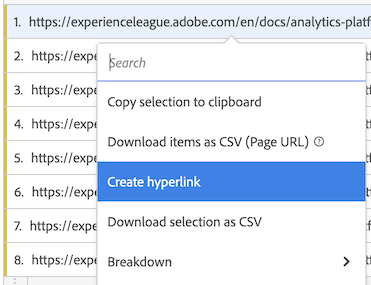
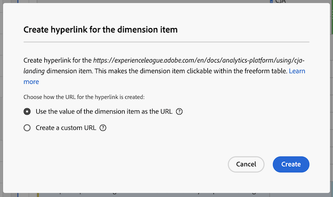
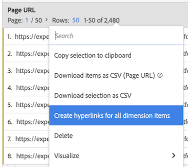
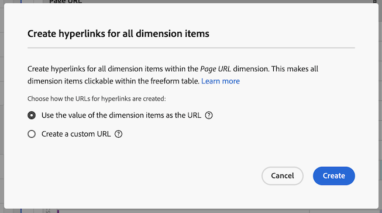
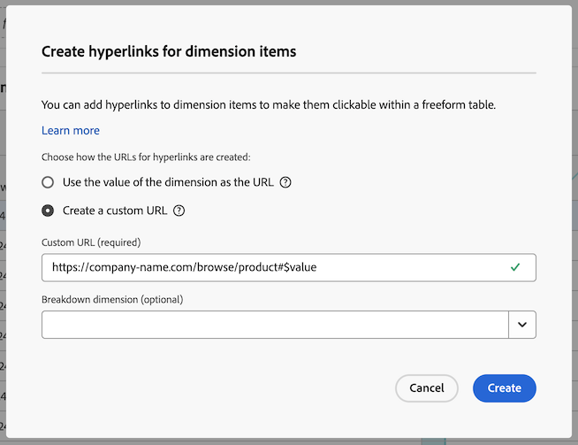
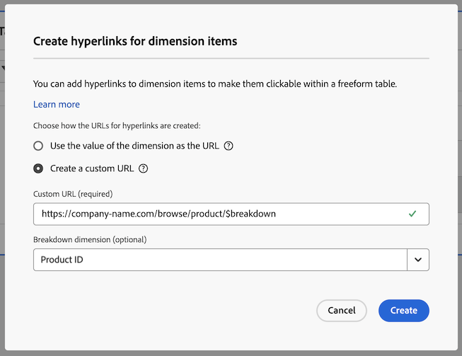
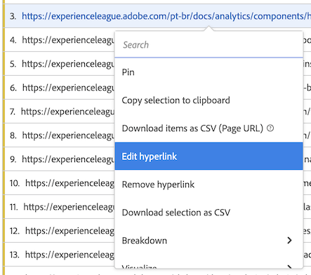
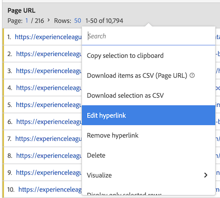
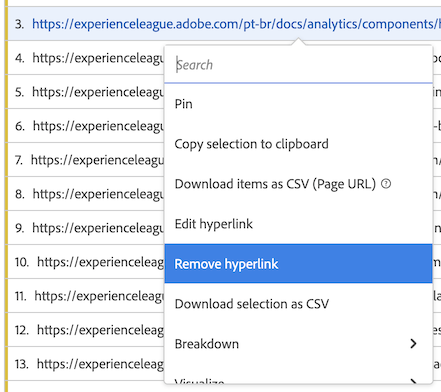
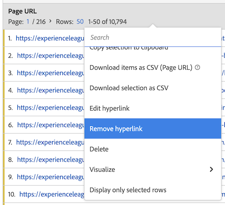

# Create hyperlinks for dimensions in a freeform table

You can create hyperlinks for dimension items to make them clickable within a freeform table in Analysis Workspace. 

This functionality is particularly useful when creating hyperlinks for the following types of dimension items:

* Dimension items that have URL values that you want to link to (for example, a Page URL dimension)

* Dimension items that contain breakdowns that have URL values that you want to link to (for example, a Page Name dimension that has a breakdown of a Page URL dimension)

* Dimension items or breakdowns that have values that are part of a URL that you want to link to (for example, a Page Name dimension that is part of a URL)

+++ View a video demonstration of this feature.

>[!VIDEO](https://video.tv.adobe.com/v/3430411/?learn=on)

+++

## Create hyperlinks for one or more dimension items

Consider the following when creating hyperlinks for dimension items:

* The hyperlinks you create are stored on the freeform table within the Analysis Workspace project. Hyperlinks do not persist when using the same dimension or dimension items in another table or in another project. 

* If you change the data view of the freeform table, any hyperlinks that were created for dimensions or dimension items in the table are still available, provided that the dimension exists in the data view. 

* URLs are not checked for validity when you create the hyperlink. 

  If you create a hyperlink that has an invalid URL, or if you create a hyperlink that references a dimension item that does not have a URL value (by either referencing the dimension item directly or by using the `$value` or `$breakdown` variables), then users who click the hyperlink will see an error message stating that the URL is invalid.

* Hyperlinks that are created for a single dimension item override hyperlinks that are created on the dimension.

* Hyperlinks are not functional in [downloaded PDF files](/help/analyze/analysis-workspace/curate-share/download-send.md). 

To create hyperlinks for one or more dimension items:

1. In a freeform table in Analysis Workspace, do one of the following:

   * **Create a hyperlink for a single dimension item:** Right-click the dimension item within the table for which you want to create the hyperlink, then select [!UICONTROL **Create hyperlink**].

     

     The [!UICONTROL **Create hyperlink**] dialog is displayed. The name of the dimension item for which you are creating a hyperlink is shown in the dialog. 

     

   * **Create hyperlinks for all dimension items in a dimension column:** Right-click the dimension name in the dimension column header, then select [!UICONTROL **Create hyperlinks for all dimension items**].

     

     The [!UICONTROL **Create hyperlinks for all dimension items**] dialog is displayed. The name of the dimension for which you are creating hyperlinks is shown in the dialog. 

     

1. Choose from the following options:

   * [!UICONTROL **Use the value of the dimension item as the URL**]: Choose this option for dimension items that have URL values, such as a Page URL dimension. 
   
     For example, if you are using a Page URL dimension where the value of each dimension item is a URL, then selecting this option creates a hyperlink to the URL.

   * [!UICONTROL **Create a custom URL**]: Specify either a static or dynamic custom URL. Choose this option to create hyperlinks for dimension items that do not have URL values. 
   
     For example, if you are using a Page Name dimension where the value of each dimension item is the name of a page (and not a full URL), then selecting this option allows you to specify a hyperlink to use as the link for the dimension item.
   
     If you want to create dynamic URLs for multiple dimension items, you can use the `$value` and `$breakdown` variables within your custom URL. See the table below for more information.

      To create a custom URL, specify the following information:

      |Field | Description | 
      |---------|----------|
      | [!UICONTROL **Custom URL**] | Specify a custom URL that you want to use for the hyperlink. URLs must be entered as fully qualified URLs. For example: https://www.example.com
The custom URL that you create can be static or dynamic:
 <ul><li>**Static URLs:** If you are creating a hyperlink for an individual dimension item, a static URL might be sufficient. 
Consider the following example:For example, if you have a Page Name dimension item, you can create a static URL that links users to the specific web page that you want to associate with the page name.

Suppose that you want to create hyperlinks for a list of dimension items, each linking to its respective definition in the documentation within an internal wiki page.

You can accomplish this by create a static URL for each dimension item. For example:

https://wiki.internal.company_name/page_name#item_definition
</li><li>**Dynamic URLs:** If you are creating a hyperlink for multiple dimension items or for all dimension items in a dimension column, then a dynamic URL is probably more practical. 
To make custom URLs dynamic, you include variables within the URL that allow the URL to dynamically change based on the value of the dimension itself, or the value of the breakdown dimension.

When using variables, any dimension items that contain characters that are not valid in URLs (such as spaces) are URL-encoded.

The following variables are available: (**Note**: While you can use these variables in the same URL, it is probably more common to use them separately.)
 <ul><li>**`$value`:** Allows you to insert the value of the dimension item into the URL that you specify. 
Consider the following scenario as an example:

Suppose that you want to create hyperlinks for all Page Name dimension items in a freeform table, where the value of each dimension item is part of a webpage's URL. In this case, you can construct a single custom URL that dynamically adjusts for each dimension item. 

You can accomplish this by adding the `$value` variable to the end of the custom URL that you specify. For example:
 
https://company-name.com/browse/product#$value

When this custom URL is applied to your Page Name dimension items whose values are "ProductY" and "ProductZ", the generated hyperlinks would look something like this: 

https://company-name.com/browse/product#ProductY

and

 https://company-name.com/browse/product#ProductZ 

**Tip**: If you were to add only the `$value` variable into the Custom URL field, it would be the same as selecting the [!UICONTROL **Use the value of the dimension item**] option when creating the URL.
</li><li>**`$breakdown`:** Allows you to insert the value of the breakdown dimension item into the URL that you specify. This allows you to use a dimension with a user-friendly name in your report (such as a Product Name dimension) while creating the hyperlink based on a breakdown dimension that might be less user-friendly (such as a Product ID or Page URL dimension).
When referencing a breakdown dimension, it's most common to have only one breakdown item for a given dimension item. If there are multiple breakdown items for a given dimension item, the value of the first breakdown item is used in the URL. If no breakdown items are listed, the URL will be invalid. The same sort order is applied to the breakdown items as is applied to the table.

You specify the breakdown dimension in the [!UICONTROL **Breakdown dimension**] field below.
 
Consider the example scenario described for the [!UICONTROL **Breakdown dimension**] field below.
</li></ul>   | 
      | [!UICONTROL **Breakdown dimension (optional)**] | Begin typing the name of the breakdown dimension that you want to use, then select it from the drop-down list. 
If you select a breakdown dimension in this field, you must reference it by using the `$breakdown` variable in the URL that you specify in the [!UICONTROL **Custom URL**] field.

Consider the following scenario as an example:

Suppose that you want to create hyperlinks for all Product Name dimension items in a freeform table. Each Product Name dimension item contains a breakdown of a Product ID dimension.

In this case, you can create hyperlinks for each Product Name dimension that directs users to the product page by using the value of the Product ID breakdown dimension. 

You can accomplish this by adding the `$breakdown` variable to the end of the custom URL that you specify in the [!UICONTROL **Custom URL**] field. For example:

https://company-name.com/browse/product/$breakdown

When this custom URL is applied to your Product Name dimension items that have breakdown dimension items whose values are "ProductY" and "ProductZ", the generated hyperlinks would look something like this:

https://company-name.com/browse/product/ProductY

and

https://company-name.com/browse/product/ProductZ

You would then select the Product ID dimension in the [!UICONTROL **Breakdown dimension**] field 

 | 

1. Select [!UICONTROL **Create**].

   Users who view the freeform table see the hyperlinked dimension items. When clicking a dimension item, users are taken to the hyperlinked pages in a separate browser tab. 
 
   <!-- add screenshot of a table with hyperlinks.-->

1. [Save the project](/help/analyze/analysis-workspace/build-workspace-project/save-projects.md) to save your changes.

## Edit hyperlinks

You can edit hyperlinks that have been created on dimensions or dimension items in a freeform table. 

1. In a freeform table in Analysis Workspace, do one of the following:

   * **Edit a hyperlink for a single dimension item:** Right-click the dimension item within the table where you want to edit the hyperlink.

     

   * **Edit hyperlinks for all dimension items in a dimension column:** Right-click the dimension name in the dimension column header.

     

1. Select [!UICONTROL **Edit hyperlink**] from the right-click menu.

   The [!UICONTROL **Edit hyperlinks for dimension items**] dialog is displayed.

1. For information about the configuration options for editing the hyperlink, see Step 3 in the [Create hyperlinks for one or more dimension items](#create-hyperlinks-for-one-or-more-dimension-items) section above, then select [!UICONTROL **Apply**] when you are finished with your updates.

1. [Save the project](/help/analyze/analysis-workspace/build-workspace-project/save-projects.md) to save your changes.

## Remove hyperlinks

You can remove hyperlinks that have been created for dimension items in a freeform table. 

>[!NOTE]
>
>In a freeform table, if you delete a dimension that contains hyperlinks, the hyperlinks will not persist if you add the same dimension back to the freeform table. 

To remove hyperlinks from dimension items:

1. In a freeform table in Analysis Workspace, do one of the following:

   * **Remove a hyperlink from a single dimension item:** Right-click the dimension item within the table where you want to remove the hyperlink.

     

   * **Remove hyperlinks from all dimension items in a dimension column:** Right-click the dimension name in the dimension column header.

     

1. Select [!UICONTROL **Remove hyperlink**] from the right-click menu.

   The hyperlink is removed from the single dimension item (if you selected a single dimension item) or from all dimension items (if you selected the dimension name in the dimension column header).

1. [Save the project](/help/analyze/analysis-workspace/build-workspace-project/save-projects.md) to save your changes.
