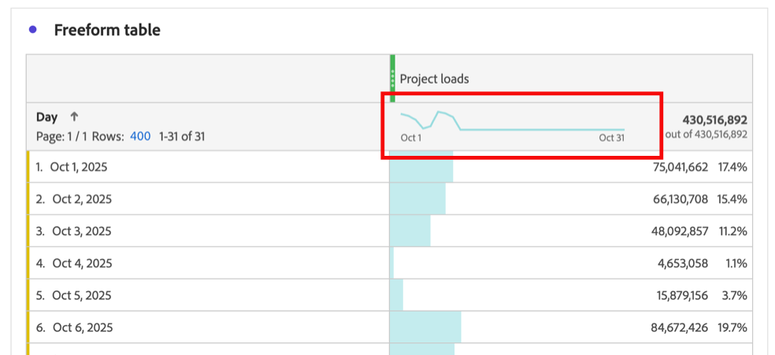
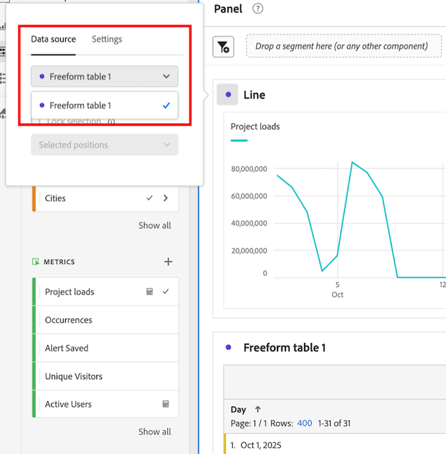
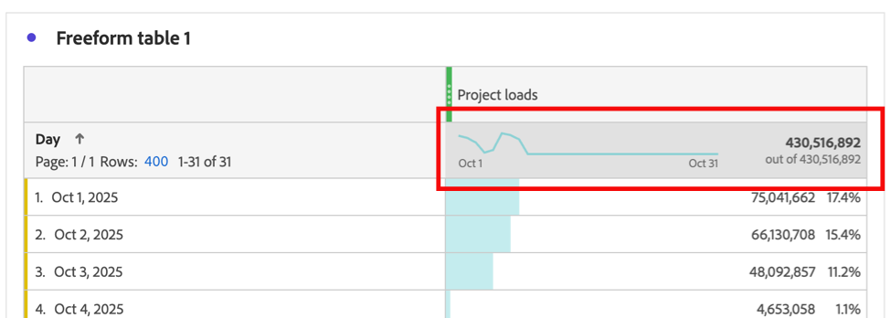

# View trended data for a freeform table

You can view the trend of the data that is included in a freeform table. This trended data shows in the following areas within Analysis Workspace:

* [Sparklines](#use-sparklines-to-view-trended-data)

* [Line visualizations](#use-line-visualizations-to-view-trended-data)

## Use sparklines to view trended data

Sparklines are shown in the metric column header of freeform tables.

  

Sparklines always include:

* Trended data for all data in the column

* Any filter criteria that is applied on the table filter

  For more information, see [Filter and sort](/help/analyze/analysis-workspace/visualizations/freeform-table/filter-and-sort.md).

## Use line visualizations to view trended data

[Line](/help/analyze/analysis-workspace/visualizations/line.md) visualizations display the data of the freeform table they are connected to.

### Connect a line visualization to a freeform table

1. Add a line visualization to an Analysis Workspace project.

1. Select the dot next to the visualization name, select the **[!UICONTROL Data source]** tab, then select the name of the freeform table that you want to connect to the line visualization. 

   

### Choose the data that is included in the line visualization

The data that is included in the connected line visualization differs, depending on which cell is selected in the freeform table. 

To view a trend of all data in the freeform table, select the sparkline cell in the freeform table.

When the sparkline cell is selected, the cell displays as dark gray.

When the sparkline cell of the connected table is selected, line visualizations include:

* Trended data for all data in the column

* Any filter criteria that is applied on the table filter

  For more information, see [Filter and sort](/help/analyze/analysis-workspace/visualizations/freeform-table/filter-and-sort.md).

When the sparkline of the connected table is not selected, line visualizations include:

* Data for the row that is selected in the connected table. If no row is selected, data for the first dimension only of the connected table is shown.

* Any filter criteria is ignored

  For more information, see [Filter and sort](/help/analyze/analysis-workspace/visualizations/freeform-table/filter-and-sort.md).

## Include filter criteria in connected line visualizations 

For information about when filter criteria is included in connected line visualizations, see [Include filter criteria in trended data in sparklines and line visualizations](/help/analyze/analysis-workspace/visualizations/freeform-table/filter-and-sort.md#include-filter-criteria-in-trended-data-in-sparklines-and-line-visualizations)

