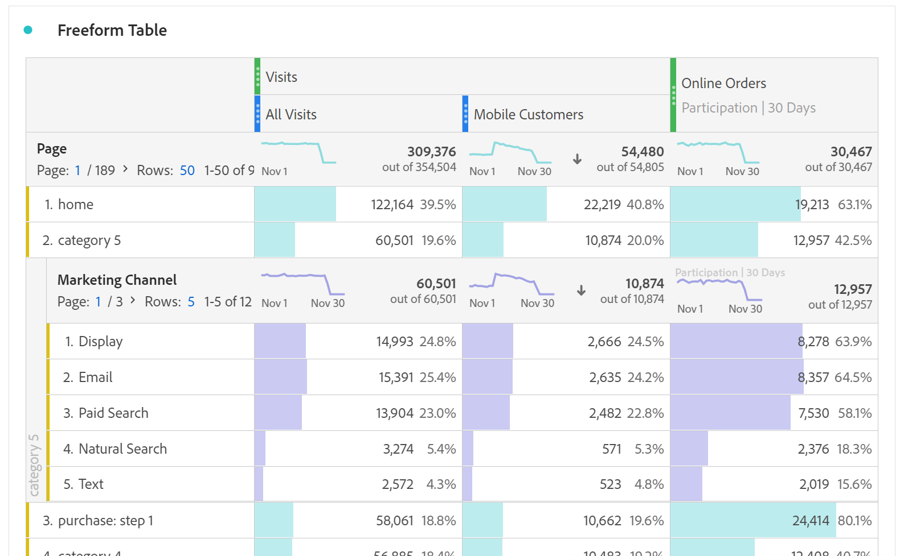

# Freeform table

In Analysis Workspace, a Freeform Table is not merely a data table, but also an interactive visualization. You can drag and drop a combination of [components](https://docs.adobe.com/content/help/en/analytics/analyze/analysis-workspace/components/analysis-workspace-components.html) into the rows and columns to create a custom table for your analysis. As each component is dropped, the table will update immediately so you can do rapid analysis.

You can customize the table in a variety of ways:

* **Rows**
  * Each dimension row can show up to 400 rows, before pagination occurs. You can fit more rows into a single screen by adjusting the project's [view density](https://docs.adobe.com/content/help/en/analytics/analyze/analysis-workspace/build-workspace-project/view-density.html).
  * Rows can be broken down by additional components. To breakdown many rows at once, simply select multiple rows and then drag the next component on top of the selected rows. Learn more about [breakdowns](https://docs.adobe.com/content/help/en/analytics/analyze/analysis-workspace/components/dimensions/t-breakdown-fa.html).
  * Rows can be [filtered](https://docs.adobe.com/content/help/en/analytics/analyze/analysis-workspace/visualizations/freeform-table/pagination-filtering-sorting.html) to show a reduced set of items. Additional settings are available under [Row settings](https://docs.adobe.com/content/help/en/analytics/analyze/analysis-workspace/visualizations/freeform-table/column-row-settings/table-settings.html).

* **Columns**
  * Components can be stacked within columns to create segmented metrics, cross-tab analysis and more.
  * Each column's view can be adjusted under the [column settings](https://docs.adobe.com/content/help/en/analytics/analyze/analysis-workspace/build-workspace-project/column-row-settings/column-settings.html).
  * Several actions are available through the [right-click menu](https://docs.adobe.com/content/help/en/analytics-learn/tutorials/analysis-workspace/building-freeform-tables/using-the-right-click-menu.html). The menu provides different actions depending on if you click the table header, rows, or columns.

## Freeform Table builder

If you prefer to add several components to your table first, then render the data, you can enable Freeform Table Builder. With the builder enabled, you can drag & drop in many dimensions, breakdowns, metrics and segments to build tables that answer more complex questions. Data will not update on-the-fly, it will update once you click **[!UICONTROL Build]**.

Table Builder is a time-saving option when you have a complex question to ask of the data, and you have an idea of the table you want to construct to answer your question. Other advantages of the table builder include the ability to:

* Arrange the table in the exact format you need, without having to wait for each action to render.
* Quickly perform up to 4 levels of breakdowns.
* Define the Row and Breakdown settings for every table row and dimension column.
* **[!UICONTROL Breakdown by Position]** for every level of the table by default (in traditional Freeform Tables, the default is **[!UICONTROL Breakdown by Item]**.)
* Manually order static rows in the table. For example, if you want metric rows to appear in a certain order.
* Preview the format of your table prior to rendering real data.

## Table interactions

You can interact with and customize a freeform table in a variety of ways:

* **Rows**
  * You can fit more rows into a single screen by adjusting the project's [view density](https://docs.adobe.com/content/help/en/analytics/analyze/analysis-workspace/build-workspace-project/view-density.html).
  * Each dimension row can show up to 400 rows, before pagination occurs. Click the number next to "Rows" to show more rows on a page. Navigate to a different page using the page arrow in the header.
  * Rows can be broken down by additional components. To breakdown many rows at once, simply select multiple rows and then drag the next component on top of the selected rows. Learn more about [breakdowns](https://docs.adobe.com/content/help/en/analytics/analyze/analysis-workspace/components/dimensions/t-breakdown-fa.html).
  * Rows can be [filtered](https://docs.adobe.com/content/help/en/analytics/analyze/analysis-workspace/visualizations/freeform-table/pagination-filtering-sorting.html) to show a reduced set of items. Additional settings are available under [Row settings](https://docs.adobe.com/content/help/en/analytics/analyze/analysis-workspace/visualizations/freeform-table/column-row-settings/table-settings.html).

* **Columns**
  * Components can be stacked within columns to create segmented metrics, cross-tab analysis and more.
  * Each column's view can be adjusted under the [column settings](https://docs.adobe.com/content/help/en/analytics/analyze/analysis-workspace/build-workspace-project/column-row-settings/column-settings.html).
  * Several actions are available through the [right-click menu](https://docs.adobe.com/content/help/en/analytics-learn/tutorials/analysis-workspace/building-freeform-tables/using-the-right-click-menu.html). The menu provides different actions depending on if you click the table header, rows, or columns.

  
## Export Freeform table data

The data in a Freeform table can be copied out of Analysis Workspace in a few ways:

* Right-click > **[!UICONTROL Copy data to clipboard]** exports the displayed table data. If a table selection is made, this option will say **[!UICONTROL Copy selection to clipboard]**. The **Ctrl+C** hotkey also copies selected data.
* Right-click > **[!UICONTROL Download data as CSV]** downloads the displayed table data as a CSV. If a table selection is made, this option will say **[!UICONTROL Download selection as CSV]**.
* Right-click > **[!UICONTROL Project > Download items as CSV]** will export up to 50,000 dimension items for the selected dimension.

Learn more about all data [export options](https://experienceleague.adobe.com/docs/analytics/analyze/analysis-workspace/curate-share/download-send.html) for Analysis Workspace.

