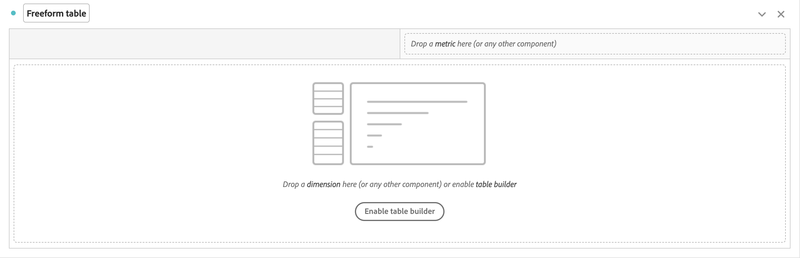
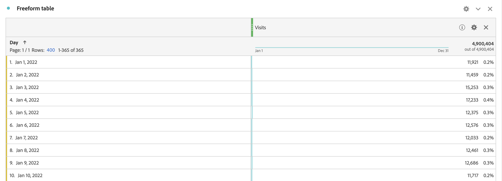
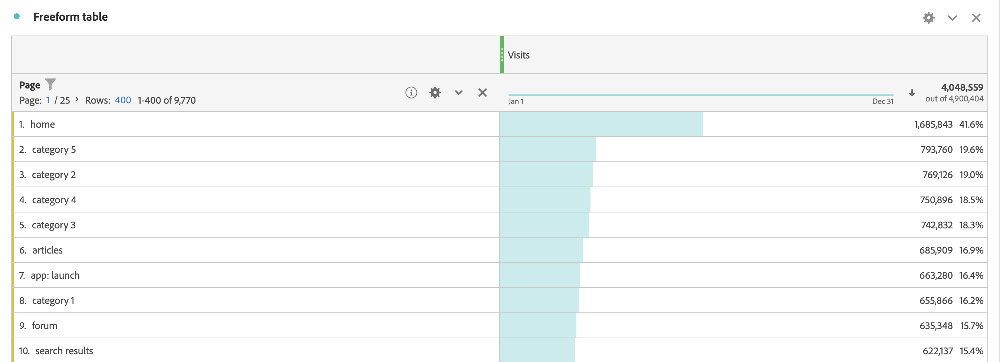
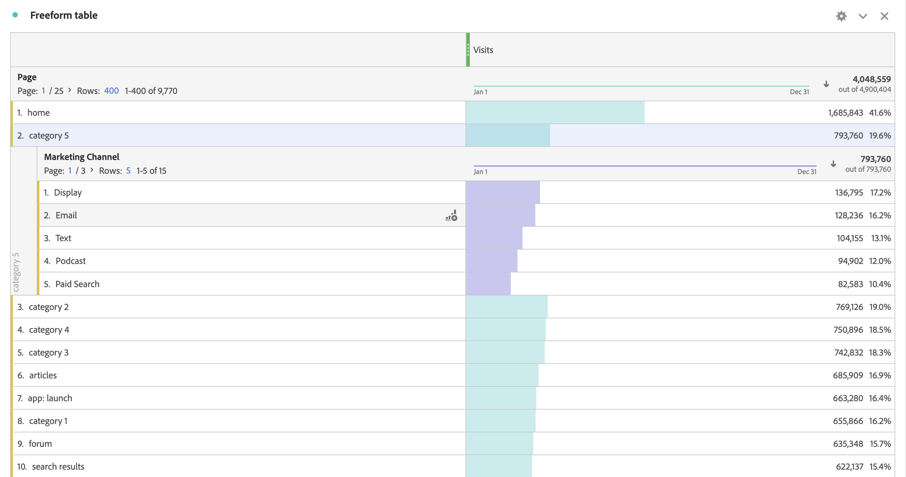
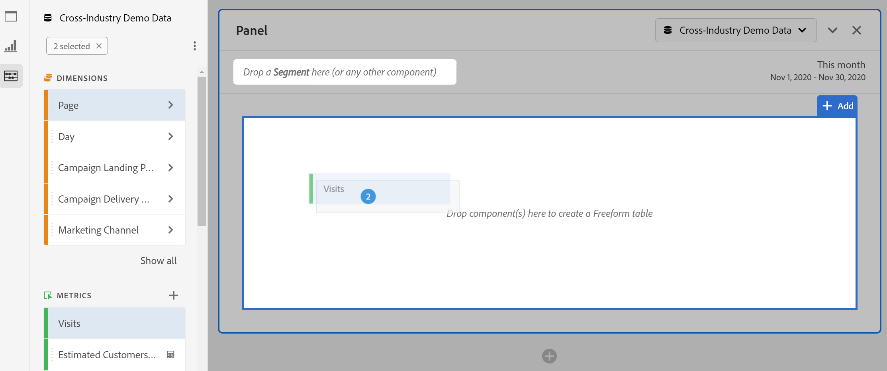
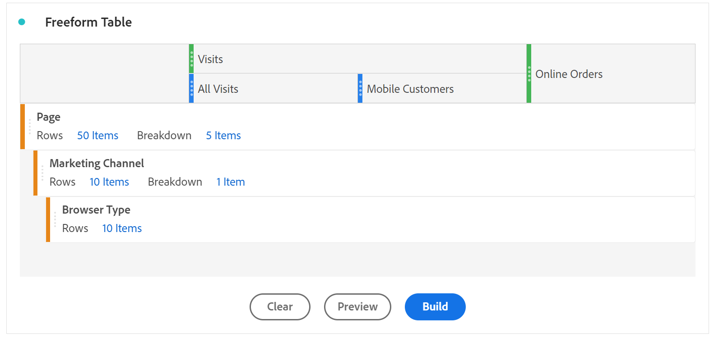
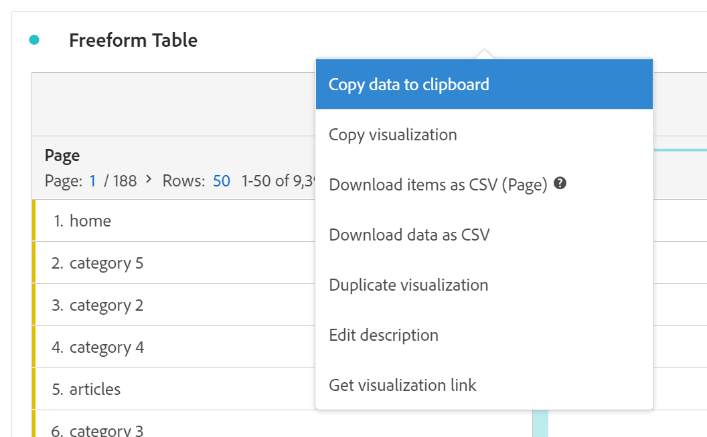

# Freeform table

In Analysis Workspace, a Freeform Table is the foundation for interactive data analysis. You can drag and drop a combination of [components](https://experienceleague.adobe.com/docs/analytics/analyze/analysis-workspace/components/analysis-workspace-components.html) into rows and columns to create a custom table for your analysis. As each component is dropped, the table updates immediately, so you can quickly analyze and dig deeper.

To illustrate, you start with an empty Freeform Table.

If you drop the **[!UICONTROL **Visits**]** metric on the **[!UICONTROL **Drop a metric here (or any other component)**]**, the Freeform Table automatically populates with visits per day for the period you selected.

If you then drop the **[!UICONTROL **Page**]** dimension to replace the **[!UICONTROL **Day**]** dimension column, the Freeform table automatically reflects visits for each page.

And you can then break down, for example, the **[!UICONTROL **category:5**]** page by dropping the **[!UICONTROL **Marketing Channel**]** dimension on the **[!UICONTROL **category:5**]** row.

## Automated tables

As illustrated above, the quickest way to build a table is to drop components directly into a blank project, panel, or freeform table. A freeform table will automatically be built for you in a recommended format. [Watch the tutorial](https://experienceleague.adobe.com/docs/analytics-learn/tutorials/analysis-workspace/building-freeform-tables/auto-build-freeform-tables-in-analysis-workspace.html).

## Freeform table builder

If you prefer to add several components to your table first, then render the data, you can enable Freeform Table Builder. With the builder enabled, you can drag & drop in many dimensions, breakdowns, metrics, and segments to build tables that answer more complex questions. Data will not update on-the-fly, it updates once you click **[!UICONTROL Build]**.

## Table interactions

You can interact with and customize a freeform table in a variety of ways:

* **Rows**
  * You can fit more rows into a single screen by adjusting the project's [view density](https://experienceleague.adobe.com/docs/analytics/analyze/analysis-workspace/build-workspace-project/view-density.html).
  * Each dimension row can show up to 400 rows, before pagination occurs. Click the number next to "Rows" to show more rows on a page. Navigate to a different page using the page arrow in the header.
  * Rows can be broken down by additional components. To breakdown many rows at once, simply select multiple rows and then drag the next component on top of the selected rows. Learn more about [breakdowns](https://experienceleague.adobe.com/docs/analytics/analyze/analysis-workspace/components/dimensions/t-breakdown-fa.html).
  * Rows can be [filtered](https://experienceleague.adobe.com/docs/analytics/analyze/analysis-workspace/visualizations/freeform-table/filter-and-sort.html) to show a reduced set of items. Additional settings are available under [Row settings](https://experienceleague.adobe.com/docs/analytics/analyze/analysis-workspace/visualizations/freeform-table/column-row-settings/table-settings.html).

* **Columns**
  * Components can be stacked within columns to create segmented metrics, cross-tab analysis and more.
  * Each column's view can be adjusted under the [column settings](https://experienceleague.adobe.com/docs/analytics/analyze/analysis-workspace/build-workspace-project/column-row-settings/column-settings.html).
  * Several actions are available through the [right-click menu](https://experienceleague.adobe.com/docs/analytics-learn/tutorials/analysis-workspace/building-freeform-tables/using-the-right-click-menu.html). The menu provides different actions depending on if you click the table header, rows, or columns.
  
## Export Freeform Table data

Learn more about all data [export options](https://experienceleague.adobe.com/docs/analytics/analyze/analysis-workspace/curate-share/download-send.html) for Analysis Workspace.

* Right-click > **[!UICONTROL Copy data to clipboard]** exports the displayed table data. If a table selection is made, this option will say **[!UICONTROL Copy selection to clipboard]**. The **Ctrl+C** hotkey also copies selected data.
* Right-click > **[!UICONTROL Download data as CSV]** downloads the displayed table data as a CSV. If a table selection is made, this option will say **[!UICONTROL Download selection as CSV]**.
* Right-click > **[!UICONTROL Project > Download items as CSV]** exports up to 50,000 dimension items for the selected dimension.

Learn more about all data [export options](https://experienceleague.adobe.com/docs/analytics/analyze/analysis-workspace/curate-share/download-send.html) for Analysis Workspace.

## Videos

Freeform table builder overview:

>[!VIDEO](https://video.tv.adobe.com/v/31318/?quality=12)

Freeform table filters:

>[!VIDEO](https://video.tv.adobe.com/v/23232/?quality=12)

Freeform table totals:

>[!VIDEO](https://video.tv.adobe.com/v/29273/?quality=12)
