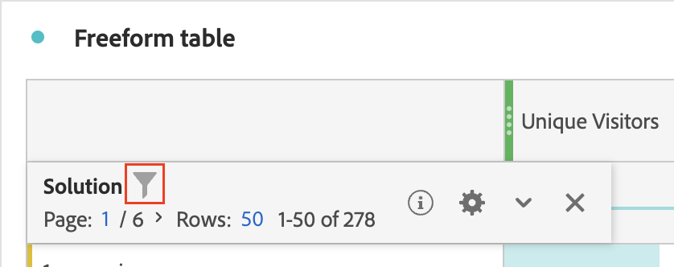

# Filter and sort tables

Freeform tables in Analysis Workspace are the foundation for interactive data analysis. As such, they can contain thousands of rows of information. Filtering and sorting the data can be a critical part of efficiently surfacing the most important information. 

## Filter tables

 Filters in Analysis Workspace help you hone in on the right information.
 
 To filter data in Analysis Workspace:
 
 1. In a Freeform table, hover over the column that contains the data you want to filter.
 
 1. Select the **Filter** icon.

    

 1.  In the [!UICONTROL **Search word or phrase**] field, specify a word or phrase that you want to filter by. Only rows that contain the words you specify in the order you specify them are shown. 

 1. (Optional) To create a more advanced filter, select [!UICONTROL **Show advanced**]. 

    The following options are available

    |Option | Function | 
    |---------|----------|
    | [!UICONTROL **Include unspecified (none)**] | Select this option to show data in the table that does not fall into any of the dimensions of the table. <!--what is this?--> |
    | [!UICONTROL **Search word or phrase**] | Specify a word or phrase |
    | [!UICONTROL **Show advanced**] | B3 | 

 1. Select [!UICONTROL **Apply**].

    The Filter icon turns blue when a filter is applied to the table. 

 
 
 1. (Optional) Select Show Advanced, next to a dimension in a freeform table lets you filter using the following criteria:

* Contains 
* Does not contain 
* Contains all terms 
* Contains any term 
* Contains the phrase 
* Does not contain any term 
* Does not contain the phrase 
* Equals 
* Does not equal 
* Starts with 
* Ends with

## Sort tables

