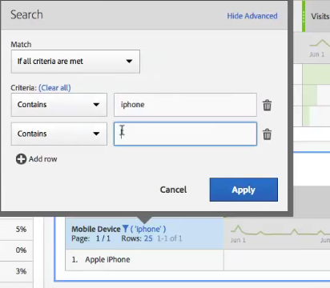

# Pagination, filtering and sorting tables

For an overview, watch this video tutorial:

[Pagination, Filtering and Sorting Tables in Analysis Workspace](https://experienceleague.adobe.com/docs/analytics-learn/tutorials/analysis-workspace/building-freeform-tables/pagination-filtering-sorting-tables.html)

## Advanced filtering options {#section_36E92E31442B4EBCB052073590C1F025}

Clicking the filter icon, then Show Advanced, next to a dimension in a freeform table lets you filter using the following criteria:

* Contains 
* Does not contain 
* Contains all terms 
* Contains any term 
* Contains the phrase 
* Does not contain any term 
* Does not contain the phrase 
* Equals 
* Does not equal 
* Starts with 
* Ends with

