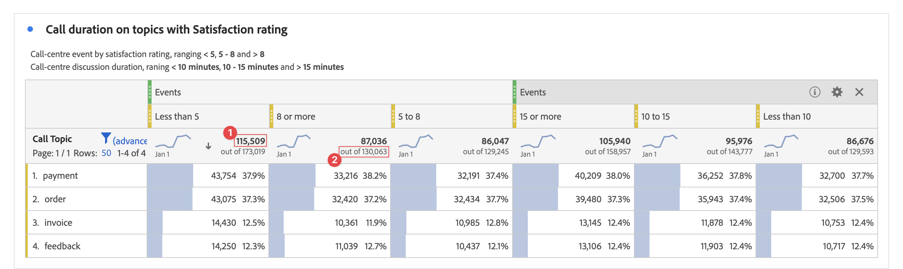
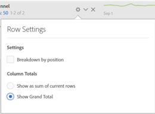

# Workspace totals

In Freeform tables, a total row appears at each breakdown level and can show two totals:

* **[!UICONTROL Grand Total]** (gray 'out of' number) - this total represents all hits that have been collected, sometimes referred to as 'report suite total'. When a segment is applied either at the panel level or within the freeform table, this total adjusts to reflect all hits that match the segment criteria.
* **[!UICONTROL Table Total]** (black number) - this total is typically equal to or a subset of the [!UICONTROL Grand Total]. It reflects any table filters applied within the freeform table, including the [!UICONTROL Include None] option.

## Display Total Setting {#display-total}

Under **[!UICONTROL Column Settings]**, there are options to **[!UICONTROL Show Totals]** and **[!UICONTROL Show Grand Total]**. If these settings are unchecked, totals will be removed from the table. This may be desired in cases where totals don't make sense, for instance, in certain [Calculated Metric scenarios](https://experienceleague.adobe.com/docs/analytics/components/calculated-metrics/calcmetrics-reference/cm-totals.html).

## Static Row Total settings {#static-row-total}

[Static row](https://experienceleague.adobe.com/docs/analytics/analyze/analysis-workspace/visualizations/freeform-table/column-row-settings/manual-vs-dynamic-rows.html) totals behave differently, and are controlled under **[!UICONTROL Row Settings]**.

* **[!UICONTROL Show sum of current rows as the total]** - this shows a client-side sum of the rows in the table which means the total will **not** de-duplicate metrics like visits or visitors.
* **[!UICONTROL Show Grand Total]** - this shows a server-side sum, which means the total will de-duplicate metrics like visits or visitors.

## Frequently asked questions

|Questions|Answer|
|---|---|
|Which 'total' are the gray column percentages based on?|This depends on the **[!UICONTROL Percentages]** setting selection under **[!UICONTROL Row Settings]**:<ul><li>Calculate percentages by column - This is the default setting. Percentages will be based on the Table Total.</li><li>Calculate percentages by row - Percentages will be based on the Grand Total.</li></ul>|
|How does the **[!UICONTROL Include Unspecified (None)]** setting impact totals?|If the **[!UICONTROL Include Unspecified (None)]** setting is unchecked, the None/Unspecified row will be removed from the table, the Table Total, and will carry through to any calculated metrics that use ['Total' metric types](https://experienceleague.adobe.com/docs/analytics/components/calculated-metrics/calcmetric-workflow/m-metric-type-alloc.html)|
|When custom table filters are applied to a freeform table, do all of my calculated metrics and conditional formatting account for the filter?|Not currently. **[!UICONTROL Include Unspecified (None)]** will be accounted for, but custom table filters will not impact the following:<ul><li>The column max/min range that conditional formatting uses will look across all data.</li><li>Calculated metrics that leverage **[!UICONTROL Grand Total]** metric types.</li><li>Calculated metrics with functions that calculate across rows in a freeform table - i.e. Column Sum, Column max, Column min, Count, Mean, Median, Percentile, Quartile, Row Count, Standard Deviation, Variance, Cumulative, Cumulative Average, Regression variants, T-Score, T-Test, Z-Score, Z-Test.</li></ul>|
|In Calculated Metrics, what does the **[!UICONTROL Grand Total]** metric type reflect?|**[!UICONTROL Grand Total]** continues to refer to the **[!UICONTROL Grand Total]**, and does not reflect filters applied to a table or the **[!UICONTROL Table Total]**.|
|What total is shown when data is either copied and pasted from a freeform table or downloaded via CSV?|The total row will reflect the **[!UICONTROL Table Total]** only and respects the column **[!UICONTROL Show Totals]** setting.|
