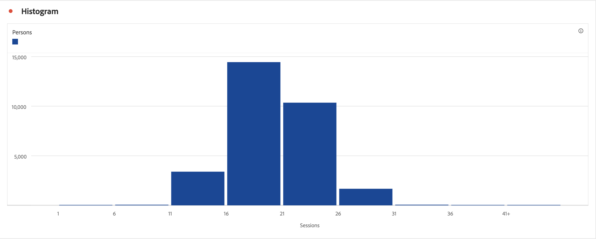
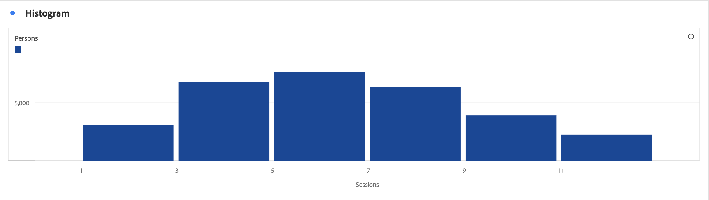
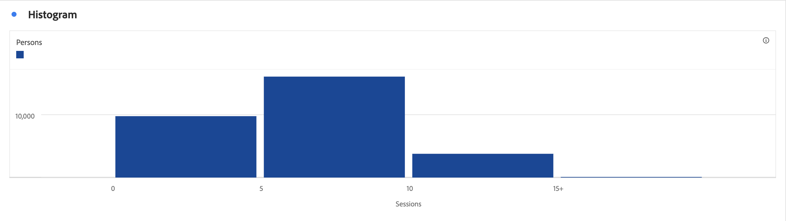

# Histogram {#histogram}

<!-- markdownlint-disable MD034 -->

>[!CONTEXTUALHELP]
>id="workspace_histogram_button"
>title="Histogram"
>abstract="Create a histogram visualization to represent the distribution of numerical data in groups of ranges."

<!-- markdownlint-enable MD034 -->

>[!BEGINSHADEBOX]

_This article documents the Histogram visualization in_  _**Adobe Analytics**._ _See [Histogram](https://experienceleague.adobe.com/en/docs/analytics-platform/using/cja-workspace/visualizations/histogram)  for the_  _**Customer Journey Analytics** version of this article._

>[!ENDSHADEBOX]

The  **[!UICONTROL Histogram]** visualization is similar to a [!UICONTROL Bar] visualization, but it groups numbers into ranges (buckets). Analytics automates the "bucketing" of numbers into ranges, but you can change the settings in [Advanced Settings](#advanced-settings).

## Use

To create a histogram:

1. Add a  **[!UICONTROL Histogram]** visualization. See [Add a visualization to a panel](freeform-analysis-visualizations.md#add-visualizations-to-a-panel).
1. Drag a metric from the **[!UICONTROL Metrics]** component list, or select a metric from the [!UICONTROL *Add a metric*] drop-down menu.
1. (optional) Select **[!UICONTROL Show advanced settings]**. See [Advanced settings](#advanced-settings).
1. Select **[!UICONTROL Build]**.

>[!NOTE]
>
>Histograms support only standard metrics, not calculated metrics.

In the example below, a histogram is used to bucket sessions for the number of persons. The histogram shows that most persons do have between 16-21 sessions for the selected date range.

## Advanced settings

As part of the visualization, specific histogram settings are available.

|  Histogram settings  | Description  |
|---|---|
|  **[!UICONTROL Starting bucket]**  | Determines which bucket the histogram starts with. "1" is the default. You can set starting numbers from 0 to infinity (no negative numbers).  |
|  **[!UICONTROL Metric buckets]**  | Lets you increase/decrease the number of data ranges (buckets.) The maximum number of buckets is 50.  |
|  **[!UICONTROL Metric bucket size]** | Lets you set the size of each bucket. For example, you can change the bucket size from 1 page view to 2 page views.  |
|  **[!UICONTROL Counting method]**  | Select from **[!UICONTROL Person]**, **[!UICONTROL Session]**, or **[!UICONTROL Event]**. For example, page views per session, or page views per person, or page views per event.  |

<!--Russ or Meike - Check Hit Type link above. -->

**Examples**:

| Starting bucket | Metric buckets | Metric bucket size | Result |
|:----:|:--:|:--:|:--|
| 1 | 5 | 2 |  |
| 0 | 3 | 5 |  |

>[!MORELIKETHIS]
>
>[Add a visualization to a panel](/help/analyze/analysis-workspace/visualizations/freeform-analysis-visualizations.md#add-visualizations-to-a-panel)
>[Visualization settings](/help/analyze/analysis-workspace/visualizations/freeform-analysis-visualizations.md#settings)
>[Visualization context menu](/help/analyze/analysis-workspace/visualizations/freeform-analysis-visualizations.md#context-menu)
>[Using histograms to identify unexpected data values](https://experienceleaguecommunities.adobe.com/t5/adobe-analytics-blogs/using-histograms-to-identify-unexpected-data-values/ba-p/596168)

