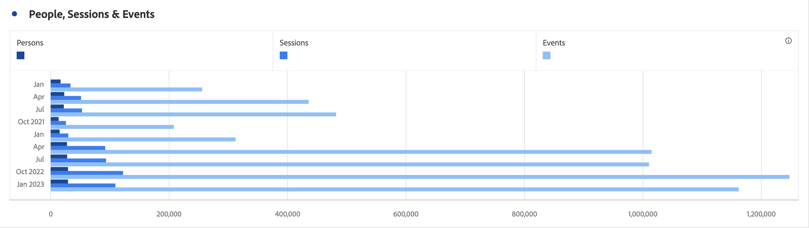
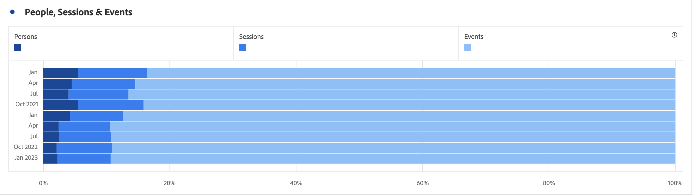

# Horizontal bar (stacked)

>[!BEGINSHADEBOX]

_This article documents the Horizontal bar and Horizontal bar stacked visualizations in_  _**Adobe Analytics**._ _See [Horizontal bar and horizontal bar stacked](https://experienceleague.adobe.com/en/docs/analytics-platform/using/cja-workspace/visualizations/horizontal-bar)  for the_  _**Customer Journey Analytics** version of this article._

>[!ENDSHADEBOX]

The horizontal bar visualization has a standard and stacked option.

## Horizontal Bar {#horizontal-bar}

<!-- markdownlint-disable MD034 -->

>[!CONTEXTUALHELP]
>id="workspace_horizontalbar_button"
>title="Horizontal bar"
>abstract="Create a horizontal bar visualization to represent various values across one or more metrics."

<!-- markdownlint-enable MD034 -->

Thie  **[!UICONTROL Horizontal bar]** visualization shows horizontal bars representing various values across one or more metrics.

## Horizontal bar stacked {#horizontal-bar-stacked}

<!-- markdownlint-disable MD034 -->

>[!CONTEXTUALHELP]
>id="workspace_horizontalbarstacked_button"
>title="Horizontal bar stacked"
>abstract="Create a horizontal bar visualization to represent various values across one or more stacked metrics."

<!-- markdownlint-enable MD034 -->

The  **[!UICONTROL Horizontal bar stacked]** visualization is like the [!UICONTROL Horizontal bar], but the series bars appear stacked.

Use the **[!UICONTROL 100% stacked]** option in  **[!UICONTROL Settings]** to turn the chart into a 100% stacked visualization.

>[!MORELIKETHIS]
>
>[Add a visualization to a panel](/help/analyze/analysis-workspace/visualizations/freeform-analysis-visualizations.md#add-visualizations-to-a-panel)
>[Visualization settings](/help/analyze/analysis-workspace/visualizations/freeform-analysis-visualizations.md#settings)
>[Visualization context menu](/help/analyze/analysis-workspace/visualizations/freeform-analysis-visualizations.md#context-menu)
>

