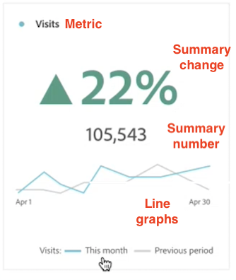
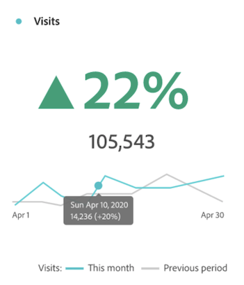
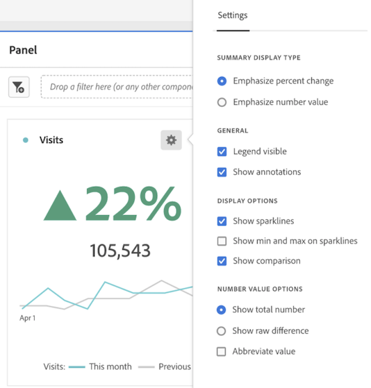
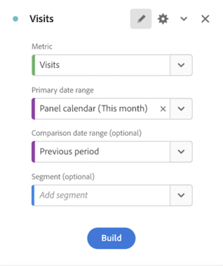

# Key metric summary

>[!NOTE]
>
>This functionality is currently in [limited testing](/help/release-notes/releases.md).

The [!UICONTROL Key metric summary] visualization lets you see how an important metric is trending within a single timeframe. It also lets you compare metric performance across two timeframes. It provides the benefits of multiple visualizations combined into one visualization:

* **[!UICONTROL Line]** visualizations that shows how the metric is trending for the primary and comparison date ranges

* **[!UICONTROL Summary percent change]** that shows the metric increase or decrease between the primary and comparison date ranges

* Current total value ([!UICONTROL **summary number**]) for the metric

## Use cases

This visualization addresses a variety of common use cases, including:

* An analyst trying to understand how opportunity creation looked this month compared to the same timeframe last year. 

* A marketer exploring how lead generation for a specific lead type has changed from this month to last month.

* An executive wanting to understand how new bookings changed from this quarter to last quarter.

## Configure the Key metric summary

1. Drag the **[!UICONTROL Key metric summary]** visualization from the **[!UICONTROL Visualizations]** menu in the left rail into a panel.

1. Configure the visualization by selecting a metric, a primary date range, and a comparison date range and a segment (if desired):

   

   | Configuration setting | Definition |
   | --- | --- |
   | **[!UICONTROL Metric]** | Select the metric you want to examine. All metrics are supported. |
   | **[!UICONTROL Primary date range]** | The current date range for the freeform table.  |
   | **[!UICONTROL Comparison date range]** | The date range to which you want to compare the primary date range. |
   | **[!UICONTROL Segment (optional)]** | Any segment that you are specifically interested in for this summary.  |

   {style="table-layout:auto"}

1. Click **[!UICONTROL Build]**.

## View the output

Please note:

* The **[!UICONTROL Previous period]** line graph (always displayed in grey) corresponds to the **[!UICONTROL Comparison date range]** in the configuration step.

* If a comparison date range is not specified during configuration or is hidden in the visualization settings, only the line graph for the primary date range is displayed. The summary change will be hidden. 

* From here, you can hover over the line graphs to see the statistics for individual days:

## Visualization settings

The Key metric summary offers multiple flexible settings to enable better reporting and communication of important metrics. Settings can be accessed through the gear icon in the top right-hand corner of the visualization.  

| Setting | Description |
| --- | --- |
| **[!UICONTROL Emphasize percent change]** | Display summary change in prominent bold type in the center of the visualization |
| **[!UICONTROL Emphasize number value]** | Display summary number in prominent bold type in the center of the visualization |
| **[!UICONTROL Legend visible]** | Show or hide the legend at the bottom of the visualization |
| **[!UICONTROL Show annotations]** | Show or hide annotations added by an admin |
| **[!UICONTROL Show sparklines]** | Show or hide line charts at the bottom of the chart. When hidden, the legend will change to no longer visually reference the lines |
| **[!UICONTROL Show min and max on sparklines]** | Show or hide minimum and maximum values on primary and comparison line charts |
| **[!UICONTROL Show comparison]** | Show or hide comparison data. When hidden, both the comparison line chart and summary change objects will be hidden from view. |
| **[!UICONTROL Show total number]** | Show or hide summary number |
| **[!UICONTROL Show raw difference]** | Show or hide raw difference between the total value of the metric in the primary date range and the secondary date range |
| **[!UICONTROL Abbreviate value]** | Abbreviate number values to simplify communicated insights (e.g. 20,000 -> 20K) |

## Edit visualization

After building the visualization, you can still edit the original configuration. 

1. Click the pencil icon in the top right corner of the visualization (next to the settings gear icon).

   

   You are now taken back to the original configuration view. 

1. Change the metric, primary date range, comparison date range, or segment as preferred.
