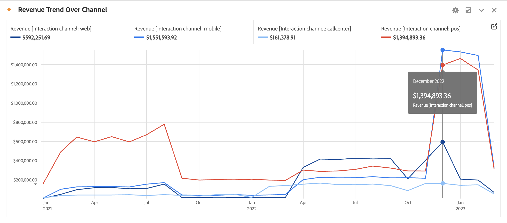
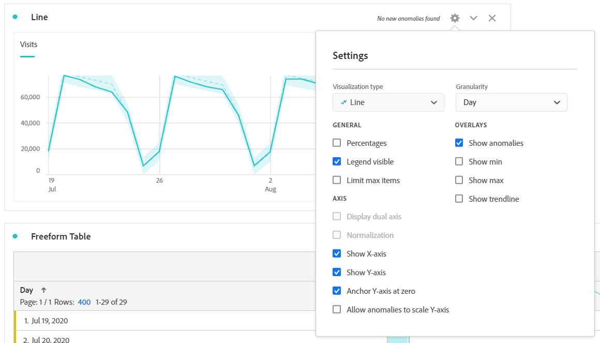
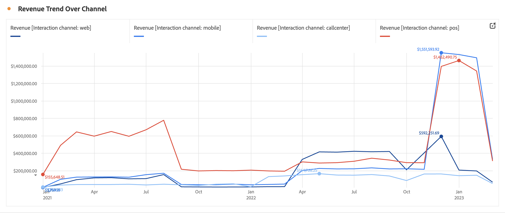

# Line

The Line visualization represents metrics using a line in order to show how values change over a period of time. A line chart can be used only when time is used as a dimension.

Click on the gear icon in the top right of the Line visualization to access [**Visualization settings**](freeform-analysis-visualizations.md) available. Settings are categorized into:

* **General**: Settings that are common across visualization types
* **Axis**: Settings that impact the x- or y-axis of the line visualization
* **Overlays**: Options for adding additional context to the series shown in your line visualization.

## Change granularity

A granularity drop-down in the [visualization settings](freeform-analysis-visualizations.md) lets you change a trended visualization (e.g. line, bar) from daily to weekly to monthly, etc. The granularity is also updated in the data source table.

## Show min or max

Under **[!UICONTROL Visualization Settings]** > **[!UICONTROL Overlays]** > **[!UICONTROL Show min/max]**, you can overlay a minimum and maximum value label to quickly highlight the peaks and valleys in a metric. Note: The min/max values are derived from the visible data points in the visualization, not the full set of values within a dimension.

## Show trendline overlay

Under **[!UICONTROL Visualization Settings]** > **[!UICONTROL Overlays]** > **[!UICONTROL Show trendline]**, you can choose to add a regression or moving average trendline to your line series. Trendlines help to depict a clearer pattern in the data.

>[!TIP]
>
>It is recommended that trendlines be applied to data that does not include today (partial data) or future dates, as those will skew the trendline. If you need to include future dates, however, remove zeroes from the data to prevent skewing for those days. To do this, go to the visualization's data source table, choose your metric column, then enable **[!UICONTROL Column Settings]** > **[!UICONTROL Interpret zero as no value]**.

All regression model trendlines are fit using ordinary least squares:

| Model | Description |
| --- | --- |
| Linear | Creates a best-fit straight line for simple linear data sets and is useful when the data increases or decreases at a steady rate. Equation: `y = a + b * x` |
| Logarithmic | Creates a best-fit curved line and is useful when the rate of change in the data increases or decreases quickly and then levels out. A logarithmic trendline can use negative and positive values. Equation: `y = a + b * log(x)` |
| Exponential | Creates a curved line and is useful when data rises or falls at constantly increasing rates. This option should not be used if your data contains zero or negative values. Equation: `y = a + e^(b * x)` |
| Power | Creates a curved line and is useful for data sets that compare measurements that increase at a specific rate. This option should not be used if your data contains zero or negative values. Equation: `y = a * x^b` |
| Quadratic | Finds the best-fit for a data set shaped like a parabola (concave up or down). Equation: `y = a + b * x + c * x^2` |
| Moving average | Creates a smooth trendline based on a set of averages. Also known as a rolling average, a moving average uses a specific number of data points (determined by your 'Periods' selection), averages them, and uses the average as a point in the line. Examples include 7 day moving average or 4 week moving average.|
