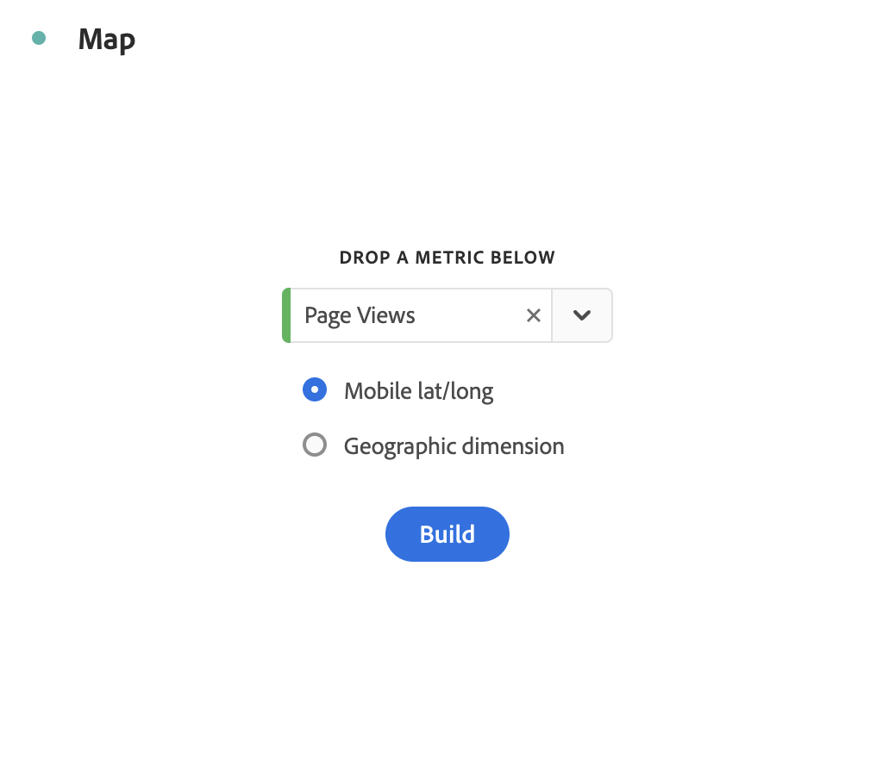

# Map {#map}

<!-- markdownlint-disable MD034 -->

<!-- markdownlint-disable MD034 -->

>[!CONTEXTUALHELP]
>id="workspace_map_button"
>title="Map"
>abstract="This visualization represents metrics by overlaying them on a map. This visualization is useful for identifying data across different geographic regions."

<!-- markdownlint-enable MD034 -->

<!-- markdownlint-disable MD034 -->

>[!CONTEXTUALHELP]
>id="workspace_map_bubbles"
>title="Bubbles"
>abstract="Plot events using bubbles."

<!-- markdownlint-enable MD034 -->

<!-- markdownlint-disable MD034 -->

>[!CONTEXTUALHELP]
>id="workspace_map_heatmap"
>title="Heatmap"
>abstract="Plot events using a heat map."

<!-- markdownlint-enable MD034 -->

>[!BEGINSHADEBOX]

_This article documents the Map visualization in_  _**Adobe Analytics**._ _See [Map](https://experienceleague.adobe.com/en/docs/analytics-platform/using/cja-workspace/visualizations/map)  for the_  _**Customer Journey Analytics** version of this article._

>[!ENDSHADEBOX]

The  **[!UICONTROL Map]** visualization in Analysis Workspace

* allows you to build a visual map of any metric (including calculated metrics),
* is useful for identifying and comparing metric data across different geographic regions,
* can support 2 data sources: latitude/longitude from mobile usage or geographic dimension for web usage,
* supports PDF export, and
* leverages WebGL for graphics display. If your graphics drivers do not support WebGL rendering, you may need to update your drivers.

>[!BEGINSHADEBOX]

See  [Map visualization in Analysis Workspace](https://video.tv.adobe.com/v/23559/?quality=12){target="_blank"} for a demo video.

>[!ENDSHADEBOX]

## Use

1. Add a  [!UICONTROL Map] visualization. See [Add a visualization to a panel](freeform-analysis-visualizations.md#add-visualizations-to-a-panel). You can only drag a Map visualization on top of a Freeform table.

   {width="50%"}

1. From the drop-down lists, select a metric. Or drag in a metric from the list of metrics (including calculated metrics).
1. Specify the data source that you want to draw from. This dialog appears only if you have location tracking enabled for mobile app data.

   | Source | Description |
   | --- | --- |
   | **[!UICONTROL Mobile Lat/Long]** | This option represents mobile app data. You see this option only if you have enabled it for your report suite in [!UICONTROL Analytics] > [!UICONTROL Admin] > [!UICONTROL Report Suites] > (select report suite) > [!UICONTROL Edit Settings] >  [!UICONTROL Mobile Management] > [!UICONTROL Enable Location Tracking]. This settings is the default (if location tracking is enabled). |
   | **[!UICONTROL Geographic Dimension]** | This option represents geo segmentation data about visitor location based on the visitor's IP address. This data gets transformed into [!UICONTROL Country], [!UICONTROL Region], and [!UICONTROL City]. Note that it does not go to the DMA or Zip Code level. Almost all report suites have this dimension enabled. If yours does not, contact Adobe Customer Care to have geographic reports enabled. |

1. Select **[!UICONTROL Build]**.

   A world map visualization with bubbles is generated.

   

1. You can now:

    * **Zoom** into this map to magnify certain areas by double-clicking the map or by using your scroll wheel. The map zooms according to where you have placed your cursor. Through zoom interaction, the required dimension (country > state > city) is automatically updated, based on the zoom level.
    * **Compare** two or more map visualizations in the same project by placing them side by side.
    * **Show period-over-period (such as, year-over-year) comparisons**:

        * Show negative numbers: For example, if you are plotting a year-over-year metric, the map can show -33% over New York.
        * With metrics that are of type *percent*, clustering averages the percentages together.
        * A green/red color scheme: Positive/Negative

    * **Rotate** the map in 2D or 3D by holding the [!UICONTROL Ctrl] key and moving the map.
    
    * **Toggle** to a different view, such as the heat map, using the [settings](/help/analyze/analysis-workspace/visualizations/map-visualization.md#section_5F89C620A6AA42BC8E0955478B3A427E) described below. Note that the bubble view is the default setting.

1. **Save** the project to save all map settings (coordinates, zoom, rotation).
1. The freeform table, below the visualization, can be populated by dragging in location dimensions and metrics from the left rail.

## Configure

To reconfigure the Map visualization, select .

## Settings

To define settings for the visualization, select .

| Setting | Description |
|--- |--- |
| **[!UICONTROL Map type]** | |
|**[!UICONTROL Bubbles]|Plots events using bubbles. A bubble chart is a multi-variable graph that is a cross between a scatterplot and a proportional area chart. This view is the default.|
|[!UICONTROL Heatmap]|Plots events using a heatmap. A heatmap is a graphical representation of data where the individual values contained in a matrix are represented as colors.|
| **[!UICONTROL Styles]** | |
|[!UICONTROL Color theme]|Shows the color scheme for the heat map and bubbles. You can choose among Coral, Reds, Greens or Blues. The default is Coral.|
|[!UICONTROL Map style]|You can choose from Basic, Streets, Bright, Light, Dark, and Satellite.|
|**[!UICONTROL Cluster Radius]**|Groups data points together that are within the specified number of pixels. The default is 50.|
|**[!UICONTROL Custom Max Value]**|Lets you alter the threshold for the max value for the map - adjusting this value adjusts the scale for the bubbles/heatmap values (color and size) relative to the custom max value set.|

<!--
## Build a time-parting heatmap

Here is a video on the topic:

>[!VIDEO](https://video.tv.adobe.com/v/26991/?quality=12)

-->

