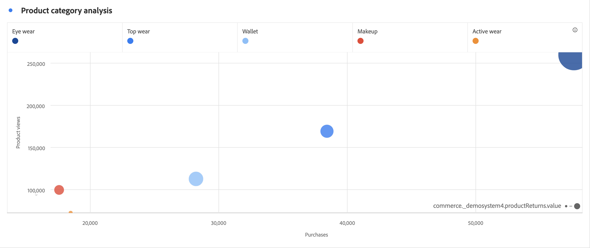

# Scatterplot

The scatterplot visualization shows the relationship between dimension items and up to three metrics. It requires three components, and supports visualizing up to four components.

* The row component (typically a dimension) represents each point on the graph. Different rows show as different colored dots.
* The leftmost column (typically a metric) plots the position of the dot on the Y axis (vertical).
* The second column plots the position of the dot on the X axis (horizontal).
* The third column determines the radius of the dot.
* All subsequent columns in a freeform table are ignored by the scatterplot visualization.

