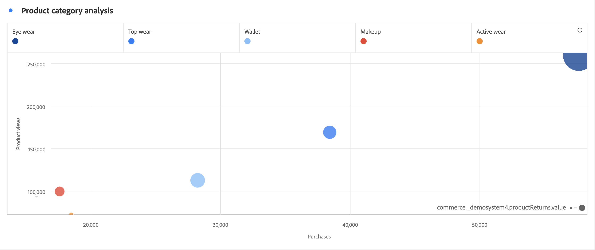

# Scatter {#scatter}

<!-- markdownlint-disable MD034 -->

>[!CONTEXTUALHELP]
>id="workspace_scatter_button"
>title="Scatter"
>abstract="Create a scatter visualization that shows the relationship between dimension items and up to three metrics."

<!-- markdownlint-enable MD034 -->

>[!BEGINSHADEBOX]

_This article documents the Scatter visualization in_  _**Adobe Analytics**._ _See [Scatter](https://experienceleague.adobe.com/en/docs/analytics-platform/using/cja-workspace/visualizations/scatterplot)  for the_  _**Customer Journey Analytics** version of this article._

>[!ENDSHADEBOX]

The  **[!UICONTROL Scatter]**  visualization helps you to identify correlations and patterns between different metrics in your data. The  visualization shows the relationship between dimension items and up to three metrics. The visualization requires three components, and supports visualizing up to four components.

* The row component (typically a dimension) represents each point on the graph. Different rows show as different colored dots.
* The leftmost column (typically a metric) plots the position of the dot on the Y axis (vertical).
* The second column plots the position of the dot on the X axis (horizontal).
* The third column determines the radius of the dot.
* All subsequent columns in a freeform table are ignored by the scatterplot visualization.

>[!BEGINSHADEBOX]

See  [Scatterplot visualization](https://experienceleague.adobe.com/en/docs/analytics-learn/tutorials/analysis-workspace/visualizations/scatterplot-visualization){target="_blank"} for a demo video.

>[!ENDSHADEBOX]

>[!NOTE]
>
>When you [configure the legend to be visible](/help/analyze/analysis-workspace/visualizations/freeform-analysis-visualizations.md#settings) in the scatter, the legend is only shown when the data source contains a limited number of (selected) dimension items.

>[!MORELIKETHIS]
>
>[Add a visualization to a panel](/help/analyze/analysis-workspace/visualizations/freeform-analysis-visualizations.md#add-visualizations-to-a-panel)
>[Visualization settings](/help/analyze/analysis-workspace/visualizations/freeform-analysis-visualizations.md#settings)
>[Visualization context menu](/help/analyze/analysis-workspace/visualizations/freeform-analysis-visualizations.md#context-menu)
>
