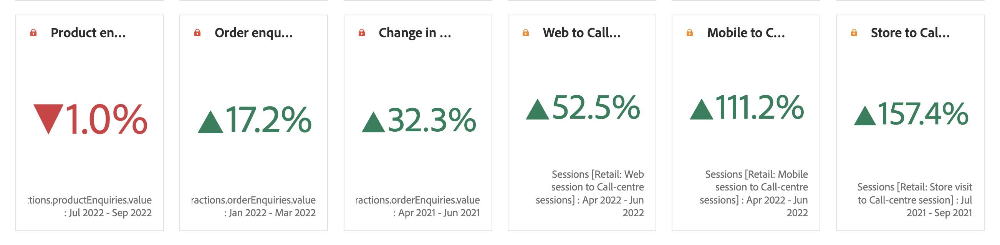

# Summary Number and Summary Change

## Summary Number visualization {#summary-number}

Use the Summary Number visualization to highlight a large number that is important in a project. This visualization behaves in the following ways:

* Selects the total of the column if no cell is selected.
* If a single cell is selected, it shows the summary for that cell.
* If more than one cell is selected, it shows the first cell selected.
* If the column is selected, it picks the first cell value in the column.

Click the **Visualization settings** gear in to the top right to configure the Summary Number settings: 

| Setting | Definition |
|--- |--- |
| Percentages | Display percentages instead of raw numbers.|
| Legend visible | Display information about the metric displayed.|
| Abbreviate value | Choose to abbreviate values and show up to 3 decimal places.|
| Summarize value by | Choose to display the max, min, mean, median, or sum for a selection of data.|

## Summary Change visualization {#summary-change}

Use the Summary Change visualization to show the delta (change) between two numbers. The green and red color of the Summary Change can be controlled through [custom event polarity](https://experienceleague.adobe.com/docs/analytics/admin/admin-tools/success-events/success-event.html) or a calculated metric's [Show Upward Trend As](https://experienceleague.adobe.com/docs/analytics/components/calculated-metrics/calcmetric-workflow/cm-build-metrics.html) option.

This visualization behaves in the following ways:

* If no cell is selected, it compares the first two cell values in the column.
* If one cell is selected, it shows 0, because it compares the cell value to itself.
* If two cells are selected, the first selected cell is taken as numerator and the second as denominator.
* If more than two cells are selected, it only considers the first two for comparison.
* If a range of cells is selected, it compares the first to the last cells selected in the range.
* If the column is selected, it compares the first value to itself, which shows a change of 0.

Click the **Visualization settings** gear in to the top right to configure the Summary Change settings: 

| Setting | Definition |
|--- |--- |
| Percentages | Display percentages instead of raw numbers.|
| Legend visible | Display information about the metric displayed.|
| Show Percent Change| Shows the percent change between the 2 numbers.|
| Show Raw Difference| Shows the raw difference between the 2 numbers. You can also abbreviate values and show up to 3 decimal places with this option.|
