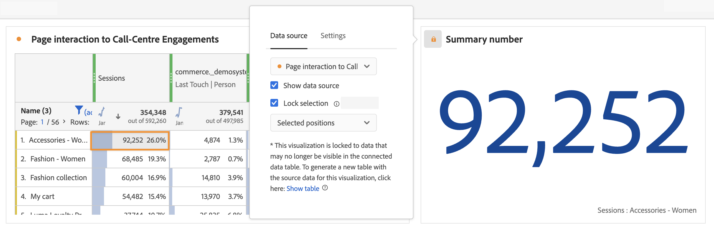

# Manage data sources {#manage-data-sources}

>[!CONTEXTUALHELP]
>id="workspace_freeformtable_lockselection"
>title="Lock selection"
>abstract="Enable this setting to lock the visualization to the selected positions or the selected items in the data source."

>[!CONTEXTUALHELP]
>id="workspace_freeformtable_lockselection_showtable"
>title="Show table"
>abstract="Selecting **[!UICONTROL Show table]** will generate a new datasource for your current visualization, separate from the original data source."

>[!CONTEXTUALHELP]
>id="workspace_freeformtable_showtable"
>title="Show table"
>abstract="Select **[!UICONTROL Show table]** to generate a new data source for your current visualization, separate from the original data source."

Synchronizing visualizations lets you control which freeform table or data source corresponds to a visualization.

>[!TIP]
>
>You can tell which visualizations are related by the color of  next to the title of visualizations. Matching colors mean that visualizations are based on the same data source.
>

You can show or hide the data source. You can also lock the selection to selected positions or selected items. These settings determine how the visualization changes (or doesn't change) when new data comes in.

<!--
**Tip:** You can tell which visualizations are related by the color of the dot next to the title. Matching colors mean that visualizations are based on the same data source.

Managing a data source lets you show the data source or lock the selection. These settings determine how the visualization changes (or doesn't change) when new data comes in.

1. [Create a project](/help/analyze/analysis-workspace/home.md) with a data table and a [visualization](/help/analyze/analysis-workspace/visualizations/freeform-analysis-visualizations.md).
1. In the data table, select the cells (data source) you want to associate with the visualization.
1. In the visualization, click the dot next to the title to bring up the **[!UICONTROL Data Source]** dialog. Select **[!UICONTROL Show Data Source]** or **[!UICONTROL Lock Selection]**.

   

   Synchronizing a visualization to a table cell creates a new (hidden) table and color-codes the synchronized visualization with that table.

>[!BEGINSHADEBOX]

See  [Data source settings](https://video.tv.adobe.com/v/23729?quality=12&learn=on){target="_blank"} for a demo video.

>[!ENDSHADEBOX]

-->

| Option | Description |
|--- |--- |
| **[!UICONTROL Data source]** | Select the data source on which the visualization is based, from the drop-down menu. |
| **[!UICONTROL Linked visualizations]** | Lists all linked visualizations. Applies to the data source (freeform table). |
| **[!UICONTROL Show data source]** | Lets you show or hide the data source (freeform table) that corresponds to the visualization. |
| **[!UICONTROL Lock Selection]** | Select this option to lock the visualization   to the data currently selected in the corresponding data table. Once enabled, select between:  <ul><li>**Selected Positions**: The visualization is locked on the **positions** that are selected in the corresponding data table. These positions continue to be visualized, even if the specific items in these positions change (for example due to sorting or filtering). For example, select this option if you want to show the top five campaign names listed in the data source in this visualization at all times. No matter which campaign names show up.</li> <li>**Selected Items**: The visualization is locked on the specific **items** currently selected in the corresponding data table. These items continue to be visualized, even if they change their ranking among items in the table. For example, select this option if you want to show the same five specific campaign names listed in the data source in this visualization at all times. No matter how those campaign names rank.</li></ul>If the visualization is locked to data that is no longer visible in the connected data table, you can generate a new table. Select **[!UICONTROL Show table]** to generate a new datasource for your current visualization, separate from the original data source. |
