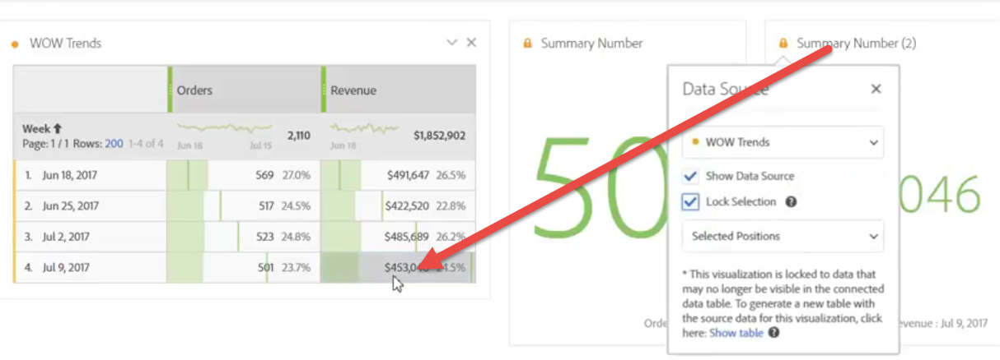

# Manage visualization data sources

Synchronizing visualizations lets you control which data table or data source corresponds to a visualization.

**Tip:** You can tell which visualizations are related by the color of the dot next to the title. Matching colors mean that visualizations are based on the same data source.

Managing a data source lets you show the data source or lock the selection. These settings determine how the visualization changes (or doesn't change) when new data comes in.

1. [Create a project](/help/analyze/analysis-workspace/home.md) with a data table and a [visualization](/help/analyze/analysis-workspace/visualizations/freeform-analysis-visualizations.md).
1. In the data table, select the cells (data source) you want to associate with the visualization.
1. In the visualization, click the dot next to the title to bring up the **[!UICONTROL Data Source]** dialog. Select **[!UICONTROL Show Data Source]** or **[!UICONTROL Lock Selection]**.

   

   Synchronizing a visualization to a table cell creates a new (hidden) table and color-codes the synchronized visualization with that table.

## Data Source settings

Here is a video on these settings:

>[!VIDEO](https://video.tv.adobe.com/v/23729/?quality=12)

| Element | Description |
| --- | --- |
| Linked Visualizations | If there are visualizations connected to a freeform or cohort table, the top left dot opens to list the connected visualizations and have a "show" checkbox option to show/hide the table. Hovering highlights the linked visualization, and clicking it takes you to it. |
| Show Data Source | Lets you show (by enabling the checkbox) or hide (by disabling) the data table that corresponds to the visualization.|
| Lock Selection | Enable this setting to lock the visualization to the data currently selected in the corresponding data table. Once enabled, choose between:<ul><li>**Selected Positions**: Choose this option if you want the visualization to stay locked on the positions that are selected in the corresponding data table. These positions will continue to be visualized, even if the specific items in these positions change. For example, choose this option if you want to show the top five campaign names in this visualization at all times, no matter which campaign names show up in the top five.</li><li>**Selected Items**: Choose this option if you want the visualization to stay locked on the specific items currently selected in the corresponding data table. These items will continue to be visualized, even if they change their ranking among items in the table. For example, choose this option if you want to show the same five specific campaign names in this visualization at all times, no matter where those campaign names rank.</li></ul>|

This architecture differs from the previous one in that Analysis Workspace no longer creates a duplicate hidden table that stores the locked selection for you. Now, the data source points to the table that you created the visualization from.

## Example use cases

* You can create a summary visualization and lock it to a cell in the table you created it from. When you enable "Show Data Source", it shows you exactly where this information is coming from in the table. The source data will be greyed out: 

  >
* You can add lots of visualizations and source them from different cells in the same table, as shown here. The table is the same as in the example above, but the sourced cell (and metric) is different: 

  >
* You can see whether there are visualizations connected to a freeform or cohort table by clicking the top left dot (Data Source Settings). Hovering will highlight the linked visualization, and clicking it will take you to it.

  >
