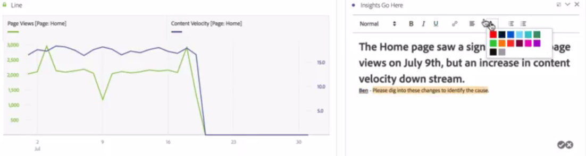

# Text

Lets you add user-defined text to your Workspace.

You can change the font settings (bold, italics, etc.) and add hyperlinks within text box visualizations & panel/visualization descriptions.

## Change font settings {#section_32727EE03FD04A8EB1D1B387DCAF6537}

After dragging a Text visualization into a panel and adding text, you can format the text by adding heading levels, changing the text bold/italic/underline, changing text color, etc.

## Add hyperlinks {#section_D55B857188A74A06B49006DF3511DC7C}

Highlight text and click the hyperlink icon in the formatting menu to add hyperlinks.
