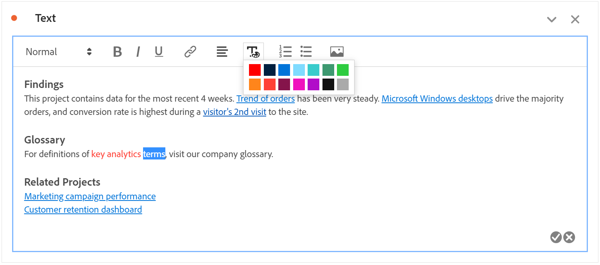
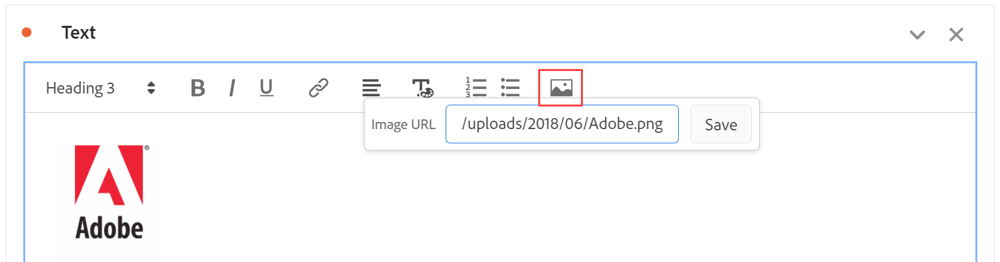

# Text

You can add user-defined text to your Workspace project by using a text visualizations or panel/visualization descriptions (right-click header > **[!UICONTROL Edit description]**). You can also change the formatting of your text, add hyperlinks, and add images.

## Adjust formatting {#format}

When editing your text box or description, you can adjust the font size (heading levels), color, styling (bold, italics, underline) and alignment of selected text. You can also add bullet and numbered lists.

## Add hyperlinks {#hyperlinks}

To add a hyperlink, highlight the text and click the hyperlink icon in the menu. Hyperlinks can link to external websites, documentation pages, [Workspace projects/panels/visualizations](https://experienceleague.adobe.com/docs/analytics/analyze/analysis-workspace/curate-share/shareable-links.html), and more to further assist your project recipients.

## Add images {#images}

To add an image to your project, click the image icon in the menu and insert a public image URL. The image URL must be publicly accessible, begin with `https`, and be of format `.png`, `.jpeg`, `.jpg`, or `.gif`. Static and animated images are supported.

