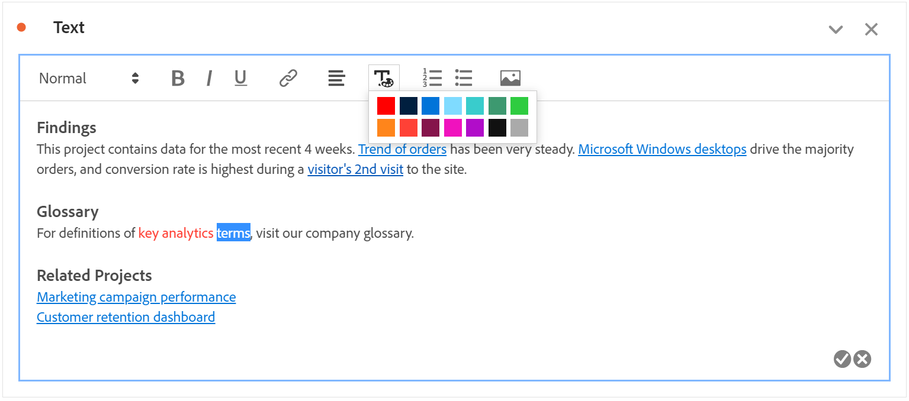
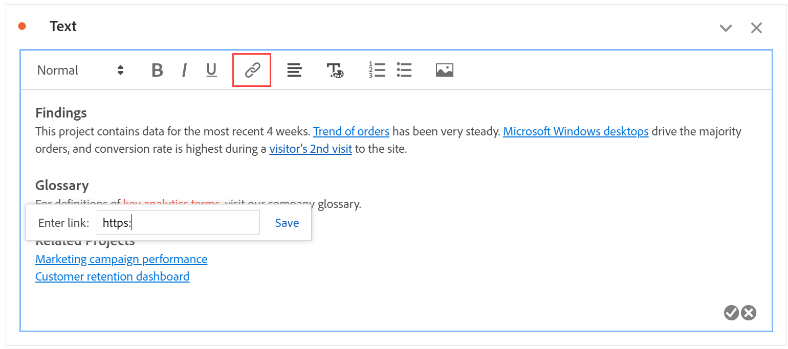

# Text {#text-visualization}

>[!CONTEXTUALHELP]
>id="workspace_text_button"
>title="Text"
>abstract="Add a user-defined rich text visualization to your project."

<!-- markdownlint-enable MD034 -->

>[!BEGINSHADEBOX]

_This article documents the Text visualization in_  _**Adobe Analytics**._ _See [Text](https://experienceleague.adobe.com/en/docs/analytics-platform/using/cja-workspace/visualizations/text)  for the_  _**Customer Journey Analytics** version of this article._

>[!ENDSHADEBOX]

You can
To add user-defined rich text to your Workspace project, you can use a  **[!UICONTROL Text]** visualization or use descriptions for a visualization and panel. 

## Use

You can use the Text visualization in the following ways:

1. Add a  **[!UICONTROL Text]** visualization. See [Add a visualization to a panel](freeform-analysis-visualizations.md#add-visualizations-to-a-panel).

1. In a panel or visualization, from the context-menu select **[!UICONTROL Edit description]**. 
   
   Select  when finished editing the description, select  to cancel.

You can change the formatting of your text, add hyperlinks, and add images.

## Adjust formatting {#format}

When editing your text box or description, you can adjust the font size (heading levels), color, styling (bold, italics, underline) and alignment of selected text. You can also add bullet and numbered lists.

## Add hyperlinks {#hyperlinks}

To add a hyperlink, highlight the text and select  in the menu. You can use hyperlinks to provide further assistance to your project recipients. Hyperlinks can link to external websites, documentation pages, [Workspace projects, panels, or visualizations](/help/analyze/analysis-workspace/curate-share/shareable-links.md), and more.

## Add images {#images}

To add an image to your project, select  in the menu and specify an image URL in **[!UICONTROL Image URL]** (for example `https://www.adobe.com/uploads/2018/06/Adobe.png`) and select **[!UICONTROL Save]**. 

The image URL must be publicly accessible, begin with `https`, and be of format `.png`, `.jpeg`, `.jpg`, or `.gif`. Static and animated images are supported. 

Be aware that drag and drop insertion of an image is not supported.

