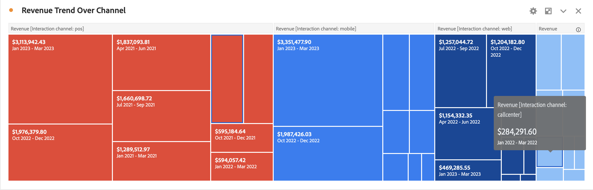

# Treemap

Displays hierarchical (tree-structured) data as a set of nested rectangles.

 Each branch of the tree is given a rectangle, which is then tiled with smaller rectangles representing sub-branches.

When the color and size dimensions are correlated in some way with the tree structure, one can often easily see patterns that would be difficult to spot in other ways, such as if a certain color is particularly relevant. A second advantage of treemaps is that, by construction, they make efficient use of space. 
