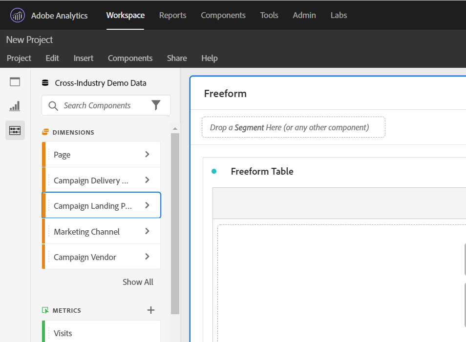

# Accessibility in Analysis Workspace

Learn about accessibility support in [!UICONTROL Analysis Workspace], the premier analysis tool for Adobe Analytics. 

Accessibility refers to making products usable for people with visual, auditory, motor, and other disabilities. Examples of accessibility features for software products include screen reader support, text equivalents for graphics, keyboard shortcuts, change of display colors to high contrast, and so on. 

[!UICONTROL Analysis Workspace] provides some tools that make it accessible to use, including:

## Navigate [!UICONTROL Workspace] using the keyboard

Navigation in [!UICONTROL Analysis Workspace] works top > down, and left > right. The following navigational elements facilitate accessibility:

* The `F6` key enables landmark shortcuts
* The `Tab` key moves between individual elements. 
* We apply focus indicators so that sighted keyboard users have a clear indication of which UI element currently has focus. The indicator is a blue border around the selected element.

    

### Keyboard navigation for drag & drop interactions 

[!UICONTROL Analysis Workspace] is a drag & drop user interface. However, users can add components using the keyboard instead:

1. Tab to a component in the left rail.
1. Press `Enter` to select.
1. Use arrow keys to navigate to the area where you want to drop the component.
1. Press `Enter` to place the component.

### Keyboard shortcuts (hotkeys) 

[!UICONTROL Analysis Workspace] offers a rich set of [keyboard shortcuts](https://docs.adobe.com/content/help/en/analytics/analyze/analysis-workspace/build-workspace-project/fa-shortcut-keys.html) for a more seamless workflow. Some common shortcuts for navigation, analysis creation, and insight democratization are listed below. 

#### Navigation

|Shortcut|Action|
|---|---|
|Alt + Shift + 1 / 2 / 3|Jump to different rails: [!UICONTROL Panels], [!UICONTROL Visualizations], or [!UICONTROL Components]| 
|Alt + Left/Right arrow |Navigate between panels|
|Alt + M| Collapse/expand all panels |
|Alt+  Ctrl + M |Collapse/expand active panel |
|Ctrl + / |Search left rail |

#### Analysis creation

|Shortcut|Action|
|---|---|
|Alt + 1 |New freeform table |
|Ctrl + Shift + C |New calculated metric |
|Ctrl + Shift + D |New date range |
|Ctrl + Shift + E |New segment |
|Ctrl + Z |Undo |
|Hold shift (in the panel segment dropzone) |Create a [dropdown filter](https://docs.adobe.com/content/help/en/analytics-learn/tutorials/analysis-workspace/using-panels/using-drop-down-filters.html) |

#### Democratization

|Shortcut|Action|
|---|---|
|Ctrl + S |Save |
|Ctrl + Shift + G |Curate  |
|Ctrl + G |Share  |
|Alt + Shift + S |Schedule  |
|Alt + L |Get link to project |
|Ctrl + Shift + B |Download PDF |

## Support for screen readers and screen magnifiers

A screen reader reads text that appears on the computer screen. It also reads non-textual information, such as button labels or image descriptions in the application, provided in accessibility tags or attributes.  

## Color palettes & contrast  

[!UICONTROL Analysis Workspace] strives for WCAG 2.1 AA conformance, including requirements for color contrast. 

In addition, users can set their own preferred color palette for a project under **[!UICONTROL Project]** > **[!UICONTROL Project settings]** > [Project color palette](https://docs.adobe.com/content/help/en/analytics/analyze/analysis-workspace/build-workspace-project/color-palettes.html). 

## Required field validation in component builders 

When building a component, required fields are validated when you save. If a required field does not pass validation, it will be outlined in red with an error icon. A written description appears of the issue that needs to be fixed.  

Once a component is fully validated, pressing `Save` closes the builder. 

## Support for operating system accessibility features  

Analysis Workspace supports built-in MS Windows and macOS accessibility features like high-contrast mode, sticky keys, and slow keys/filter keys. It also provides information about the user interface to the operating system to enable interaction with assistive technologies, including screen readers such as VoiceOver for macOS and NVDA on Windows.