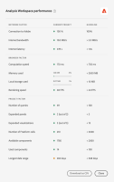

# Optimize [!UICONTROL Analysis Workspace performance]

Various factors can influence the performance of a project within Analysis Workspace. It's important to know what those contributors are before you start building a project so that you can plan and build the project in the most optimal way. This page includes a list of factors that will impact performance and optimizations you can make to ensure peak performance in Analysis Workspace. 

## [!UICONTROL Help] > [!UICONTROL Performance] in Analysis Workspace

Under **Analysis Workspace > [!UICONTROL Help] > [!UICONTROL Performance]**, you can see factors that impact your project's performance, including network, browser, and project factors. For the most accurate results, allow the project to fully load before opening the Performance page.

* The Current Project column displays the results for your current project and user environment.
* The Guideline column displays Adobe's recommended threshold for each factor.

Additionally, you can **Download as CSV** the performance contents to easily share with Adobe Customer Care or your internal IT teams.

>[!NOTE]
>
>The information on the Performance page varies each time the modal is opened, as factors are subject to change. Additionally, Adobe will continue to refine the guidelines provided as more data becomes available.

## Network factors

[!UICONTROL Help] > [!UICONTROL Performance] network factors include:

| Factor | Definition | Influenced by | Optimization |
| --- | --- | --- | --- |
| Connection to Adobe|Adobe sends in 10 test calls when the performance page is opened. This represents the percentage of those calls to Adobe that succeed. | Local network issues or Adobe issues will impact this factor. | Check status.adobe.com to verify if there are any known service issues. Then, validate your local network connection. |
| Internet bandwidth | Available for Google Chrome only. Your browser’s estimate of the bandwidth at your location. The guideline is 2.0MB/s. | Your local network connection will impact this factor. | Validate your local network connection. |
| Internet latency | Adobe sends in 10 test calls when the performance page is opened. This represents the amount of time it takes on average for each request to go to Adobe and be returned. Put more simply, it is a measure of how fast the internet is between your location and Adobe. The guideline is < 1 second. | Local network issues, many open browser tabs, or Adobe issues will impact this factor. | Check status.adobe.com to verify if there are any known service issues. Then, validate your local network connection and close unused browser tabs. |

## Browser factors

[!UICONTROL Help] > [!UICONTROL Performance] browser factors include:

| Factor | Definition | Influenced by | Optimization |
| --- | --- | --- | --- |
| Computation speed | How fast your computer performs a processing test. The guideline is < 750ms. | Your hardware as well as concurrent programs will impact this factor. | Open your computer’s Task Manager (PC) or Activity Monitor (Mac) to determine if any programs can be closed. Then, close unused browser tabs or other programs.   If those actions do not help, discuss hardware details with your IT team. |
| Memory used | Available for Google Chrome only. Every Workspace tab in a Google Chrome browser shares 4GB of memory in total. This represents the percent of that memory allowance that is being consumed by the current project. The guideline is 3500 MB, which is the point at which Workspace will begin surfacing memory errors. | Working in multiple tabs or downloading 50000 rows of data will contribute to increased memory usage. | If you receive a memory error, close other Workspace tabs and/or run 50000 row downloads one-at-a-time. |
| Local storage used | Data stored locally to your computer for use in the browser. Each origin (e.g. experience.adobe.com) has an allowance of 10MB. | Analysis Workspace uses local storage for several functions, including to store auto-saved (existing) projects, user settings, and feature flags. | To ensure Analysis Workspace functions do not become disrupted, clear local storage for the experience.adobe.com domain. |
| Rendering speed | FPS stands for Frames per second, which is how many times per second the browser draws the page on your screen. 24 FPS is commonly what the human eye can observe; if FPS is lower than that, you will observe rendering issues in Workspace. | FPS is impacted by multitasking across many Workspace projects at once and size of the project being viewed. Other programs running on your computer may have an impact, such as streaming, background scanners, etc. Additionally, your hardware will impact this factor. | Open your computer’s Task Manager (PC) or Activity Monitor (Mac) to determine if any programs can be closed. Then, close unused browser tabs or other programs.   If those actions do not help, discuss hardware details with your IT team. |

## Project factors

[!UICONTROL Help] > [!UICONTROL Performance] project factors include:

| Factor | Definition | Optimization |
| --- | --- | --- |
|Number of queries | The total number of queries (requests) made to Adobe to retrieve data that is displayed in the project. Queries include ranked requests for tables, anomaly detection, sparklines, components shown in the left rail, and more. Excludes collapsed panels and visualizations. The guideline is 100. | Simplify your project where possible by splitting out data into several projects that serve a specific purpose or group of stakeholders. Use tags to organize projects into themes, and use [direct linking](https://experienceleague.adobe.com/docs/analytics/analyze/analysis-workspace/curate-share/shareable-links.html) to create an internal table of contents so that stakeholders can more easily find what they need. |
| Expanded panels (out of total panels) | The number of expanded panels out of the total number of panels in the project. The guideline is 5. | After taking steps to simplify your project, collapse panels in your project that do not need to viewed on load. When the project is opened, only expanded panels will be processed. Collapsed panels will not be processed until the user expands them. |
| Expanded visualizations (out of total visualizations) | The number of expanded tables and visualizations out of the total in the project, including hidden data sources. The guideline is 15. | After taking steps to simplify your project, collapse visualizations in your project that do not need to be viewed on load. Prioritize the visuals that are most important to the consumer of the report and break out supporting visuals into a separate, more detailed panel or project if needed. |
| Number of Freeform cells | The total number of Freeform table cells in the project, calculated by rows * columns across all tables. Excludes hidden data sources. The guideline is 4000. | Reduce the number of columns in your table to only the most relevant data points. Reduce the number of rows in your table by adjusting the number of rows shown, applying a table filter, or applying a segment. |
| Available components | The total number of components retrieved in the left rail of the project, across all report suites in the project. This will impact the speed in which the left rail loads and how fast search results are returned within it. The guideline is 2000. | Talk to your product admin about creating a curated virtual report suite that has a more tailored set of components. |
| Used components | The total number of components used in the project. The guideline is 100. | The number of used components is not a direct influencer of performance. However, the complexity of those components will contribute to performance of the project. See optimizations in the “Additional factors" section below. |
| Longest date range | This factor displays the longest date range used the project. The guideline is 1 year. | Where possible, don't pull in more data than you need. Narrow the panel calendar to the relevant dates for your analysis or use date range components (purple components) in your freeform tables. Date ranges used in a table override the panel date range. For example, you can add last month, last week and yesterday to the table columns to request those specific ranges of data. For more information on working with date ranges in Analysis Workspace, watch [this video](https://experienceleague.adobe.com/docs/analytics-learn/tutorials/analysis-workspace/calendar-and-date-ranges/date-ranges-and-calendar-in-analysis-workspace.html).   Additionally, minimize the number of year-over-year comparisons used in the project. When a year-over-year comparison is calculated, it looks across the full 13 months of data between the months of interest. This has the same impact as changing the panel date range to last 13 months. |

## Additional factors

Additional factors that are not included on Help > Performance include:

| Factor | Definition | Influenced by | Optimization |
| --- | --- | --- | --- |
| Segment complexity | Intricate segments can have a significant impact on project performance. | Factors that add complexity to a segment (in descending order of impact) include: <ul><li>Operators of "contains,", "contains any of", "matches," "starts with," or "ends with" </li><li>Sequential segmentation, especially when dimension restrictions (Within/After) are used </li><li>Number of unique dimension items within dimensions used in the segment (e.g., Page = 'A' when Page has 10 unique items will be faster than Page = 'A' when Page has 100000 unique items) </li><li>Number of different dimensions used (e.g., Page = 'Home' and Page = 'Search results' will be faster than eVar 1 = 'red' and eVar 2 = 'blue')</li><li>Many OR operators (instead of AND)</li><li>Nested containers that vary in scope (e.g., "Hit" inside of "Visit" inside of "Visitor")</li></ul> | While some of the complexity factors cannot be prevented, look for opportunities to reduce the complexity of your segments. In general, the more specific you can be with your segment criteria, the better. For example:<ul><li>With containers, using a single container at the top of the segment will be faster than a series of nested containers.</li><li>With operators, "equals" will be faster than "contains", and "equals any of" will be faster than "contains any of".</li><li>With many criteria, AND operators will be faster than a series of OR operators.</li></ul> Look for opportunities to reduce many OR statements into a single "equals any of" statement.  [Classifications](/help/components/classifications/c-classifications.md) can also help to consolidate many values into concise groups from which you can then create segments. Segmentation on classification groups provides performance benefits over segments that contain many OR statements or "contains" criteria. |
| Visualization complexity (segments, metrics, filters) | The type of visualization (e.g. fallout vs a freeform table) added to a project by itself doesn't influence project performance very much. It is the complexity of the visualization that will add to processing time. | Factors that add complexity to a visualization include:<ul><li>Range of data requested</li><li>Number of segments applied; for instance, segments used as rows of a freeform table</li><li>Use of complex segments</li><li>[Static item](https://experienceleague.adobe.com/docs/analytics/analyze/analysis-workspace/visualizations/freeform-table/column-row-settings/manual-vs-dynamic-rows.html) rows or columns in freeform tables</li><li>Filters applied to rows in freeform tables</li><li>Number of metrics included, especially calculated metrics that use segments</li></ul>|If you notice that your projects aren't loading as quickly as you'd like, try replacing some segments with eVars and filters, where possible.  If you find yourself continually using segments and calculated metrics for data points that are important to your business, consider improving your implementation to capture these data points more directly. The use of a tags in Adobe Experience Platform and Adobe's processing rules can make implementation changes quick and easy to implement. |
| Report suite size | The amount of data collected into your report suite. | - | Consult with your implementation team or an Adobe expert to determine if there are implementation improvements that can be made to improve overall experience in Adobe Analytics. |
| Concurrent queries | The number of queries that are being requested by your organization to Adobe at the same time. Each organization is entitled to a minimum of 5 concurrent queries. | If a report is taking a long time, typically it is due to the fact that it is in a queue with other reports. This means your organization is trying to run many concurrent requests against a specific report suite. Queries can come from API requests, reporting UIs (Analysis Workspace, Reports & Analytics, Report Builder, etc), scheduled projects, scheduled reports, scheduled alerts, and concurrent users making reporting requests. | Spread your requests and schedules for the report suite more evenly throughout the day. Also, shift your requests to off-peak times when possible. Monday mornings, Tuesday mornings, and the first of each month are peak reporting times. |
| Data center capacity | The amount of reporting capacity you and other customers share within an Adobe data center. | This is impacted by the number of concurrent queries made by your organization and other organizations within your data center. | Your organization is entitled to a set capacity and if the system is under a light load, Adobe will shift more capacity to you, above and beyond your entitled allowance. |
