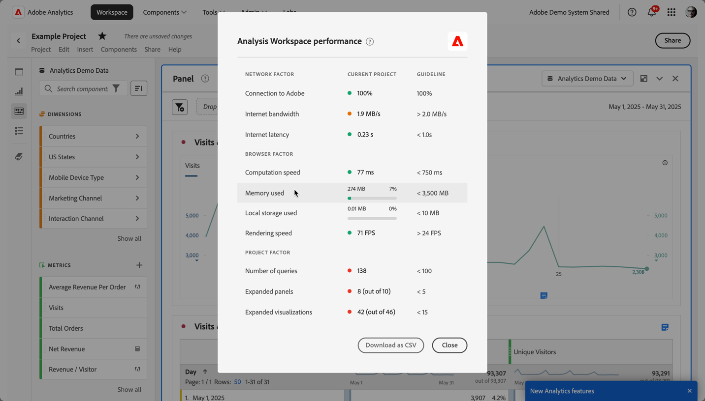
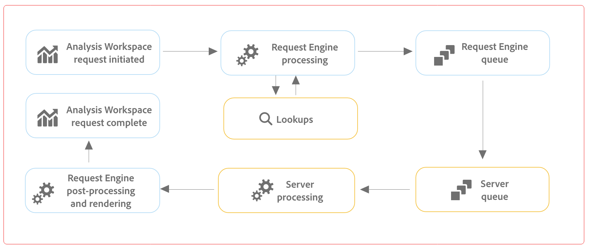

# Optimize Analysis Workspace performance

Various factors influence the performance of a project within Analysis Workspace.  To understand these factors, help you to plan and build projects in the most optimal way.

To gain insight into the performance of Analysis Workspace:

1. Select **[!UICONTROL Help] > [!UICONTROL Performance]**.
   You can see a modal dialog that displays factors that impact your project's performance, including network, browser, and project factors. For the most accurate results, allow the project to load before you 

   * The **[!UICONTROL Current Project]** column displays the results for your current project and user environment.
   * The **[!UICONTROL Guideline]** column displays Adobe's recommended threshold for each factor.

1. Select **[!UICONTROL Download as CSV]** to download the performance report, so you can share the report within your internal organization or with Adobe support.

>[!NOTE]
>
>The information on the Performance page varies each time the modal is opened, as factors are subject to change. Additionally, Adobe continues to refine the guidelines provided as more data becomes available.

## Network factors

Network factors include:

| Factor | Definition | Influenced by | Optimization |
| --- | --- | --- | --- |
| Connection to Adobe | Adobe sends in 10 test calls when the performance page is opened. These calls represent the percentage of those calls to Adobe that succeed. | Local network issues or Adobe issues impact this factor. | Check status.adobe.com to verify if there are any known service issues. Then, validate your local network connection. |
| Internet bandwidth | Available for Google Chrome only. Your browser's estimate of the bandwidth at your location. The guideline is 2.0MB/s. | Your local network connection impacts this factor. | Validate your local network connection. |
| Internet latency | Adobe sends in 10 test calls when the performance page is opened. These calls represent the amount of time for each request to reach Adobe and return. And are a measure of how fast the internet is between your location and Adobe. The guideline is less than 1 second. | Local network issues, many open browser tabs, or Adobe issues impact this factor. | Check status.adobe.com to verify if there are any known service issues. Then, validate your local network connection and close unused browser tabs. |

## Browser factors

Browser factors include:

| Factor | Definition | Influenced by | Optimization |
| --- | --- | --- | --- |
| Computation speed | How fast your computer performs a processing test. The guideline is less than 750 milliseconds. | Your hardware as well as concurrent programs impact this factor. | Open your computer's Task Manager (PC) or Activity Monitor (Mac) to determine if any programs can be closed. Then, close unused browser tabs or other programs.   If those actions do not help, discuss hardware details with your IT team. |
| Memory used | Available for Google Chrome only. Every Workspace tab in a Google Chrome browser shares 4GB of memory in total. This value represents the percent of that memory allowance consumed by the current project. The guideline is 3500 MB, which is the point at which Workspace begins surfacing memory errors. | Working in multiple tabs or downloading 50000 rows of data contribute to increased memory usage. | If you receive a memory error, close other Workspace tabs and/or run 50000 row downloads one-at-a-time. |
| Local storage used | Data is stored locally to your computer for use in the browser. Each origin (for example, experience.adobe.com) has an allowance of 10MB. | Analysis Workspace uses local storage for several functions, including to store auto-saved (existing) projects, user settings, and feature flags. | To ensure that Analysis Workspace functions are not disrupted, clear local storage for the experience.adobe.com domain. |
| Rendering speed | FPS stands for Frames per second, which is how many times per second the browser draw the page on your screen. 24 FPS is commonly what the human eye can observe; if FPS is lower than that, you observe rendering issues in Workspace. | FPS is impacted by multitasking across many Workspace projects at once and size of the project being viewed. Other programs running on your computer may have an impact, such as streaming, background scanners, etc. Additionally, your hardware impacts this factor. | Open your computer's Task Manager (PC) or Activity Monitor (Mac) to determine if any programs can be closed. Then, close unused browser tabs or other programs.   If those actions do not help, discuss hardware details with your IT team. |

## Project factors

Project factors include:

| Factor | Definition | Optimization |
| --- | --- | --- |
|Number of requests | The total number of requests made to Adobe to retrieve data that is displayed in the project. Queries include ranked requests for tables, anomaly detection, sparklines, components shown in the left rail, and more. This value excludes collapsed panels and visualizations. The guideline is 100. | Simplify your project where possible by splitting out data into several projects that serve a specific purpose or group of stakeholders. Use tags to organize projects into themes, and use [direct linking](https://experienceleague.adobe.com/en/docs/analytics/analyze/analysis-workspace/curate-share/shareable-links) to create an internal table of contents so that stakeholders can more easily find what they need. |
| Expanded panels (out of total panels) | The number of expanded panels out of the total number of panels in the project. The guideline is 5. | After taking steps to simplify your project, collapse panels in your project that you do not need to view on load. When the project is opened, only expanded panels are processed. Collapsed panels are not processed until the user expands them. |
| Expanded visualizations (out of total visualizations) | The number of expanded tables and visualizations out of the total in the project, including hidden data sources. The guideline is 15. | After taking steps to simplify your project, collapse visualizations in your project that do not need to be viewed on load. Prioritize the visuals that are most important to the consumer of the report and break out supporting visuals into a separate, more detailed panel or project if needed. |
| Number of Freeform cells | The total number of Freeform table cells in the project, calculated by rows * columns across all tables. This value excluded hidden data sources. The guideline is 4000. | Reduce the number of columns in your table to only the most relevant data points. Reduce the number of rows in your table by adjusting the number of rows shown, applying a table filter, or applying a segment. |
| Available components | The total number of components retrieved in the left rail of the project, across all report suites in the project. This value impacts the speed in which the left rail loads and how fast search results are returned within it. The guideline is 2000. | Talk to your product admin about creating a curated virtual report suite that has a more tailored set of components. |
| Used components | The total number of components used in the project. The guideline is 100. | The number of components used is not a direct influencer of performance. However, the complexity of those components contributes to the performance of the project. See optimizations in the A[dditional factors](#additional-factors) section below. |
| Longest date range | This factor displays the longest date range used in the project. The guideline is 1 year. | Where possible, don't pull in more data than you need. Narrow the panel calendar to the relevant dates for your analysis. Or use date range components in your freeform tables. Date ranges used in a table override the panel date range. For example, you can add last month, last week and yesterday to the table columns to request those specific ranges of data. For more information on working with date ranges in Analysis Workspace, watch [this video](https://experienceleague.adobe.com/en/docs/analytics-learn/tutorials/analysis-workspace/calendar-and-date-ranges/using-date-ranges-and-comparisons-in-analysis-workspace).   Additionally, minimize the number of year-over-year comparisons used in the project. When a year-over-year comparison is calculated, the calculations look across the full 13 months of data between the months of interest. This comparison has the same impact as changing the panel date range to last 13 months. |

## Request factors

Request factors

Use the following diagram and terms to learn how requests are processed and the various factors that influence processing times:

>[!NOTE]
>
>Recommended guidelines for these factors are based on a complexity score of medium for reporting requests.

### Request processing diagram

### Request processing terms

| Factor | Definition | Optimization |
| --- | --- | --- |
|[!UICONTROL **Average request time**] | The time required from when the request is initiated to when it is complete. The guideline is 15 seconds. 
In the [Request processing](#request-processing-diagram) diagram above, the request time represents the full process, from **Analysis Workspace request initiated** to **Analysis Workspace request complete**.
 |  |
|[!UICONTROL **Longest request time**] | The time required from when the request is initiated to when it is complete. 
In the [Request processing](#request-processing-diagram) diagram above, the request time represents the full process, from **Analysis Workspace request initiated** to **Analysis Workspace request complete**.
 |  |
| [!UICONTROL **Average lookup time**] | Because Analysis Workspace stores only the hash for any strings that are used in any segments, each time you process a project, **Lookups** are performed to match the hashes with the appropriate values. The guideline is under 2 seconds.
These lookups can be a resource-intensive process, depending on the number of values that could potentially match the hash. 

In the [Request processing](#request-processing-diagram) diagram above, the lookup time is represented in the **Lookups** phase (at the time of **Request Engine processing** phase).
 | If requests are slowing down here, it is probably due to having too many string segments in you project, or having strings with overly generic values that have too many potential matches. |
| [!UICONTROL **Average queue time**] | The total time waiting in the queue before requests are processed. The guideline is 5 seconds.
In the [Request processing](#request-processing-diagram) diagram above, the queue time is represented in the **Request Engine queue** phase and **Server queue** phase.
 | If requests are slowing down here, it may be due to too many requests running simultaneously in your organization. Try running the request at an off-peak time. |
| [!UICONTROL **Average server processing time**] | The average amount of time it takes to process the request.
In the [Request processing](#request-processing-diagram) diagram above, the average server processing time is represented in the **Server queue** phase and **Server processing** phase. The guideline is 10 seconds | If requests are slowing down here, it is likely that the project has overly long date ranges or complex visualizations. Try shortening your project date range to decrease processing times. |
| [!UICONTROL **Complexity**] | Not all requests require the same amount of time to process. Request complexity can help provide a general idea about the time required to process the request. The guideline is Medium or lower. 
Possible values include:
 <ul><li>[!UICONTROL **Low**]</li><li>[!UICONTROL **Medium**]</li><li>[!UICONTROL **High**]</li></ul>This value is influenced by the values in the following columns:<ul><li>[!UICONTROL **Month boundaries**]</li><li>[!UICONTROL **Columns**]</li><li>[!UICONTROL **Segments**]</li></ul> |  |
| [!UICONTROL **Month boundaries**] | The number of months that are included in a request. More month boundaries add to the complexity of the request. The guideline is 6 or fewer. | If requests are slowing down here, it may be because the month boundaries in your project are too large. Try reducing the number of months. |
| [!UICONTROL **Columns**] | The number of metrics and breakdowns in the request. More columns add to the complexity of the request. The guideline is 10 or fewer. | If requests are slowing down here, it may be because there are too many columns in your project. Try reducing the number of columns. |
| [!UICONTROL **Segments**] | The number of segments applied to the request. More segments add to the complexity of the request. The guideline is 5 or fewer. | If requests are slowing down here, it may be because there are too many segments in your project. Try reducing the number of segments.  |

## Additional factors

Additional factors that are not included in Help > Performance include:

| Factor | Definition | Influenced by | Optimization |
| --- | --- | --- | --- |
| Segment complexity | Intricate segments can have a significant impact on project performance. | Factors that add complexity to a segment (in descending order of impact) include: <ul><li>Operators of **[!UICONTROL contains]**, **[!UICONTROL contains any of]**, **[!UICONTROL matches]**, **[!UICONTROL starts with]**, or **[!UICONTROL ends with]**/ </li><li>Sequential segmentation, especially when dimension restrictions (Within/After) are used </li><li>The number of unique dimension items within dimensions used in the segment (for example, Page = 'A' when Page has 10 unique items are faster than Page = 'A' when Page has 100000 unique items).</li><li>The number of different dimensions used (for example, Page = 'Home' and Page = 'Search results' are faster than eVar 1 = 'red' and eVar 2 = 'blue')</li><li>Many OR operators (instead of AND)</li><li>Nested containers that vary in scope (for example, Hit inside of Visit inside of Visitor)</li></ul> | While some of the complexity factors cannot be prevented, look for opportunities to reduce the complexity of your segments. In general, the more specific you can be with your segment criteria, the better. For example:<ul><li>With containers, using a single container at the top of the segment are faster than a series of nested containers.</li><li>With operators, **[!UICONTROL equals]** are faster than **[!UICONTROL contains]**, and **[!UICONTROL equals any of]** are faster than **[!UICONTROL contains any of]**.</li><li>With many criteria, AND operators are faster than a series of OR operators.</li></ul> Look for opportunities to reduce many OR statements into a single **[!UICONTROL equals any of]** statement.  [Classifications](/help/components/classifications/classifications-overview.md) can also help to consolidate many values into concise groups from which you can then create segments. Segmentation on classification groups provides performance benefits over segments that contain many OR statements or **[!UICONTROL contains]** criteria. |
| Visualization complexity (segments, metrics, filters) | The type of visualization (for example, fallout vs a freeform table) added to a project by itself doesn't influence project performance very much. The complexity of the visualization adds to processing time. | Factors that add complexity to a visualization include:<ul><li>Range of data requested</li><li>Number of segments applied; for instance, segments used as rows of a freeform table</li><li>Use of complex segments</li><li>[Static item](https://experienceleague.adobe.com/en/docs/analytics/analyze/analysis-workspace/visualizations/freeform-table/column-row-settings/manual-vs-dynamic-rows) rows or columns in freeform tables</li><li>Filters applied to rows in freeform tables</li><li>Number of metrics included, especially calculated metrics that use segments</li></ul>|If you notice that your projects aren't loading as quickly as you'd like, try replacing some segments with eVars and filters, where possible.  If you find yourself continually using segments and calculated metrics for data points that are important to your business, consider improving your implementation to capture these data points more directly. The use of a tags in Adobe Experience Platform and Adobe's processing rules can make implementation changes quick and easy to implement. |
| Report suite size | The amount of data collected into your report suite. | - | Consult with your implementation team or an Adobe expert to determine if there are implementation improvements that can be made to improve the overall experience in Adobe Analytics. |
| Concurrent queries | The number of queries requested by your organization at the same time. Each organization is entitled to a minimum of 5 concurrent queries. | If a report is taking a long time, the report might be in a queue with other reports. Your organization is trying to run many concurrent requests against a specific report suite. Queries can come from API requests, reporting UIs (Analysis Workspace, Report Builder), scheduled projects, scheduled reports, scheduled alerts, and concurrent users making reporting requests. | Spread your requests and schedules for the report suite more evenly throughout the day. Also, shift your requests to off-peak times when possible. Monday mornings, Tuesday mornings, and the first of each month are peak reporting times. |

## Tips to increase productivity in Analysis Workspace

>[!BEGINSHADEBOX]

See  [Tips to increase productivity](https://video.tv.adobe.com/v/31157?quality=12&learn=on){target="_blank"} for a demo video.

>[!ENDSHADEBOX]

