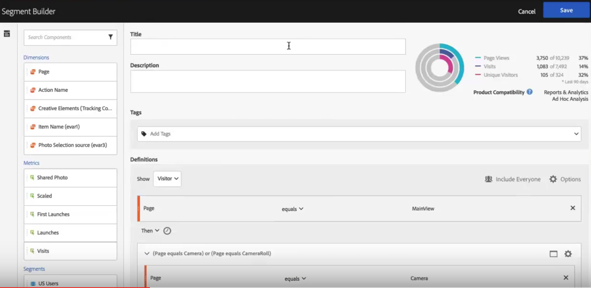

# Apply segments in fallout analysis

You can create segments from a touchpoint, add segments as touchpoint, and compare key workflows across various segments in Analysis Workspace.

## Create a segment from a touchpoint {#section_915E8FBF35CD4F34828F860C1CCC2272}

1. First, create a segment from a specific touchpoint that you are especially interested in and that might be useful to apply to other reports. You do this by right-clicking the touchpoint and selecting **[!UICONTROL Create segment from touchpoint]**.

   

   The Segment Builder opens, pre-populated with the pre-built sequential segment that matches the touchpoint you selected:

   

1. Give the segment a title and description and save it.

   You can now use this segment in any report you wish.

## Add a segment as a touchpoint {#section_17611C1A07444BE891DC21EE8FC03EFC}

If you want to see, for example, how your US users trend and affect the fallout, just drag the US users segment into the fallout:

Or you can create an AND touchpoint by dragging the US users segment onto another checkpoint.

## Compare segments in fallout {#section_E0B761A69B1545908B52E05379277B56}

You can compare an unlimited number of segments in the Fallout visualization.

1. Select the segments you want to compare from the [!UICONTROL Segments] rail on the left. In our example, we have selected 2 segments: US Users and Non-US Users. 
1. Drag them into the Segment drop zone at the top.

   

1. Optional: You can keep "All Visits" as the default container or delete it.

   

1. You can now compare the fallout across the two segments, such as where one segment is outperforming another, or other insights.

