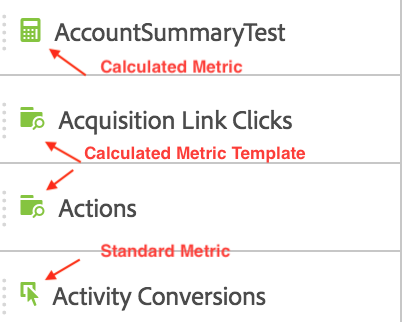

# Metrics

You can either drag a standard metric, calculated metric, or calculated metric template from the [!UICONTROL  Components] menu to the table: 

 

Or you can click **[!UICONTROL  Components]** > **[!UICONTROL  New Metric]**. This will take you to the [ Calculated Metric Builder](https://marketing.adobe.com/resources/help/en_US/analytics/calcmetrics/), where you can build custom metrics from existing metrics. 

To make it easier to quickly create calculated metrics, **[!UICONTROL  Create metric from selection]** has been added to the column right-click menu in Freeform Tables. This option displays when one or more header column cells are selected. 

 
