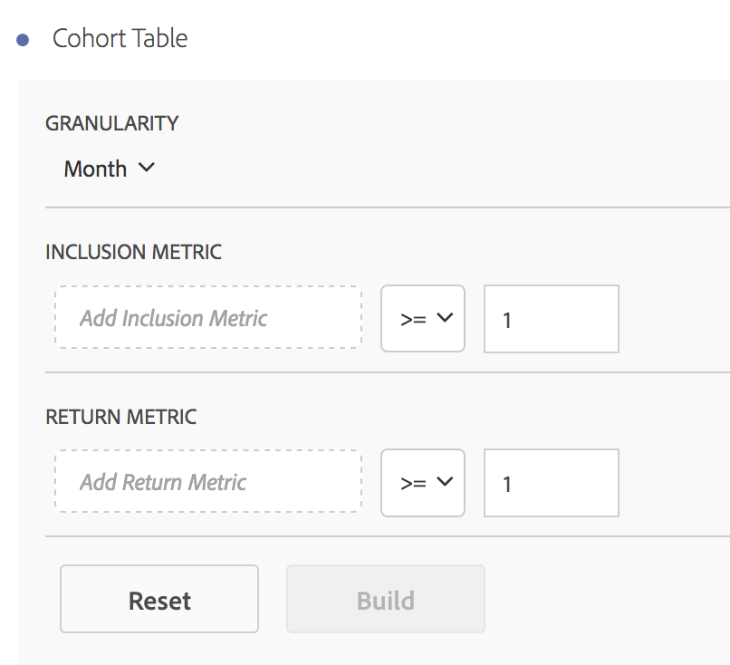

# Cohort table

See [ What is cohort analysis?](../../analysis_workspace_bucket/freeform-analysis-visualizations/cohort-table/cohort_analysis.md#concept_9D240A490265427DA694D18D14EACC0E). 

Add a Cohort Table by dragging in a Blank Panel from the [!UICONTROL  Panel] rail, then dragging in a Cohort Table from the [!UICONTROL  Visualizations] rail. Add inclusion and return metrics. For more information, see [ Cohort analysis](../../analysis_workspace_bucket/freeform-analysis-visualizations/cohort-table/cohort_analysis.md#concept_9D240A490265427DA694D18D14EACC0E). 

 

Run the report: 

 
