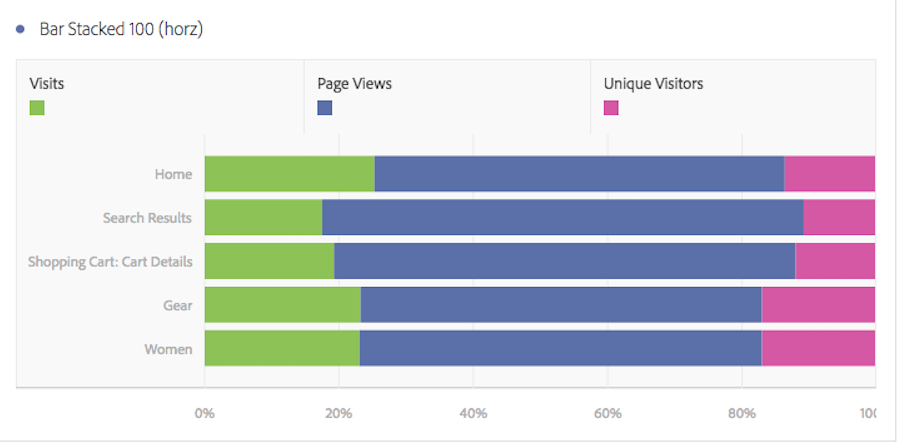

# Horizontal Bar and Horizontal Bar Stacked

## Horizontal Bar {#section_73A4D6F6C8864045A97B0B32B5FFFEDB}

This visualization shows horizontal bars representing various values across one or more metrics. 

 

## Horizontal Bar Stacked {#section_50C08E9E20A94024A6553BC352ADB597}

This visualization is like the [!UICONTROL  Horizontal Bar Chart], but the series bars appear stacked. 

 

The [!UICONTROL  Horizontal Bar Stacked] visualization setting on bar stacked visualizations turns the chart into a "100% stacked" visualization: 

 
