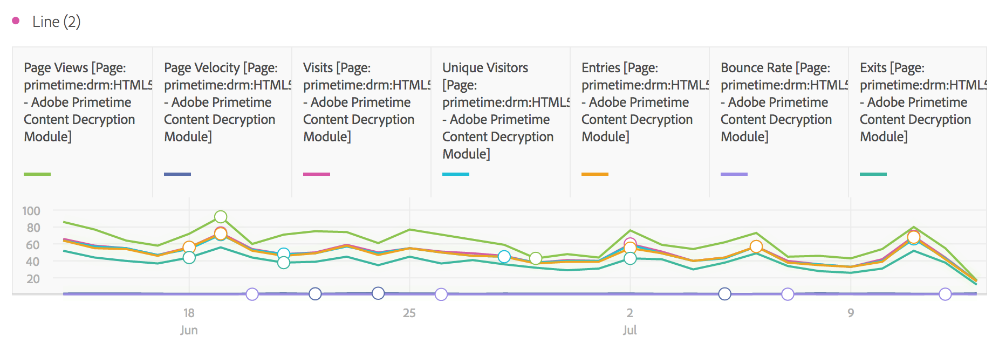
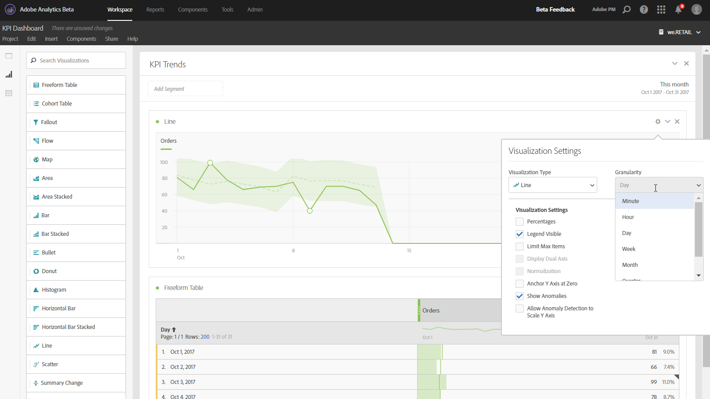

# Line

This visualization represents metrics using a line in order to show how values change over a period of time. A line chart can be used only when time is used as a dimension. 

 

A granularity drop-down in the[ visualization settings](../../analysis_workspace_bucket/freeform-analysis-visualizations.md#section_D3BB5042A92245D8BF6BCF072C66624B) lets you change a trended visualization (e.g. line, bar) from daily to weekly to monthly, etc. 

 
