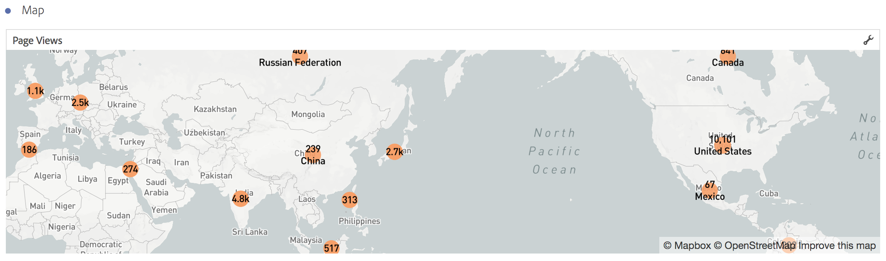
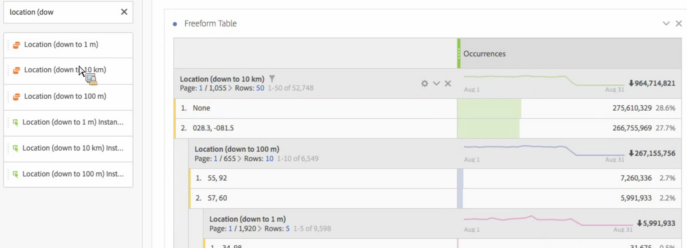
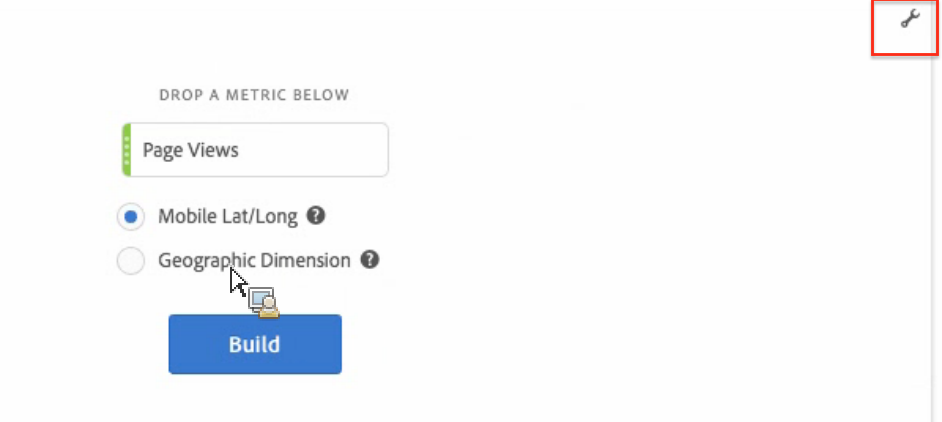

# Map

* [ Overview ](../../analysis_workspace_bucket/freeform-analysis-visualizations/map-visualization.md#section_19F740FAF08D47B1AF1EF239A74FC75C)
* [ Build a Map Visualization ](../../analysis_workspace_bucket/freeform-analysis-visualizations/map-visualization.md#section_61BBFA3A7BFD48DA8D305A69D9416299)
* [ Map Visualization Settings ](../../analysis_workspace_bucket/freeform-analysis-visualizations/map-visualization.md#section_5F89C620A6AA42BC8E0955478B3A427E)

## Overview {#section_19F740FAF08D47B1AF1EF239A74FC75C}

The Map Visualization in Analysis Workspace 

* Is a new visualization type that allows you to build a visual map of any metric (including calculated metrics).
* Is useful for identifying and comparing metric data across different geographic regions.
* Can support 2 data sources: latitude/longitude from mobile usage or geographic dimension for web usage.
* Now supports PDF export.
* Leverages WebGL for graphics display. If your graphics drivers do not support WebGL rendering, you may need to update your drivers.

## Build a map visualization {#section_61BBFA3A7BFD48DA8D305A69D9416299}

1. From the list of visualizations, drag **[!UICONTROL  Map]** into a Freeform panel:  

1. Drag in a metric from the list of metrics (including calculated metrics).
1. Specify the data source you want to draw from. (This dialog appears only if you have location tracking enabled for mobile app data.) 
<table id="table_CD54B433464B4282A7524FB187016C47"> 
 <tbody> 
  <tr> 
   <td colname="col1"> 
<b>Mobile Lat/Long</b> 
 </td> 
   <td colname="col2"> 
This option represents mobile app data. 
 
You will see this option only if you have enabled it for your report suite in 
     <ignoretag> 
       Analytics   &gt; 
       Admin   &gt; 
       Report Suites   &gt; 
       &amp;lt;select report suite&amp;gt;   &gt; 
       Edit Settings   &gt; 
       Mobile Management   &gt; 
       Enable Location Tracking  
     </ignoretag>. 
 
This is the default setting (if location tracking is enabled). 
 </td> 
  </tr> 
  <tr> 
   <td colname="col1"> 
<b>Geographic Dimension </b> 
 </td> 
   <td colname="col2"> 
This option represents geo segmentation data about visitor location based on the visitor's IP address. This data gets transformed into Country, Region, and City. Note that it does not go to the DMA or Zip Code level. 
 
Almost all report suites have this dimension enabled. If yours does not, contact Adobe Customer Care to have geographic reports enabled. 
 </td> 
  </tr> 
 </tbody> 
</table>

1. Click **[!UICONTROL  Build]**. The first view you will see is a World View with a bubble map, similar to this. 

    

1. You can now 

    * **Zoom** into this map to magnify certain areas by double-clicking the map or by using your scroll wheel. The map zooms according to where you have placed your cursor. Through zoom interaction, the required dimension (country &gt; state &gt; city) is automatically updated, based on the zoom level.
    * **Compare** two or more map visualizations in the same project by placing them side by side.
    * **Show period-over-period (such as, year-over-year) comparisons**:     
        * Show negative numbers: For example, if you are plotting a year-over-year metric, the map can show -33% over New York.
        * With metrics that are of type "percent", clustering averages the percentages together.
        * A green/red color scheme: Positive/Negative

    * **Rotate** the map in 2D or 3D by holding the [!UICONTROL  Ctrl] key and moving the map.
    * **Toggle** to a different view, such as the heat map, using the [ settings ](../../analysis_workspace_bucket/freeform-analysis-visualizations/map-visualization.md#section_5F89C620A6AA42BC8E0955478B3A427E) described below. Note that the bubble view is the default setting.

1. **Save** the project to save all map settings (coordinates, zoom, rotation).
1. The freeform table, below the visualization, can be populated by dragging in location dimensions and metrics from the left rail:  

## Map visualization settings {#section_5F89C620A6AA42BC8E0955478B3A427E}

There are 2 sets of settings for Map: 

The **wrench icon** at the top right brings back the initial dialog where you can change the metric and the data source: 

 

Clicking the **gear icon** reveals these visualization settings: 

<table id="table_548CA0656C784C0DB114A54E580E0E0E"> 
 <thead> 
  <tr> 
   <th colname="col1" class="entry"> Setting </th> 
   <th colname="col2" class="entry"> Description </th> 
  </tr> 
 </thead>
 <tbody> 
  <tr> 
   <td colname="col1"> Bubbles </td> 
   <td colname="col2"> 
Plots events using bubbles. A bubble chart is a multi-variable graph that is a cross between a scatterplot and a proportional area chart. This is the default view. 
 </td> 
  </tr> 
  <tr> 
   <td colname="col1"> Heatmap </td> 
   <td colname="col2"> 
Plots events using a heatmap. A heatmap is a graphical representation of data where the individual values contained in a matrix are represented as colors. 
 
  
 </td> 
  </tr> 
  <tr> 
   <td colname="col1"> Styles: Color Theme </td> 
   <td colname="col2"> 
Shows the color scheme for the heat map and bubbles. You can choose among Coral, Reds, Greens or Blues. Default is Coral. 
 </td> 
  </tr> 
  <tr> 
   <td colname="col1"> Styles: Map Style </td> 
   <td colname="col2"> 
You can choose among Basic, Streets, Bright, Light, Dark, and Satellite. 
 </td> 
  </tr> 
  <tr> 
   <td colname="col1"> Cluster Radius </td> 
   <td colname="col2"> 
Groups data points together that are within the specified number of pixels. Default is 50. 
 </td> 
  </tr> 
  <tr> 
   <td colname="col1"> Custom Max Value </td> 
   <td colname="col2"> 
Lets you alter the threshold for the max value for the map - adjusting this value adjusts the scale for the bubbles/heatmap values (color and size) relative to the custom max value set. 
 </td> 
  </tr> 
 </tbody> 
</table>

