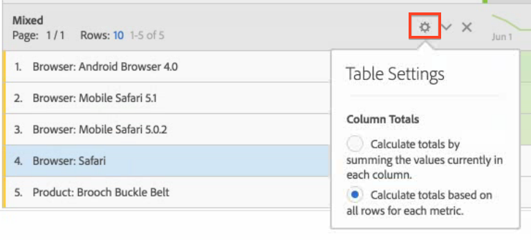

# Manual vs. dynamic rows

For example, when you drag the Browser dimension into the table, all of its dimension items (e.g., Android Browser, Mobile Safari, Firefox, etc.) dynamically get pulled into the table. 

In contrast, any time you manually select and drop a specific metric, segment, data range, or individual dimension item into a table, the result is a hardcoded or "manual" row or list. You can now interact with a manual row in these ways: 

* Click the Preview icon in manual rows that lets you preview segments, metrics, date ranges.
* Click the "x" icon to delete that row from the table.
* Limit how many rows display and enable paging.
* Add "mixed dimension items". For example, add an item from a browser dimension and another item from a product dimension. Here is an illustration: 

   

In addition, (only) when you are in a manual row mode, you can now change how the column totals are calculated. Just click the gear icon and toggle between these 2 options: 

 

|  Option  | Description  |
|---|---|
|  Calculate totals by summing the values currently in each column.  | This option calculates only the rows currently in the table. (Client-side calculation)  |
|  Calculate totals based on all rows for each metric.  | This option includes all dimension items for this dimension, even those not listed in the table. (Server-side calculation)  |

