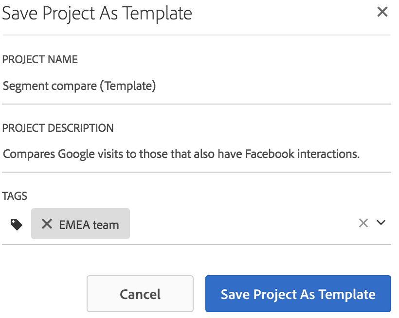

# Templates

## Templates {#topic_40932F09E18A467983AFBB29908E1CB8}
>Short DescriptionYou can choose whether to create a project from: 

* A blank project (default). For instructions, see [ Create an Analysis Workspace Project ](../../analysis_workspace_bucket/freeform_overview/t_freeform_project.md#task_C2C698ACC7954062A28E4784911E6CF2).
* A standard template. These templates are created by Adobe and ship out of the box.
* A custom template. These templates can be created by users with admin rights or by non-admins, provided they have been granted the Create/Curate Projects in Analysis Workspace permission. (  **[!UICONTROL  Admin]** > **[!UICONTROL  User Management]** > **[!UICONTROL  Groups]** > **[!UICONTROL  Edit All Report Access]** > **[!UICONTROL  Customize Analytics Tools]** > **[!UICONTROL  Create/Curate Projects in Analysis Workspace]**
 

* [ Create a custom template ](../../analysis_workspace_bucket/freeform_overview/starter_projects.md#task_279637F56CFD4B6094D7CBDB82FA4835)
* [ Standard templates ](../../analysis_workspace_bucket/freeform_overview/starter_projects.md#concept_4FE900FEEC894E849CB6C6A0E0ADA524)
>## Create a custom template {#task_279637F56CFD4B6094D7CBDB82FA4835}
>Short DescriptionUsers with admin rights can turn any project they create into a custom template. Here's how: 

>1. Open the project.
>1. Go to **[!UICONTROL  Project]** > **[!UICONTROL  Save As Template]**.

>        

>       The project will be saved under the current project name, followed by the word (Template) in parentheses. Admins can change this name by editing the template. 

>       >[!NOTE]
>       >
>       >By default, project templates are visible to everyone in your organization. You can organize them by applying tags. (Go to **[!UICONTROL  Project]** > **[!UICONTROL  Project Info &amp;amp; Settings]** to edit tags and descriptions.) 

>       **Actions you can perform on custom templates** 

>        

>    <table id="table_D7C7B0CA1EE64E108484C03426800EBC"> 
 <thead> 
  <tr> 
   <th colname="col1" class="entry"> Action </th> 
   <th colname="col2" class="entry"> Description </th> 
  </tr> 
 </thead>
 <tbody> 
  <tr> 
   <td colname="col1"> 
Edit template 
 </td> 
   <td colname="col2"> 
Lets an admin edit the template by changing its data source, modifying components, visualizations, date ranges, etc. 
 
To edit a custom template, either 
 
    <ul id="ul_2B3A371F83334E14806385753A360903"> 
     <li id="li_EE75E0281B764BA9B56FF1DB1B12D2CC">Bring up the list of custom templates in Analysis Workspace, select one, and click  Edit Template , or </li> 
     <li id="li_4934DAAA46204990A295E22A97F81EDA">In Analytics, navigate to 
      <ignoretag> 
        Components   &gt; 
        Projects  
      </ignoretag>, then filter on  Templates . Click the name of the template you want to edit. </li> 
    </ul> 
 
 
Note:  After editing a template, depending on the situation, you have two options:  Save ,  Save As . Here is how they differ: 
     <ul id="ul_87E2842C8AA442399585B1C6189F5E16"> 
      <li id="li_AB7B189729E14E40A0141ECE2A24C113"><b>Save</b>: Updates the custom template for all users. When someone else creates a project from this custom template, they will see the changes you have made. </li> 
      <li id="li_C85B0B9873A3404D8B443BBD30B37CEB"><b>Save As</b>: Creates a copy of the custom template with your changes. </li> 
     </ul> 
 
(You can tell that you are in edit mode when the  Share  &gt;  Share Project  menu item is disabled.) 
 </td> 
  </tr> 
  <tr> 
   <td colname="col1"> 
Search on templates 
 </td> 
   <td colname="col2"> 
In the Custom Templates dialog, click  Search Templates . 
 </td> 
  </tr> 
  <tr> 
   <td colname="col1"> 
Sort templates 
 </td> 
   <td colname="col2"> 
You can sort templates alphabetically, by relevance, and by creation date. 
 
In the Custom Templates dialog, click  Sort: . 
 </td> 
  </tr> 
  <tr> 
   <td colname="col1"> 
Apply tags to template 
 </td> 
   <td colname="col2"> 
Open the template and go to 
     <ignoretag> 
       Project   &gt; 
       Project Info &amp;amp; Settings  
     </ignoretag>. Click  Add Tags . 
 </td> 
  </tr> 
  <tr> 
   <td colname="col1"> 
Modify template description 
 </td> 
   <td colname="col2"> 
Open the template and go to 
     <ignoretag> 
       Project   &gt; 
       Project Info &amp;amp; Settings  
     </ignoretag>. Double-click the description and edit it. 
 </td> 
  </tr> 
 </tbody> 
</table>

>## Standard templates {#concept_4FE900FEEC894E849CB6C6A0E0ADA524}
>Short DescriptionWhen you first open a Workspace, templates are available in the left rail. Analysis Workspace Templates cover common use cases. They are grouped by the vertical they belong to and are populated with different dimensions, segments, metrics and visualizations, depending on the report suite you have selected. 

You can use these pre-populated templates as they are or adapt them to your needs (by adding or replacing metrics or visualizations, for example) and save them under a new name. 

Here are available templates and the questions that each template helps answer: 

**Media** 

* **Content Consumption**: Which content is being consumed the most and is engaging users?
* **Recency - Frequency - Loyalty**: Who are my loyal readers?
**Mobile** 

>[!IMPORTANT]
>
>Mobile templates are available only if your report suite is enabled for Mobile.

* **Messaging:** Focuses on in-app and push messaging performance.
* **Location:** Includes a Map showcasing location data.
* **Key Metrics:** Keep a pulse on the key metrics of your app.
* **App Usage:** How many app users, launches, and first launches did the app have, and what was the average session length?
* **Acquisition:** See how mobile acquisition links are performing.
* **Performance:** How is the app performing and where are users having problems?
* **Retention:** Who are my loyal users and what do they do?
* **Journeys:** What are the prominent usage patterns for my app?
**Retail** 

* **Campaign Performance:** What campaigns are driving the most revenue?
* **Products:** Which products are performing the best?
**Web** 

* **Acquisition:** What are the top traffic drivers to my website?
* ** Content Consumption:** What are the top places people go on my site?
* **Retention:** What types of users are likely to be loyal users of my site?
* **Technology:** What technology are people using to access my site?
**People** 

>[!NOTE]
>
>The People template and its associated People metric is available for use only as part of the[ Adobe Experience Cloud Device Co-op ](https://marketing.adobe.com/resources/help/en_US/mcdc/mcdc-people.html). 

It is based on the People metric, which is a de-duplicated version of the Unique Visitors metric. The People metric provides a measure of how often consumers using multiple devices interact with your brand. The template lets you 

* Segment your data for US/Canada vs. the rest of the world. The Device Co-op is currently available only in North America.
* Compare the People and Unique Visitors metrics side by side.
* See the "compression rate", a calculated metric that calculates how much smaller the People metric is as a percentage of Unique Visitors.
* Compare the device type totals your customers use
* See how many average devices per person are used.
* Discover how to use segment stacking with the People metric.
* Explore how using the Experience Cloud ID in your environment enhances the effectiveness of the People metric.
