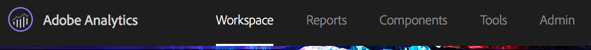
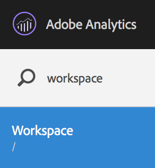
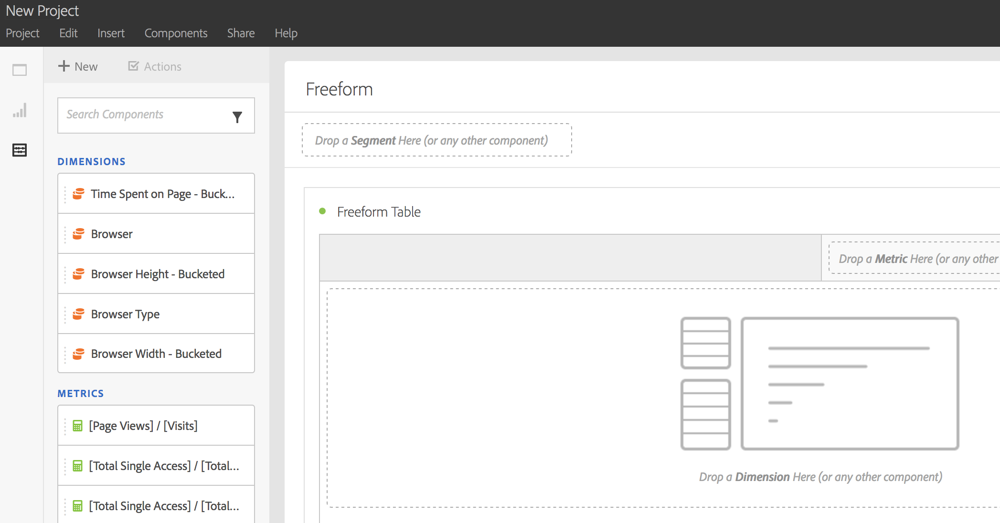
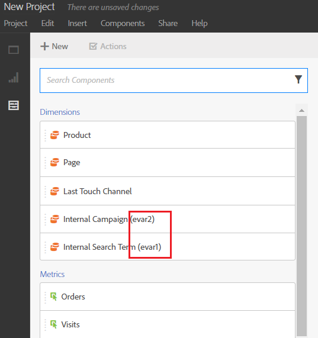
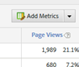
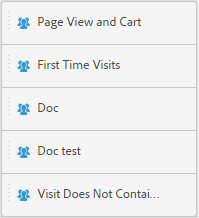
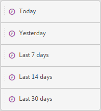

# Create an Analysis Workspace project

## Create an Analysis Workspace project {#task_C2C698ACC7954062A28E4784911E6CF2}
>Create a project and add components (dimensions, metrics, segments, date ranges) to the freeform panel.This article familiarizes you with the Analysis Workspace interface elements and shows how to create a project. For specific use cases, see [ Use Cases for Analysis Workspace](../../analysis_workspace_bucket/analysis-workspace-features/freeform-analysis-examples-use-cases.md#concept_173D1EB783F24EA89E754628BA30FF4B). 

**To create an Analysis Workspace project** 

>1. Specify user permission to create and curate projects.
>   Before creating or curating an Analysis Workspace project, administrators must add you to a group with the **[!UICONTROL  Create / Curate Projects in Analysis Workspace]** permission enabled, or to the **[!UICONTROL  All Report Access]** user group. ( **[!UICONTROL  Admin]** > **[!UICONTROL  User Management]** &gt; [ Groups](https://marketing.adobe.com/resources/help/en_US/reference/?f=groups)). 
>
>1. In the [!DNL  Experience Cloud], click **[!UICONTROL  Analytics]** > **[!UICONTROL  Workspace]**.

>        

>       Alternatively, enter a forward slash (/) to open the report search bar, then type *` workspace`*. 

>        
>1. Click **[!UICONTROL  Create New Project]**.

>    
>    * A blank project (default). For instructions, see below.
>    * A standard template. These templates are created by Adobe and ship out of the box. For instructions, see [ Templates](../../analysis_workspace_bucket/freeform_overview/starter_projects.md#concept_49B9A327C5004DB0A4BE6291435625C5)
>    * A custom template. These templates are created by users with admin rights. For instructions, see [ Templates](../../analysis_workspace_bucket/freeform_overview/starter_projects.md#concept_49B9A327C5004DB0A4BE6291435625C5)
>        
>1. To create a project from a blank project, click **[!UICONTROL  Blank Project]**.
>    * Then click **[!UICONTROL  Create]**, or
>    * Simply click **[!UICONTROL  Enter]**.
>   A blank project displays, showing a freeform panel and a data table visualization. 
>

>        

>       >[!NOTE]
>       >
>       >Sometimes, an "Incompatible Report Suite" message shows up when loading a project (or switching to a report suite) where not all of the components (metrics/dimensions) included in the project are included in the report suite. You can see a list of the components that are not compatible, so that you know why you are getting the message.

>    <table id="table_3989E45D9D4241CBB2E58B29DA257B2F"> 
 <thead> 
  <tr> 
   <th colname="col1" class="entry"> Element </th> 
   <th colname="col2" class="entry"> Description </th> 
  </tr> 
 </thead>
 <tbody> 
  <tr> 
   <td colname="col1"><a href="../../analysis_workspace_bucket/analysis-workspace-components.md#concept_BEBE3A75E072495D9E2F895567BBD462" format="dita" scope="local"> Components</a> </td> 
   <td colname="col2"> 
Dimensions, metrics, segments, and date ranges that you can drag into projects. 
 </td> 
  </tr> 
  <tr> 
   <td colname="col1"><a href="../../analysis_workspace_bucket/freeform-analysis-visualizations.md#concept_09242627629147A88A68F1506954C276" format="dita" scope="local"> Visualizations</a> </td> 
   <td colname="col2"> 
Items you can drag to the panel or project areas of the interface. 
 </td> 
  </tr> 
  <tr> 
   <td colname="col1"><a href="../../analysis_workspace_bucket/freeform-analysis-visualizations/freeform-table.md#concept_0D2E24FCCBAF4194AA941448860E422F" format="dita" scope="local"> Freeform Panel </a> </td> 
   <td colname="col2"> 
The canvas or workspace with which you interact in Analysis Workspace. 
 </td> 
  </tr> 
 </tbody> 
</table>

>1. Save your project. Name the project, provide a description (optional, but useful) and tag the project (optional), then click **[!UICONTROL  Save Project]**.

>       1. You can now right-click and copy a visualization or panel, and then paste ("insert") that copied element into another place within the project, or into a different project.

>       >[!NOTE]
>       >
>       >After you copy/save-as, the intra-links are now relative to the project they live within, not the original project they were copied from.
>## Add Components and Visualizations {#task_CDAC9B3007BE4A3790AFAD3746D669B1}

>1. Build your project by dragging *` components`* to the project.
>   The [!UICONTROL  Component] toolbar displays searchable dimensions, metrics, segments, and date ranges that you use most frequently. 

>   **Dimensions (orange)** 

>   Apply at the project level 

>    

>   Prop#, eVar#, and event# are appended to the dimension names, and you can search on those numbers. Example: "Internal Campaign" shows up in the left rail as "Internal Campaign (evar2)". 

>   Note that the prop, eVar, and event numbers do not show in the table (to keep the titles short). 

>   There is a default sort order for some out-of-the-box dimensions, when they are dragged into a freeform table or when they are viewed in the left rail. For example, when "Hour of Day" is dropped into a table or viewed in the left rail, it will be sorted from 12AM-11PM. You still have the option to sort by any metric column. 

>   **Metrics (green)** 

>   Apply at the project level. 

>    

>   *` Occurrences`* is the default metric for the data table. 

>   **Segments (blue)** 

>   Draggable only at the panel level, but you can create inline segments in the data table. 

>    

>   See [ Use Cases for Analysis Workspace](../../analysis_workspace_bucket/analysis-workspace-features/freeform-analysis-examples-use-cases.md#concept_173D1EB783F24EA89E754628BA30FF4B) for more information. 

>   **Date ranges and granularities (purple)** 

>   Draggable only at the panel level. You can create a project from the Calendar, when configuring a date range. 

>    
>
>1. Drag [ Visualizations](../../analysis_workspace_bucket/freeform-analysis-visualizations.md#concept_09242627629147A88A68F1506954C276) to your project.
>   **** 

>   The [!UICONTROL  Visualizations] panel provides standard Analytics graphs, charts, donuts, data tables, [ cohort](../../analysis_workspace_bucket/freeform-analysis-visualizations/cohort-table/cohort_analysis.md#concept_9D240A490265427DA694D18D14EACC0E) tables, Venn diagrams, and so on. You can drag-and-drop multiple visualizations into your project. 

>    

>    
>
>## Use the right-click menu to customize your data {#concept_8117C300F21843B99F4E1B9AB7B11B6F}
The right-click menu lets you perform the following actions, depending on which cell in a table you right-click. 

 

<!-- 
Need descriptions... 
 -->

* [ Add time period column](../../analysis_workspace_bucket/analysis-workspace-components/calendar/time_comparison.md#concept_93BCAD81B7A54ABBBA5CD9E419F6F764)
* [ Compare time periods](../../analysis_workspace_bucket/analysis-workspace-components/calendar/time_comparison.md#concept_93BCAD81B7A54ABBBA5CD9E419F6F764)
* Copy to Clipboard
* Delete selected
* [ Create alert from selection](../../analysis_workspace_bucket/virtual-analyst/intellligent_alerts.md#concept_3B41B293C0C444038A9F3068A7676D42)
* [ Breakdown](../../analysis_workspace_bucket/analysis-workspace-components/dimensions/t_breakdown_fa.md#task_B594DA2476E84DFDA8279E831F0BD9C4) 
    * Dimensions
    * Metrics
    * Segments
    * Time

* [ Visualize](../../analysis_workspace_bucket/freeform-analysis-visualizations.md#concept_09242627629147A88A68F1506954C276)
* [ Download as CSV](../../analysis_workspace_bucket/curate/download_send.md#concept_BB548979F47F45739679B830428C3025)
* [ Trend selection](../../analysis_workspace_bucket/analysis-workspace-features.md#concept_4D69EE46E3C24EEB97C935A8789364F9)
* [ Create segment from selection](../../analysis_workspace_bucket/analysis-workspace-components/t_freeform-project-segment.md#task_11C6A2C7717B48049E5750B9D20FEC80)
* [ Run in segment comparison](../../analysis_workspace_bucket/panels/segment-comparison.md#concept_74FAC1C6D0204F9190A110B0D9005793)
* Display only selected rows
* Display all rows
See [ Keyboard and Mouse Interactions Available in Analysis Workspace](../../analysis_workspace_bucket/freeform_overview/fa_shortcut_keys.md#concept_9A6356084DBC4D468E265E7A65B3E051) for information about copying and selecting rows. 
