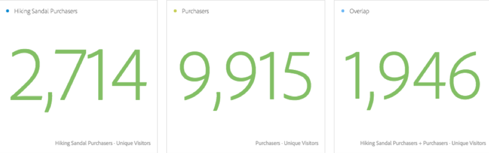

# Segment comparison (IQ)

Analysts can spend many hours or even days searching for relevant differences between segments across broad swaths of your company’s metrics and dimensions. Not only is this analysis tedious and time consuming, you can never be sure whether you haven’t missed a key difference insight about a segment that would make a big impact to your targeted marketing efforts. 

Here are some key new concepts, visualizations, and tables that are introduced with the Segment Comparison tool: 

## “Everyone else” segment {#section_30AEE8181E5D46D9AB27F7CA3815D0CD}

For convenience, we’ve added the “everyone else” segment so that you don't have to create it manually. For example, take the Purchasers audience. You don't have to create a Non-Purchasers segment, since it's already included in the “everyone else” segment and can be quickly removed if you’d rather add a different segment for comparison. 

## Size and overlap {#section_885A71EE458C43189A77B8F552CA346A}

The Size and Overlap visualization illustrates the comparative sizes of each selected segment and how much they overlap with each other. You can hover over the visual to see how many visitors were in each overlapping or non-overlapping section. You can also right click on the overlap to create a brand new segment for further analysis. If two segments do not overlap (for example if using the “everyone else” segment), you’ll also see that reflected in this visual. 

 

## Population summaries {#section_21F2B66C60184A71B89E2982A6FB945D}

To the right of the Size and Crossover visual, the Segment Comparison Tool displays the total unique visitor count in each segment and the population of the overlap. 

 

## Top metrics {#section_E4A38516424949B79A559DC8793071F2}

>[!NOTE]
>
>Row items that are applied after the segment comparison has finished do not receive a Difference Score; the table will load only metric data for the two segments that are being compared

The top metrics table displays the statistically most differentiating metrics between the two segments you’ve selected. Each row in this table represents a differentiating metric, ranked by how different it is between each segment. The metrics are also shown on a per-visitor basis, meaning that if “Visits” appears in the table, the corresponding numbers in the table represent the average number of visits per visitor in each segment. We also provide a difference score indicating how different this metric is between these two segments. A score of 1 represents a large statistical difference, whereas a score of 0 represents no statistical difference. 

For details on how the difference scores of each table are calculated, refer to [ Statistical Tests Used in Segment Comparison ](../../analysis_workspace_bucket/panels/segment-comparison/statistical-test.md#concept_0B6AC754EAED460283D4626983F838F4). 

The Top Metrics table is similar to any other table you use in Analysis Workspace. You can drag any metric you’re interested in into the table, and we’ll show you how it compares. 

You can customize the table any way you want. We’ve also added a new “create visual” icon to each row in the table. Clicking this icon creates a brand new table and visual above the Segment Comparison Tool if you don’t want to clutter the Top Metrics Table and would prefer to continue deeper analysis in a new table. If this metric is not relevant, you can click “X” to remove it from the table altogether. Finally, just as other Freeform Tables, you can paginate through the list of displayed metrics or display the top 10, 20, 50, etc. if you’d like to see more than the default five line items displayed by default. 

 

To the right of the metrics table is a linked visualization. By default, the Segment Comparison Tool will display the top metric in the table trended over the last 30 days for each segment. If you want to visualize another metric found in the Top Metrics table, just select it by clicking and the visualization to the right will update to show the selected metric. 

 

## Top dimension items {#section_439C1782B153427CB4FB85E177146EC0}

>[!NOTE]
>
>Row items that are applied after the segment comparison has finished do not receive a Difference Score; the table will load only metric data for the two segments that are being compared

Similar to the Top Metrics table, the Segment Comparison Tool provides a Top Dimension Items table illustrating the most differentiating dimension items across all of your dimensions. Each row shows the percentage of each segment exhibiting this dimension item. 

For example, if comparing “Segment A” with “Segment B”, the Top Dimension Items table might reveal that 100% of visitors in “Segment A” had the dimension item Browser Type: Google, whereas only 19.6% of “Segment B” had this dimension item. 

 

To the right of the Top Dimension Items table, the Segment Comparison Tool highlights the top dimension item selected along with other top dimension items from that dimension for comparison: 

 

## Top segments table {#section_6A0C39F930564240AF7A157005C7A80B}

>[!NOTE]
>
>Row items that are applied after the segment comparison has finished do not receive a Difference Score; the table will load only metric data for the two segments that are being compared

The Top Segments table is a useful table showing which segments (other than the two segments selected for comparison) overlap very differently between the two selected segments. For example, when comparing Segment A with Segment B, the Top Segments table may show that a third segment, “Repeat Visitors” overlaps highly with Segment A but does not overlap with Segment B. 

 

In addition, the top differentiating additional segment is displayed in an overlap visual to the right of the table: 

 

The overlap visual graphically indicates the difference in overlap between all three segments, and like the other linked visuals, clicking on each additional segment in the table will update the visual to correspond to the selected segment. 

Click here for more information on the [ statistical tests ](../../analysis_workspace_bucket/panels/segment-comparison/statistical-test.md#concept_0B6AC754EAED460283D4626983F838F4) used in comparing segments. 
