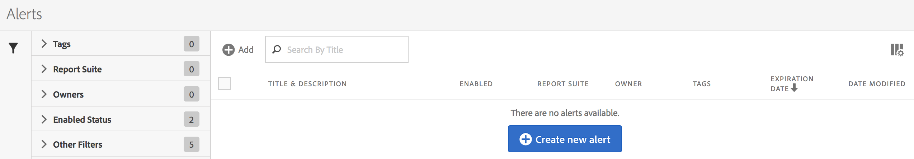
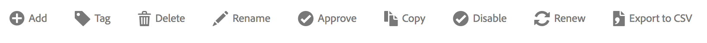

# Alert Manager

 

The Alert Manager ( **[!UICONTROL  Analytics]** > **[!UICONTROL  Components]** > **[!UICONTROL  Alerts]**) is structured very much like the [ Segment Manager](https://marketing.adobe.com/resources/help/en_US/analytics/segment/seg_manage.html) and the [ Calculated Metric Manager](https://marketing.adobe.com/resources/help/en_US/analytics/calcmetrics/cm_manager.html) and allows you to 

 

* Access the Alert Builder by clicking **[!UICONTROL  + Add]**.
* Tag alerts. This allows you to organize them for ease of use.
* Delete alerts.
* Rename alerts.
* Approve alerts.
* Copy alerts.
* Enable/disable alerts.
* **Renew** an alert expiration date. When one or more alerts are selected, they can be renewed by clicking Renew.This extends their expiration dates to be 1 year from the day Renew was clicked, regardless of their original expiration date.
* Export an alert to a .CSV file.
* Edit alerts by double-clicking the alert title.
* Search for alerts.
* Add alerts to other report suites.
* Specify/change the owner of an alert.
* Add other filters.
* Define an alert **expiration date**.
