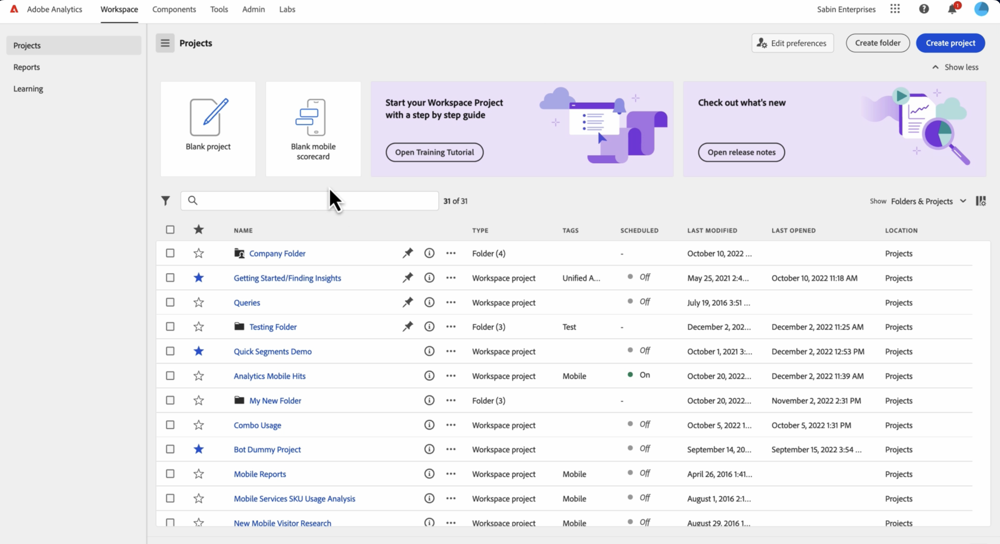
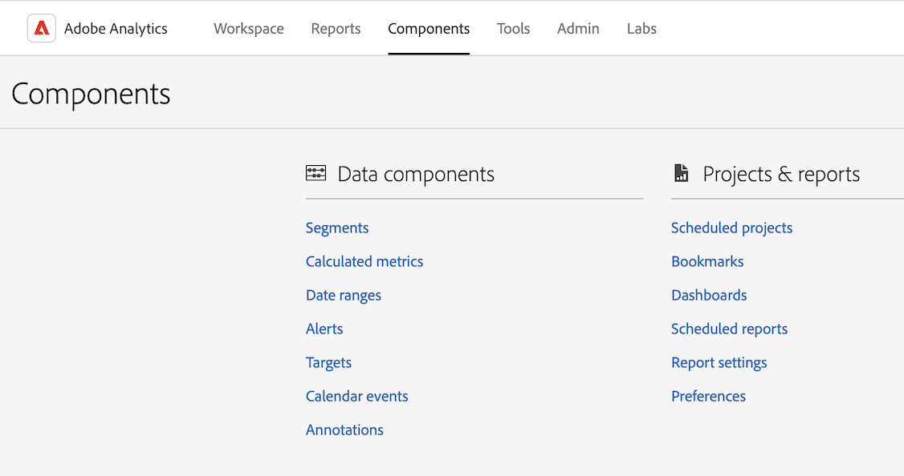
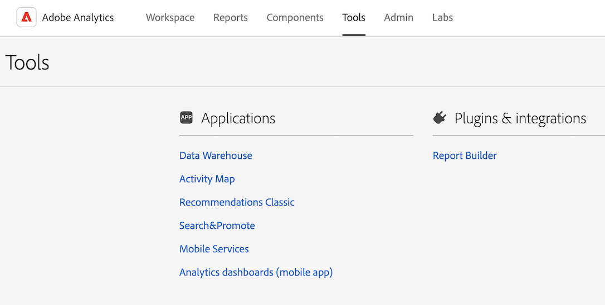
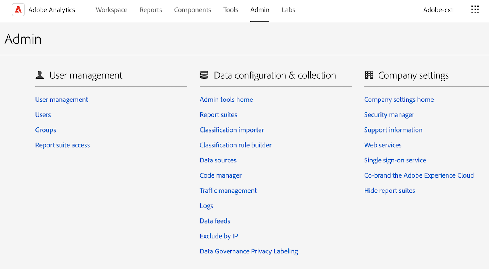
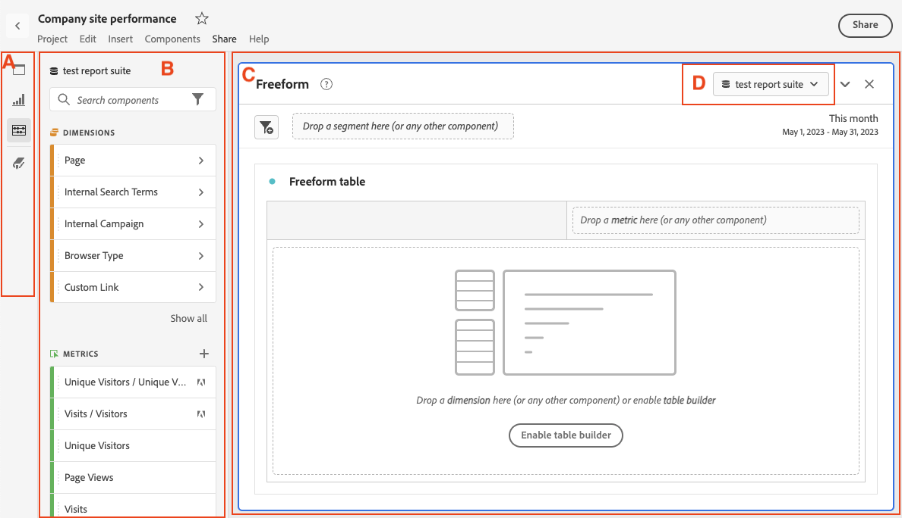

# Understand the Analytics interface

The Adobe Analytics interface consists of the following key areas, including tabs for managing projects in Analysis Workspace, managing components, tools, and administrator functions.

The following sections describe each area of Analysis Workspace:

## Workspace tab

The [!UICONTROL Workspace] tab shows shows the [!UICONTROL Projects] area by default, which displays the Company folder, any personal folders you created, your projects, and Mobile scorecards. 

1. In Adobe Analytics, select the [!UICONTROL **Workspace**] tab.

   

For more information about the features and functions available on the [!UICONTROL Workspace] tab, see [Adobe Analytics Landing page](/help/analyze/landing.md).

## Reports tab

Effective December 31, 2023, Adobe intends to discontinue Reports & Analytics and its accompanying reports and features. 

Instead, use the [!UICONTROL **Reports**] area in the left rail on the [!UICONTROL **Workspace**] tab. For more information, see *Navigate the Reports tab* in [Adobe Analytics Landing page](/help/analyze/landing.md).

## Components tab

The [!UICONTROL Components] tab includes features that help you fine tune and empower your analysis of data.

1. In Adobe Analytics, select the [!UICONTROL **Components**] tab, then select [!UICONTROL **All components**].

   

2. Select any of the following product features to configure it: 

   
   | Product feature | Function | More information |
   |---------|----------|----------|
   | Segments | Adobe Analytics lets you build, manage, share, and apply powerful, focused audience segments to your reports using Analytics capabilities, the Adobe Experience Cloud, Adobe Target, and other integrated Adobe products. | [Analytics segmentation](https://experienceleague.adobe.com/docs/analytics/components/segmentation/seg-home.html?lang=en) |
   | Calculated metrics | Calculated and Advanced Calculated (or Derived) metrics are custom metrics that you can create from existing metrics.  They allow marketers, product managers, and analysts to ask questions of the data without having to change the Analytics implementation.  | [Calculated and Advanced Calculated (Derived) metrics](https://experienceleague.adobe.com/docs/analytics/components/calculated-metrics/cm-overview.html?lang=en) |
   | Date ranges | Analysis Workspace includes a list of default date ranges that users can use when building analyses. In addition, you can create custom date ranges and make them available to users in Analysis Workspace. | [Create custom date ranges](https://experienceleague.adobe.com/docs/analytics/analyze/analysis-workspace/components/calendar-date-ranges/custom-date-ranges.html?lang=en) <!-- should create an article in the Components Guide for managing/creating date ranges. This article in the Tools Guide needs updating. --> |
   | Virtual report suites | Virtual report suites segment your Adobe Analytics data so you can control access to each segment. | [Virtual report suites overview](https://experienceleague.adobe.com/docs/analytics/components/virtual-report-suites/vrs-about.html?lang=en) |
   | Alerts | Intelligent Alerts allow for more granular control over alerts and integrates anomaly detection with the alert system. | [Intelligent alerts](https://experienceleague.adobe.com/docs/analytics/components/alerts/intellligent-alerts.html?lang=en) |
   | Targets | Targets let you measure your website performance and track progress against target goals. When you create targets, you select which attribute metrics or eVars you want to measure or you can choose to measure your entire site against your selected metric. 
Targets are part of Reports & Analytics. Read more about the Reports & Analytics [End-of-life announcement](https://express.adobe.com/page/6WnF8JK6IRDhf/).
 | [Targets](https://experienceleague.adobe.com/docs/analytics/analyze/reports-analytics/targets.html?lang=en) |
   | Calendar events | For reports trended over time, calendar events allow you to graphically display events and see whether campaigns or other events have affected your site traffic, revenue, or any other metric. | [Calendar events](https://experienceleague.adobe.com/docs/analytics/components/t-calendar-event.html?lang=en) |
   | Annotations | Annotations in Workspace enable you to effectively communicate contextual data nuances and insights to your organization. They let you tie calendar events to specific dimensions and metrics.  | [Manage annotations](https://experienceleague.adobe.com/docs/analytics/analyze/analysis-workspace/components/annotations/manage-annotations.html?lang=en) |
   | Classification sets | Classification sets provide a single interface to manage classifications and rules. 
A classification is a way of categorizing Analytics variable data, then displaying the data in different ways when you generate reports. You establish a relationship between a variable value and metadata related to that value. Classifications can be used on most custom dimensions, such as Tracking code, props, and eVars.
  | [Classification sets overview](https://experienceleague.adobe.com/docs/analytics/components/classifications/sets/overview.html?lang=en) |
   | Locations | In order to import Adobe Analytics classification data from a cloud destination, you first need to add and configure the location where you want the classification data to be collected. You can create, edit, or delete locations. | [Locations manager](https://experienceleague.adobe.com/docs/analytics/components/locations/locations-manager.html?lang=en) |
   | Scheduled projects | When managing scheduled projects, you can edit and delete recurring project schedules; search for a schedule in the search bar or by using the filter options in the left rail; and filter by tag, approved schedules, owners and more. | [Scheduled projects](/help/components/scheduled-projects-manager.md) |
   | Bookmarks | Bookmarks give you access to the reports that you use the most. The bookmarks you create are added to the Experience Cloud and are available in integrated capabilities like data connectors. 
Bookmarks are part of Reports & Analytics. Read more about the Reports & Analytics [End-of-life announcement](https://express.adobe.com/page/6WnF8JK6IRDhf/). | [Bookmark manager](https://experienceleague.adobe.com/docs/analytics/analyze/reports-analytics/bookmarks.html?lang=en) |
   | Dashboards | Dashboards are created to visualize metrics and provide interactive analytic capability with data. By clicking on items within a dashboard, you can quickly and easily segment the data to derive information from your analysis. 
Dashboards are part of Data Workbench. Read more about the Data Workbench [End-of-life announcement](https://experienceleague.adobe.com/docs/data-workbench/using/eol.html?lang=en). | [Dashboard manager](https://experienceleague.adobe.com/docs/analytics/analyze/reports-analytics/dashboard-manage.html?lang=en) |
   | Scheduled reports | Admin-level users can see and manage scheduled reports across the organization. | [Scheduled reports queue](https://experienceleague.adobe.com/docs/analytics/components/scheduled-reports-admin.html?lang=en) |
   | Report settings | These settings refer to legacy Adobe Analytics products, which excludes Analysis Workspace and its related components. o make adjustments to Analysis Workspace settings, go to Components > Preferences.  |  |
   | Preferences | Manage settings for Analysis Workspace and its related components for all new projects or panels that you create. Existing projects and panels are not affected. | [Preferences](/help/analyze/analysis-workspace/user-preferences.md) |

   {style="table-layout:auto"}

## Tools tab

<!-- The Tools tab ... -->

1. In Adobe Analytics, select the [!UICONTROL **Tools**] tab, then select [!UICONTROL **All tools**].

   

2. Select any of the following product features to configure it:

   | Product feature | Function | More information |
   |---------|----------|----------|
   | Data Warehouse | Data Warehouse refers to the copy of Analytics data for storage and custom reports, which you can run by filtering the data. 
The Request Manager lets you view, duplicate, and re-prioritize requests.
 | [Manage Data Warehouse requests](https://experienceleague.adobe.com/docs/analytics/export/data-warehouse/data-warehouse-requests-manage.html?lang=en) |
   | Activity Map | Activity Map is designed to rank link activity using visual overlays and provide a dashboard of real-time analytics to monitor audience engagement of your web pages. It lets you set up different views to visually identify the acceleration of customer activity, quantify marketing initiatives, and act on audience needs and behaviors. | [Activity Map overview](https://experienceleague.adobe.com/docs/analytics/analyze/activity-map/activity-map.html?lang=en) |
   | Recommendations Classic | Recommendations is an Adobe Target feature that automatically display products, services, or content that might interest your visitors based on previous user activity, preferences, or other criteria.  | [Recommendations](https://experienceleague.adobe.com/docs/target/using/recommendations/recommendations.html?lang=en) |
   | Search & Promote |  |  |
   | Mobile Services |  |  |
   | Analytics dashboards (mobile app) | The Adobe Analytics dashboards app delivers anytime, anywhere insights from Adobe Analytics. Through the app, users can view intuitive Scorecards that you create using the Adobe Analytics desktop UI.  | The Adobe Analytics dashboards app in the iOS App Store or Google Play store |
   | Report Builder | Adobe Report Builder is an add-in for Microsoft Excel. It lets you build customized requests from Adobe Analytics data, which you can insert into your Excel worksheets. Requests can dynamically reference cells within your worksheet, and you can update and customize how Report Builder presents the data. |[What is Report Builder?](https://experienceleague.adobe.com/docs/analytics/analyze/report-builder/home.html?lang=en) |

   {style="table-layout:auto"}

## Admin tab

The Admin tab includes features and configuration options to administer Adobe Analytics.

1. In Adobe Analytics, select the [!UICONTROL **Admin**] tab, then select [!UICONTROL **All admin**].

   

2. Select any of the following product features to configure it:   

   | Product feature | Function | More information |
   |---------|----------|----------|
   | Analytics users & assets | While most user and product management functions are now available only in the [Adobe Admin Console](https://helpx.adobe.com/enterprise/using/admin-console.html), the administrative functions of transferring assets from one user to another, as well as setting an expiration date for a user account, are available only from the Adobe Analytics Admin area. | [Transfer user assets or set account expirations](https://experienceleague.adobe.com/docs/analytics/admin/admin-tools/user-product-management/users-assets.html?lang=en) |
   | User ID migration | The Analytics user ID migration enables administrators to easily migrate user accounts in Analytics User Management to the Adobe Admin Console.  | [Analytics User Migration to the Adobe Admin Console](https://experienceleague.adobe.com/docs/analytics/admin/admin-tools/user-product-management/migrate-users/c-migration-tool.html?lang=en) |
   | User management home (legacy) | User and product management has moved to the Adobe Admin Console. Use the Adobe Admin Console to get started managing user permissions for Adobe Analytics users. | [Analytics in the Adobe Admin Console](https://experienceleague.adobe.com/docs/analytics/admin/admin-console/home.html?lang=en) |
   | Groups (legacy) | Group management has moved to the Adobe Admin Console. Use the Adobe Admin Console to get started managing groups for Adobe Analytics. | [Analytics in the Adobe Admin Console](https://experienceleague.adobe.com/docs/analytics/admin/admin-console/home.html?lang=en) |
   | Report suite access | The method for granting access to report suite tools has moved to the Adobe Admin Console. Use the Adobe Admin Console to grant report suite access for Adobe Analytics users. | [Product profile permissions for Report Suite Tools](https://experienceleague.adobe.com/docs/analytics/admin/admin-console/permissions/report-suite-tools.html?lang=en) |
   | Admin tools home |  |  |
   | Report suites | Lets you define the rules that govern how data is processed in a report suite. | [Report Suite manager](https://experienceleague.adobe.com/docs/analytics/admin/admin-tools/manage-report-suites/report-suites-admin.html?lang=en)  |
   | Analytics users & assets | User and asset management has moved to the Adobe Admin Console. Use the Adobe Admin Console to get started managing user permissions for Adobe Analytics users. | [Analytics in the Adobe Admin Console](https://experienceleague.adobe.com/docs/analytics/admin/admin-console/home.html?lang=en) |
   | Classification importer | Use the importer to upload classifications into Adobe Analytics. You can also export the data for updating prior to an import. | [Classifications importer overview](https://experienceleague.adobe.com/docs/analytics/components/classifications/classifications-importer/c-working-with-saint.html?lang=en) |
   | Classification rule builder | Rather than maintaining and uploading classifications each time your tracking codes change, you can create automatic, rule-based classifications and apply them across multiple report suites. | [Classification Rule Builder workflow](https://experienceleague.adobe.com/docs/analytics/components/classifications/classifications-rulebuilder/classification-rule-builder.html?lang=en) |
   | Data sources | Use the data source manager to create, edit, or deactivate data sources. You can also use this interface to track the status of files uploaded to data sources FTP locations. | [Manage data sources](https://experienceleague.adobe.com/docs/analytics/import/data-sources/manage.html?lang=en) |
   | Code manager | Code manager lets you download data collection code for web and mobile platforms | [Code Manager](https://experienceleague.adobe.com/docs/analytics/admin/admin-tools/code-manager-admin.html?lang=en) |
   | Traffic management | The Traffic Management page lets you specify expected traffic volume changes. These settings let Adobe allocate the appropriate resources to ensure that your traffic can be tracked and processed in a timely manner. | [Traffic management overview](https://experienceleague.adobe.com/docs/analytics/admin/admin-tools/manage-report-suites/edit-report-suite/traffic-management/traffic-management.html?lang=en) |
   | Server call usage | A server call, also known as a "hit" or an "image request", is an instance in which data is sent to Adobe servers to process. A Server Call Usage dashboard is available that tracks your server call consumption data and compares it to your contractual limit. You can set up alerts to prevent overages. | [Server Call Usage overview](https://experienceleague.adobe.com/docs/analytics/admin/admin-tools/server-call-usage/overage-overview.html?lang=en) |
   | Logs | Log files to help you see when users log in, their usage, access, report suites, and Admin changes. | [Logs](https://experienceleague.adobe.com/docs/analytics/admin/admin-tools/logs.html?lang=en) |
   | Advertising Analytics | Configure Adobe Analytics to show all your Google and Bing Paid Search data side by side. | [Configure Advertising Analytics](https://experienceleague.adobe.com/docs/analytics/admin/admin-tools/manage-report-suites/edit-report-suite/advertising-analytics-config.html?lang=en) |
   | Data feeds | Data feeds are a powerful way to get raw data out of Adobe Analytics. This raw data can be used in other platforms outside of Adobe to use at your organization's discretion.  | [Analytics Data Feed overview](https://experienceleague.adobe.com/docs/analytics/export/analytics-data-feed/data-feed-overview.html?lang=en) |
   | Exclude by IP | You can exclude data from specific IP addresses, such as internal website activities, site testing and employee usage, from your reports. Excluding data improves report accuracy by excluding IP address data. Additionally, you can remove data from denial of service or other malicious events that can skew report data. You can configure exclusion or by using your firewall. | [Exclude by IP address](https://experienceleague.adobe.com/docs/analytics/admin/admin-tools/exclude-ip.html?lang=en) |
   | Publishing widgets |  |  |
   | Reporting Activity Manager | The Reporting Activity Manager lets you see the reporting capacity for each report suite in your organization. It provides detailed visibility into reporting consumption and helps you easily diagnose and fix capacity issues during peak reporting times. | [Reporting Activity Manager](https://experienceleague.adobe.com/docs/analytics/admin/admin-tools/reporting-activity.html?lang=en) |
   | Data Governance Privacy Labeling | Labeling report suite data means that you assign identity, sensitivity, and data governance labels to each variable in a given report suite.  | [Label report suite data](https://experienceleague.adobe.com/docs/analytics/admin/admin-tools/data-governance/data-labels/gdpr-setup-reportsuite.html?lang=en) |
   | Company settings home | The Company Settings page lets you configure settings that apply to all report suites managed by your organization. | [Company settings overview](https://experienceleague.adobe.com/docs/analytics/admin/admin-tools/company-settings/c-company-settings.html?lang=en) |
   | Security manager | The Security Manager lets you control access to reporting data. Options include strong passwords, password expiration, IP login restrictions, and email domain restrictions. | [Security Manager](https://experienceleague.adobe.com/docs/analytics/admin/admin-tools/company-settings/security-manager.html?lang=en) |
   | Support information | The Support Information page manages the support information that displays throughout Reports & Analytics. Reports & Analytics. 
Effective December 31, 2023, Adobe intends to discontinue Reports & Analytics and its accompanying reports and features. Read more about the Reports & Analytics [End-of-life announcement](https://www.adobe.com/go/analytics_rnaeol_en).
  |  |
   | Web services | The Web Services APIs provide programmatic access to marketing reports and other Suite services that let you duplicate and augment functionality available through the Analytics interface. | [Web services](https://experienceleague.adobe.com/docs/analytics/admin/admin-tools/company-settings/web-services-admin.html?lang=en) |
   | Report Builder reports | Manage license assigned to Report Builder users. | [Report Builder reports](https://experienceleague.adobe.com/docs/analytics/admin/admin-tools/company-settings/report-builder-reports-admin.html?lang=en) |
   | Single sign-on service | Single sign-on in the Adobe Experience Cloud is implemented through the Admin Console. | [Analytics in the Adobe Admin Console](https://experienceleague.adobe.com/docs/analytics/admin/admin-console/home.html?lang=en) |
   | Co-brand the Adobe Experience Cloud | The Manage Co-Branding Image page lets you display your company logo in Reports & Analytics downloaded reports and legacy dashboards. Co-branding is not used in Analysis Workspace.
Effective December 31, 2023, Adobe intends to discontinue Reports & Analytics and its accompanying reports and features. Read more about the Reports & Analytics [End-of-life announcement](https://www.adobe.com/go/analytics_rnaeol_en).
 | [Co-Branding](https://experienceleague.adobe.com/docs/analytics/admin/admin-tools/company-settings/co-branding-admin.html?lang=en) |
   | Hide report suites | Lets you hide report suites in the Adobe Analytics user interface if you no longer want a report suite to be available to you and your users. | [Hide report suites](https://experienceleague.adobe.com/docs/analytics/admin/admin-tools/company-settings/c-hide-report-suites.html?lang=en) |  |

   {style="table-layout:auto"}

## Analysis Workspace

Analysis Workspace allows you to quickly build analyses to gather insights and then share those insights with others. Using the drag-and-drop browser interface, you can craft your analysis, add visualizations to bring data to life, curate a dataset, and share and schedule projects with anyone you choose.

The following image and accompanying table explain some of the main areas in Analysis Workspace.

For a more detailed overview of Analysis Workspace, see [Analysis Workspace overview](/help/analyze/analysis-workspace/home.md).

| Location in image | Name and function |
|---------|----------|
| A | **Far left rail:** Contains tabs for adding panels, visualizations, and components to Analysis Workspace. Also contains the Data Dictionary icon that is used to open the Data Dictionary. |
| B | **Left rail:** Depending on which tab is selected in the far left rail, this area contains individual panels, visualizations, or components. |
| C | **Canvas:** This is the main area where you drag content from the left rails to build your project. The project dynamically updates as you add panels, visualizations, and components to the canvas. | 
| D | **Report suite drop-down menu:** For each panel in Analysis Workspace, the report suite drop-down menu allows you to choose the report suite that you want to use as your data source. | 