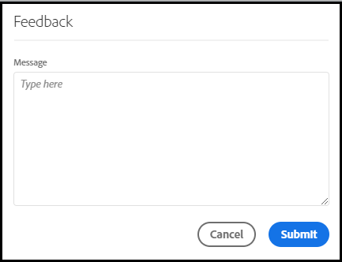

# [!UICONTROL Labs] User Guide

[!UICONTROL Labs] allows for faster prototyping of early-stage ideas. It is a combination of tools and processes that accelerates development transparently, with a customer focus. It allows users to engage with emerging technologies, to discover valuable insights, and to influence future feature development and priorities. You can use Labs to get early access to Adobe Analytics innovations and to evaluate upcoming features within the context of your own business use cases and data.

## Requirements

[!UICONTROL Labs] is automatically enabled for all admins. Other team members should contact their product administrators and request access.

If you have not already done so, read and sign the applicable Non-Disclosure Agreement and Terms & Conditions forms.

## Access the [!UICONTROL Labs] Portal

To access [!UICONTROL Labs]:

1. If you do not already have access to [!UICONTROL Workspace] and [!UICONTROL Labs], ask your administrator for permissions.

1. Click the **[!UICONTROL Labs]** tab.

## Evaluate a prototype

To launch and evaluate a prototype:

1. On the [!UICONTROL Labs] screen, click **[!UICONTROL Launch]** for the prototype you want to see. When the prototype is launched, you will see its name in the upper left of the prototype environment.

   

1. Watch a video that highlights the prototype by clicking **[!UICONTROL Watch Video]** in the upper right of the screen. Click **[!UICONTROL Close]** when the video is completed.

   

1. Work with the prototype. When working in the prototype environment:

* Projects created within the prototype environment cannot be saved or shared.

* In a prototype, you can evaluate the data with any dimensions, metrics, segments and visualizations that you otherwise have access to within Workspace.

* Any changes you make within a prototype will not affect data collection or processing.

* Changes made through creation or modification of segments, calculated metrics, and alerts persist outside of the prototype environment.

## Leave feedback

1. Click **[!UICONTROL Give Feedback]** to provide feedback in the message box at any point when working with the prototype.

   

1. Click **[!UICONTROL Submit]** to send your feedback.

1. To try a different prototype, or to exit the prototype environment, click **[!UICONTROL Leave Prototype]** in the upper right of the screen and complete the short survey for the prototype. Any changes made to a prototype project are lost upon exiting the prototype environment.

   

1. Click **[!UICONTROL Submit]** to return to the main Previews portal.

## Additional information

* Some prototypes within [!UICONTROL Labs] become Adobe Analytics features, others may not. Your feedback drives the decision, so review the prototypes and let Adobe know how valuable you find them.
* Labs is available to all SKU entitlements.
